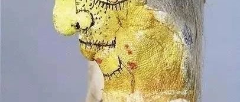
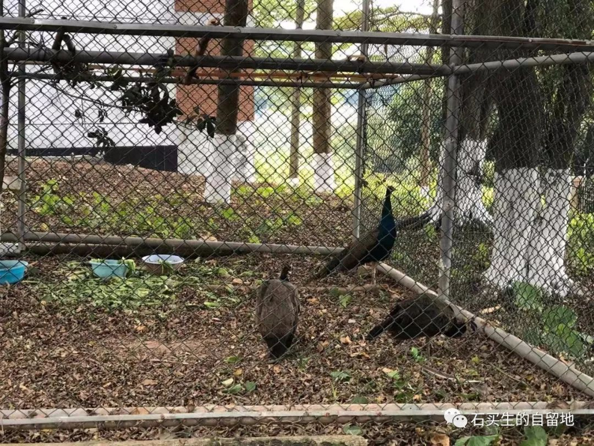
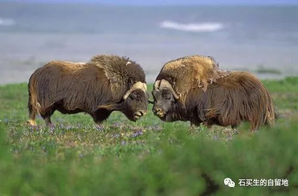
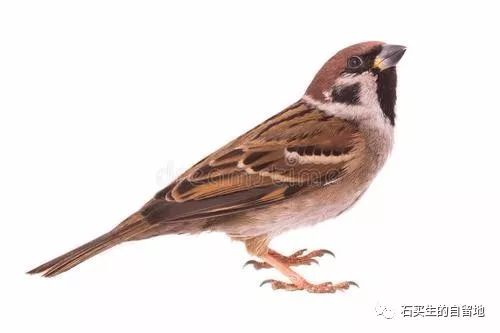

#  动物记

原创  石买生  [ 石买生的自留地 ](javascript:void\(0\);)

__ _ _ _ _

  

三只孔雀

昨天下午

窗前小叶榄仁树下的空地上

多了一个

五米见方的网状孔雀巢

三只孔雀

轻挪碎步

安享冬日慢时光

好像前生有约

不久前未名湖的清波上

来了两只黑天鹅

咯咯的叫声

改变了日子的颜色了吗

是的

可有人比以前更孤独

麝牛

  

头一次在电视上看见麝牛

在北欧荒凉的山间

为了占地为王

两只公牛在决斗

灯笼大的眼睛充满血红

犄角相碰地动山摇

四蹄踏地野性十足

衰草脉动

岩石驻足

云层在俯冲

当一方落败而逃

得胜者在配偶的心中

更加神圣

  

猫

一龙

二虎

三猫

四老鼠

在赣北

说猫生崽越多越熊

不中用

我家曾养一只黑猫

每次生崽都是一大窝

最少也有三五只

就好像上世纪六七十年代

农村女子生女娃特在行

一生就生个不停

最终呢

结果嘛

女子和猫的命运

一样的

麻雀

童年茅屋沿上

一只麻雀叽叽叽叫

我拿起弹弓

卟的一声

麻雀应声落地

现在

人到中年

它还没有原谅我

  

注：照片来自网络和自拍（第一张）

  

预览时标签不可点

微信扫一扫  
关注该公众号

****

****

×  分析

__

微信扫一扫可打开此内容，  
使用完整服务

：  ，  ，  ，  ，  ，  ，  ，  ，  ，  ，  ，  ，  。  视频  小程序  赞  ，轻点两下取消赞  在看  ，轻点两下取消在看
分享  留言  收藏  听过

精选留言

Mer_来自

[强][强][强][强]很有味道

石买生的自留地来自

[玫瑰]

Dedebi_来自

老师写的诗好有哲理

石买生的自留地来自

[咖啡]

