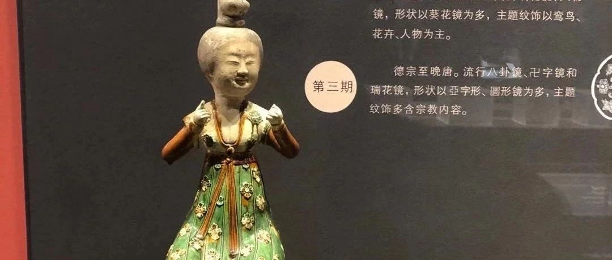
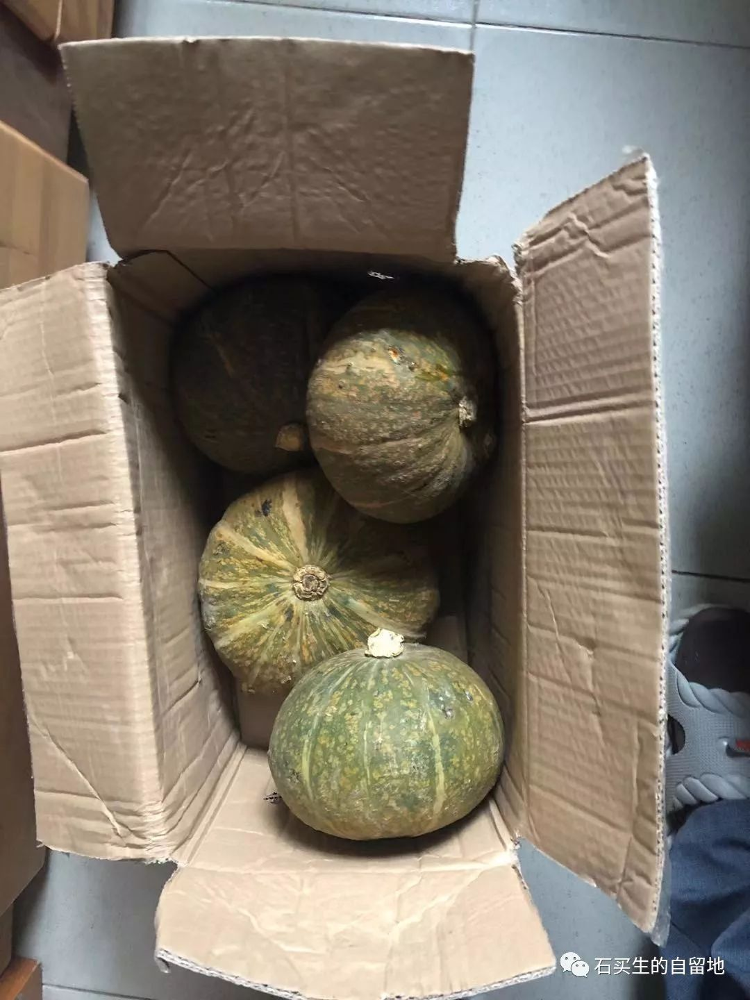
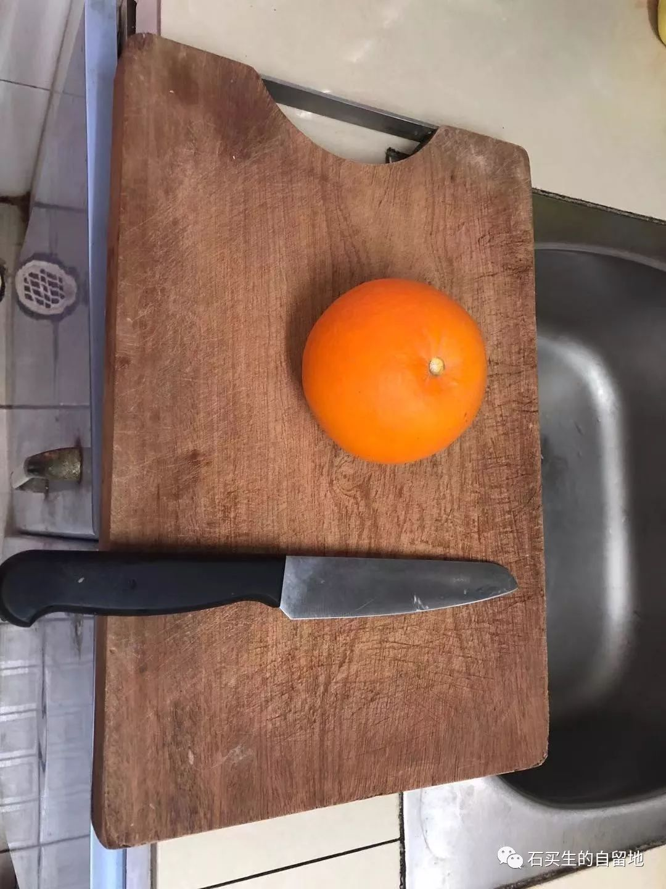

#  抱团取暖

石买生  [ 石买生的自留地 ](javascript:void\(0\);)

__ _ _ _ _

  

抱团取暖

妻子的手在手机上一点

四只青皮小南瓜

就穿过漫漫黄沙由新疆来到东莞

它们紧挨着挤在一个纸箱里

甚至来不及抱怨旅途辛苦

就远离了冬日的严寒

与恐怖的惊吓

在临湖一座筒子楼简易宿舍里

它们竞感受到生命的圆满

回想平淡的一生

一辈子尽享阳光雨露流岚

那么多平静的日子

有蜜蜂蝴蝶陪伴

好些深渊一样的夜晚也不感到伤感

好像生来只顾自个儿生长

它们从来不开仁代会

也不知特朗普刚被弹劾

也没有学会攀比争吵与诽谤

也没有想到争功名与利禄

更没有想到死

它们只是顺时而生应命而谢

把黄色的喇叭花开在最美的季节

把深青的果儿结在农人的心坎

把日子过成了蜜一样

它们的样子总是跟太初一样

性情沙土般朴实

喜欢远离尘嚣把每一天洗得清亮

沉默来自大美

奉献源于由衷

在这个慵懒的冬天

它们静穆的身子

让一对中年夫妇的日子更加澄明

  

似水流年

后天就是十二月二十二日了

我拿起一只赣南脐橙

怎么切呢

横切八瓣

竖切十六瓣

怎么切都是冬至的模样

  

  

预览时标签不可点

微信扫一扫  
关注该公众号

****

****

×  分析

__

微信扫一扫可打开此内容，  
使用完整服务

：  ，  ，  ，  ，  ，  ，  ，  ，  ，  ，  ，  ，  。  视频  小程序  赞  ，轻点两下取消赞  在看  ，轻点两下取消在看
分享  留言  收藏  听过

