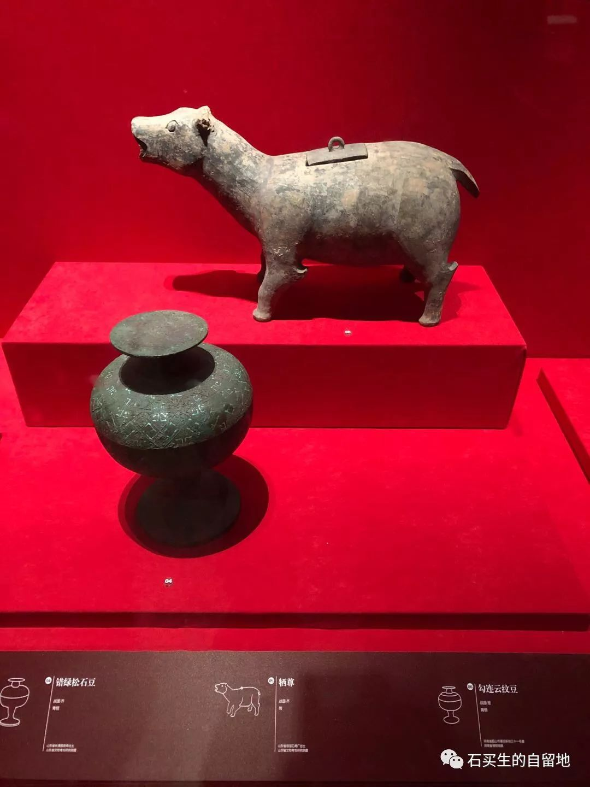
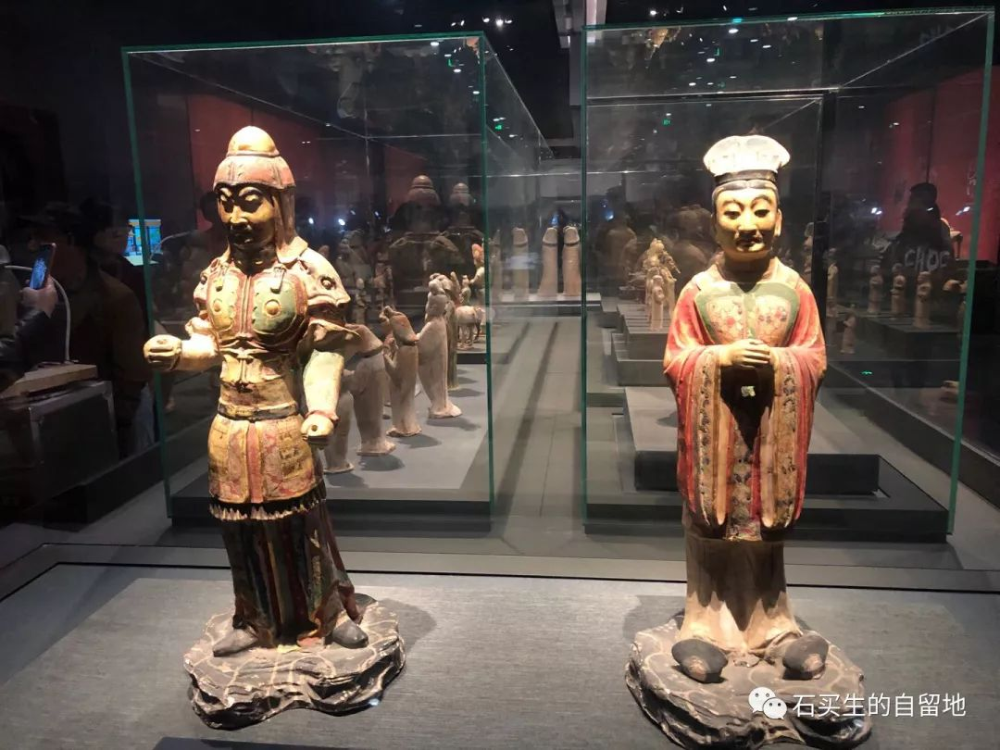
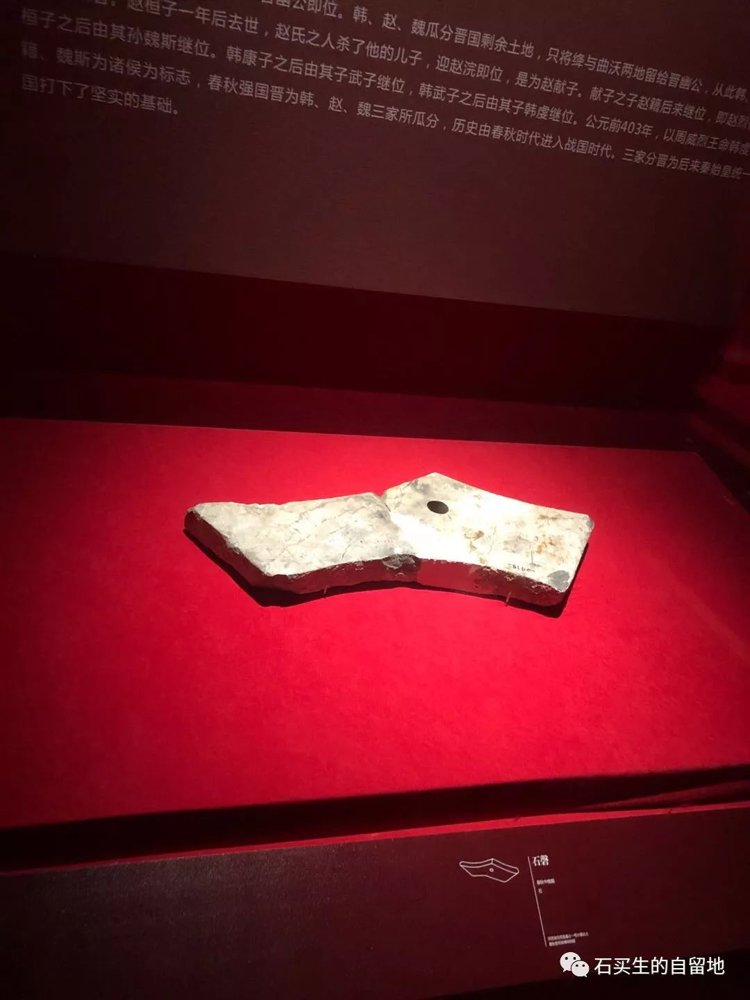

#  此岸，彼岸

原创  石买生  [ 石买生的自留地 ](javascript:void\(0\);)

__ _ _ _ _

此岸，彼岸

青春的标志

是止不住对比远方更远的迷恋

窗前的核桃树

总也变不富裕的村庄

日渐变老的父母

甚至热烈的爱情

皆可忽略

一转身沧桑中年

一切仿佛命中注定

容不得争辩

日子或黯淡或澄明

来路已断去路亦昏

得到或失去

宛若一句谶语

忠诚

叶芝在上世纪初预言

一切都四散开来再也保不住中心

现在已成真

旧的已废新的没来

你要善待每一天

不让自己对自己厌倦

不心如止水

每一次恨都清楚

每一次爱都明白

当日子和身体同时虚浮

当你不能对外界投去肯定的目光

一定要手术刀般对自己说

不

独白

哪怕只有一次

你认真打量过自己的内心吗？

没有。

为什么？

因为我怕。

怕什么？

怕它不知美丑。

怕它不明是非。

怕它黑白颠倒。

怕它丧失廉耻。

怕它麻木冷漠。

你想想，

如果我打量到我内心真实的模样，

你叫我还怎么活？

注：照片拍摄自西安博物馆、秦始皇兵马俑博物馆。

预览时标签不可点

微信扫一扫  
关注该公众号

****

****

×  分析

__

微信扫一扫可打开此内容，  
使用完整服务

：  ，  ，  ，  ，  ，  ，  ，  ，  ，  ，  ，  ，  。  视频  小程序  赞  ，轻点两下取消赞  在看  ，轻点两下取消在看
分享  留言  收藏  听过

精选留言

吴丰强来自

一定要手术刀般对自己说 不！ 喜欢这样斩截[玫瑰][玫瑰][玫瑰]

石买生的自留地来自

🤝

小彭爱上课来自

推荐老师用“一言”这个软件写诗，很有感觉

石买生的自留地来自

试试，谢谢！

