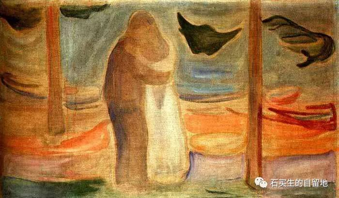
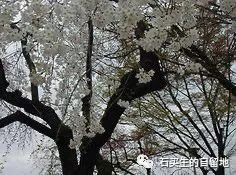

#  二月短章

原创  石买生  [ 石买生的自留地 ](javascript:void\(0\);)

__ _ _ _ _

山川异域，风月同天

疫情肆虐的日子

东瀛送来了美好的祈愿

山川异域  风月同天

这更像虔诚的祷告

你们要挺住啊

虽身处异域

我们的心与你们同在

歇斯底里往往带来恐慌

平静淡定常常制约病魔

谢谢你们

携来唐风宋韵

吾国吾土必将冬去春来

致敬白衣天使

你们是刀尖上行走的人

即使生命有危险

也不能作声

只能默默工作

默默奉献

因为忠诚

这个冬天

你们好像生活在异度空间

你们是另一个星球的人

离我们那么遥远

也有中国的索尔仁尼琴

发现危险第一个吹口哨

想警示国人

可昏聩的耳朵污你为造谣者

只有天堂为你正名

的确

一句真话比整个世界还重

你

你们

白衣天使

是我们民族的脊梁

瘟神

在硅谷

在圣塔克雷拉

我和妻儿经常在室外散步

迎面碰到

美国人印度人墨西哥人

印度人墨西哥人

看见我们

正面相看表情平静

美国人热情相迎

有时喊一句

哈喽

有时也见到中国人

我们老远就互相躲避

好像见到瘟神

尽管阳光一样灿烂

天空依然湛蓝

硅谷的樱花开了

满树淡白清香四溢

硅谷的樱花

真是报春的使者

烂漫妩媚

让大地美如斯

突然

我想起珞珈山的樱花

它们也开了吗

注：图片来自网络，图二、三是蒙克名画

预览时标签不可点

微信扫一扫  
关注该公众号

****

****

×  分析

__

微信扫一扫可打开此内容，  
使用完整服务

：  ，  ，  ，  ，  ，  ，  ，  ，  ，  ，  ，  ，  。  视频  小程序  赞  ，轻点两下取消赞  在看  ，轻点两下取消在看
分享  留言  收藏  听过

