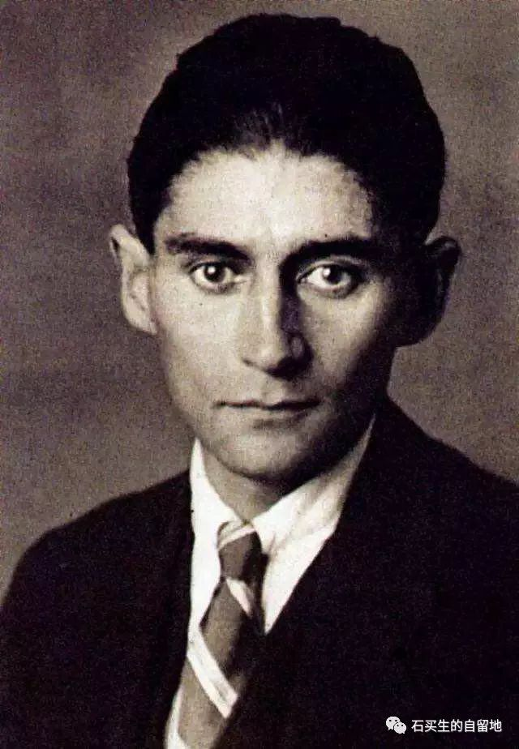
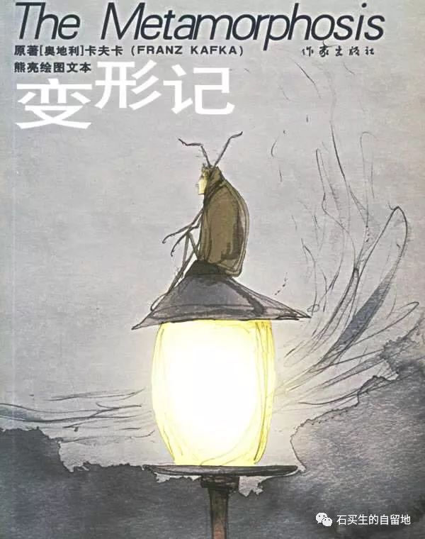

#  我怎样读卡夫卡的《变形记》？

原创  石买生  [ 石买生的自留地 ](javascript:void\(0\);)

__ _ _ _ _

导语：读一部名著有许多进入的方法。如果把一部名著比做一栋宏伟的建筑，那么从哪里进入相当关键。你可以选择从大门进入，也可以从侧门踅入，还可以凭窗观望，甚至可以通过图纸来窥视究竟。总之，途经不一，方法各异，目的只有一个，那就是通过不同途径方法，领略建筑动人景致，欣赏文字内部风景。同样，卡夫卡的《变形记》，作为一部现代小说名著，也有许多阅读方法，也可以选择从不同的途径进入，我是怎么进入，又是怎么阅读的呢？

一，读开头

《变形记》的开头已经成为经典中的经典：“一天早晨，格里高尔·萨姆沙从不安的睡梦中醒来，发现自己变成了一只巨大的甲虫。”一个好端端的人，梦醒之间，突然变成了一只巨大的甲虫，荒诞至极啊，这种荒诞来自于这个奇妙句子中的一个关键词“不安”。俗话说：日有所感，夜有所梦，正因为“不安”，所以导致变形，是什么造成不安呢？是什么导致自己不认得自己呢？这种现象也是现代艺术要回答的一种普遍现象，这种现象就是“陌生化”效应。某一天，当你对自己觉得很陌生，那么荒诞就产生了。而且细思极恐，你会觉得荒诞比庸常更真实。

这个开头因为表现了现代人生活的本质特征，所以特别牛逼，影响了一大批现代著名作家，也催生了一些奇妙开头。比如诺贝尔奖获得者哥伦比亚著名作家马尔克斯在看到《变形记》的开头时，如醍醐灌顶，高兴得跳起来，灵感迸发，写下《百年孤独》的绚丽开篇：“多年以后，奥雷连诺上校站在行刑队面前，准会想起父亲带他去参观冰块的那个遥远的下午。”既然，格里高尔能变形，那么奥雷连诺也可以生活在三维空间，总之，这个世界什么都可能发生。这也是现代小说史上有名的心有灵犀之范例。

二，读细节

好小说自然有好细节。纳博科夫说优秀读者要学会欣赏小说精彩细节。欣赏小说精彩细节就是秉烛探幽，培养独特审美眼光。那么，《变形记》有哪些动人细节呢？

细节1:甲虫形象

铁甲一样的背，穹顶似的棕色的肚子，许多弧形的硬片包围着肚子，许多条细得可怜的腿不停地舞动着。

这就是变形后的格里高尔·萨姆沙的形象，描写极度细致、极度逼真，越逼真，越显荒诞，越发引人深思，行旅推销员格里高尔是怎样变成这样一番模样的呢？小说构思绵密，金针银线，自然引出下文相关情节：工作单调辛苦，饮食低劣，缺乏友情，这也是现代人的典型生活特征，长此以往，怎么不让人产生异化，产生变形呢？卡夫卡厉害就在于他有一双犀利的眼睛，能透过庸常生活，表现现代人的本质特征和生活困境。

细节2:致命苹果

一个扔得不太用力的苹果轻轻擦过格里高尔的背， 没有带给他什么损害就飞了。可是紧跟着马上飞来了另一个，
正好打中了他的背并且还陷了进去；格里高尔掐扎着往前爬，仿佛能把这种可惊的莫名其妙的痛苦留在身后似的；可是他觉得自己好像被钉住在原处，
就六神无主地瘫倒在地上。

这一只又一只致命苹果来自格里高尔的父亲。当时格里高尔身子被玻璃碎片割破，正在化脓腐烂，他的老父亲觉得儿子越来越成为家庭负担，难以承受精神的煎熬，于是就采取这种极端方式惩罚儿子，当最后一只苹果深陷后背，维系格里高尔生命的最后一点亲情也没有了，他彻底被人世遗弃了！在这世间，他曾是尽责的职员，尽职的儿子，尽力的哥哥，可命运乖张，让他变成甲虫，现在又被家人遗弃，命悬一线，只有奄奄一息了。

此处卡夫卡用笔锋利，剜出了现代人性的残忍，应是小说的高潮部分。任何读者读到此处，都会揪心，扼腕长叹。

细节3:深情一瞥

他最后的一瞥是落在母亲身上的，她已经完全睡着了。

这是格里高尔留给人世的最后一瞥，即写出母亲的无尽疲倦，也写出来他对世间的无限眷恋，既有对母亲的不舍和哀伤，也有对母亲的深深祝福。卡夫卡看似冷峻的笔墨，实则蕴藏着无限温情，作为一个小说家，他想通过格里高尔的深情一瞥，保留对这个残酷世界的一丝希冀，一点曙光，让我们读者不要完全绝望。格里高尔1去了，千万个格里高尔2、3还要好好活着。

三，读写法

卡夫卡作为现代小说的先驱者之一，他的小说有着鲜明的风格。《变形记》作为他的代表作，其突出特点是心理描写细致入微，精彩绝伦。这种心理描写接近于戏剧中的内心独白，又近似于诗人的喃喃低语，读起来摄人心魄，文字深入骨髓。

比如：起床这么早，他想，会使人变傻的。人是需要睡觉的。

整篇小说都是类似自言自语，实则是人物意识的流动，接近于意识流小说，但又有别于意识流，因为卡夫卡在表现人物内心的深度上，在表现社会本质特征上，都能巧妙通过人物心理，表现出深刻的寓意，又是还能营造出如梦似幻的艺术氛围，让人叹为观止

预览时标签不可点

微信扫一扫  
关注该公众号

****

****

×  分析

__

微信扫一扫可打开此内容，  
使用完整服务

：  ，  ，  ，  ，  ，  ，  ，  ，  ，  ，  ，  ，  。  视频  小程序  赞  ，轻点两下取消赞  在看  ，轻点两下取消在看
分享  留言  收藏  听过

精选留言

