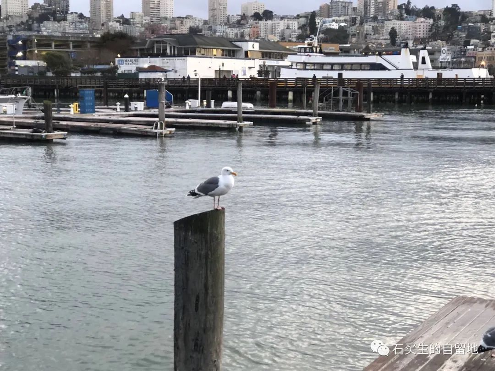
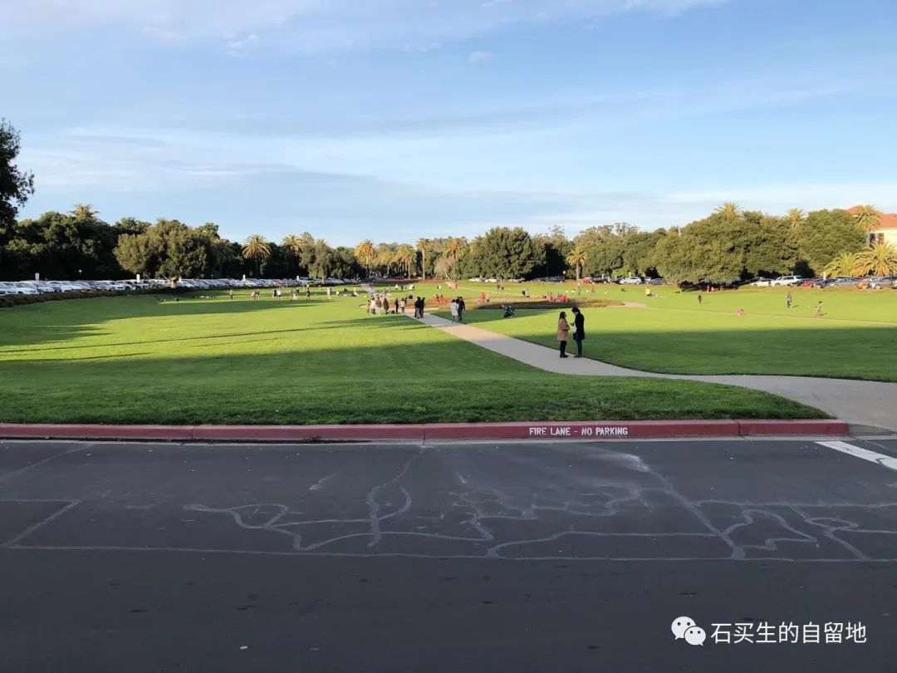
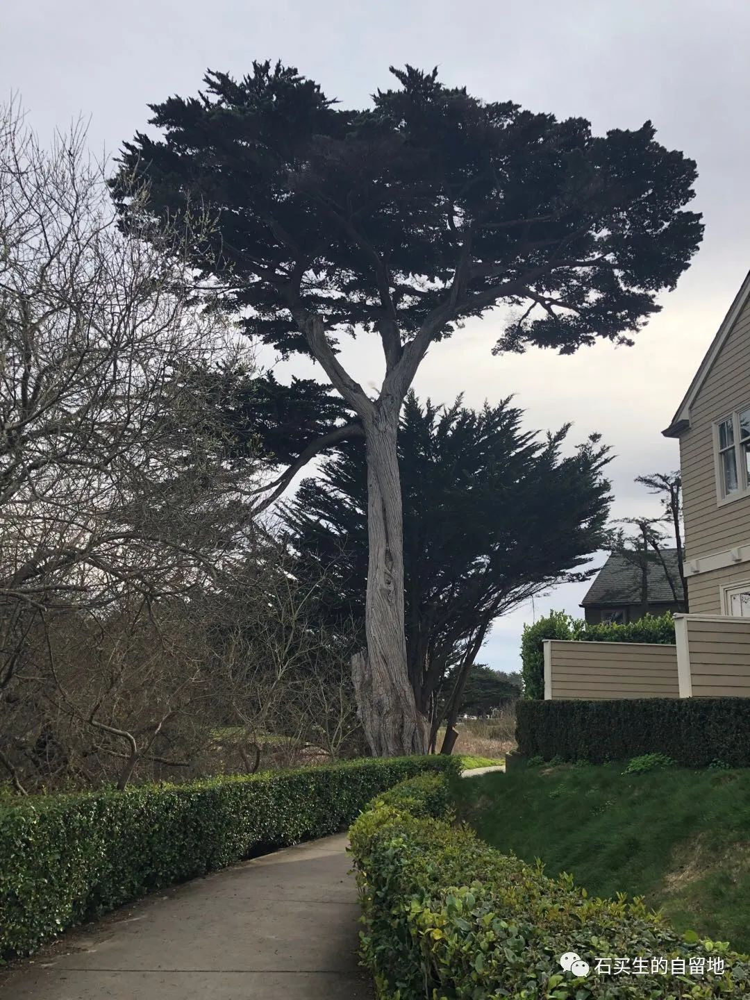
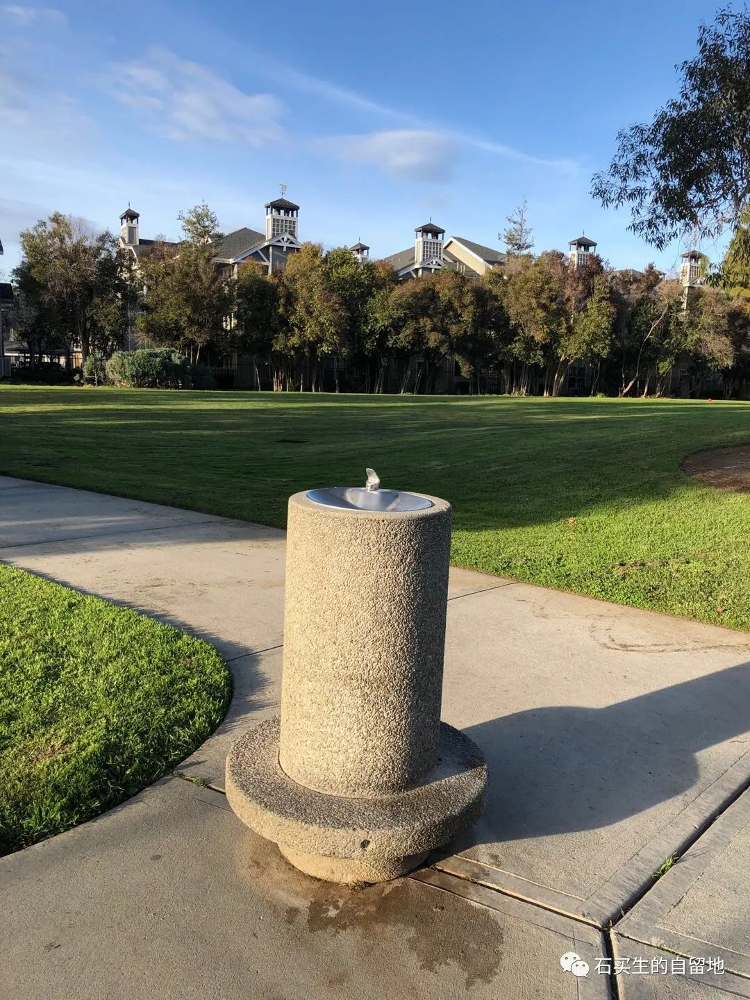
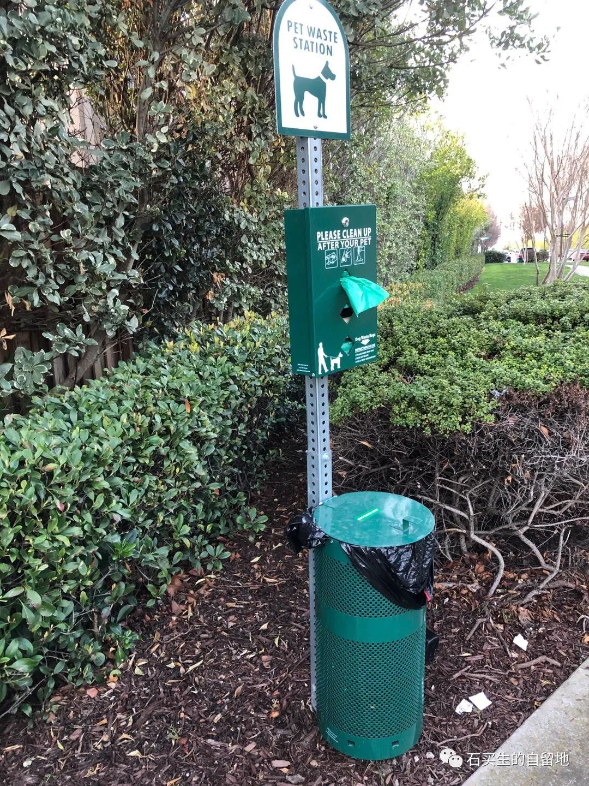
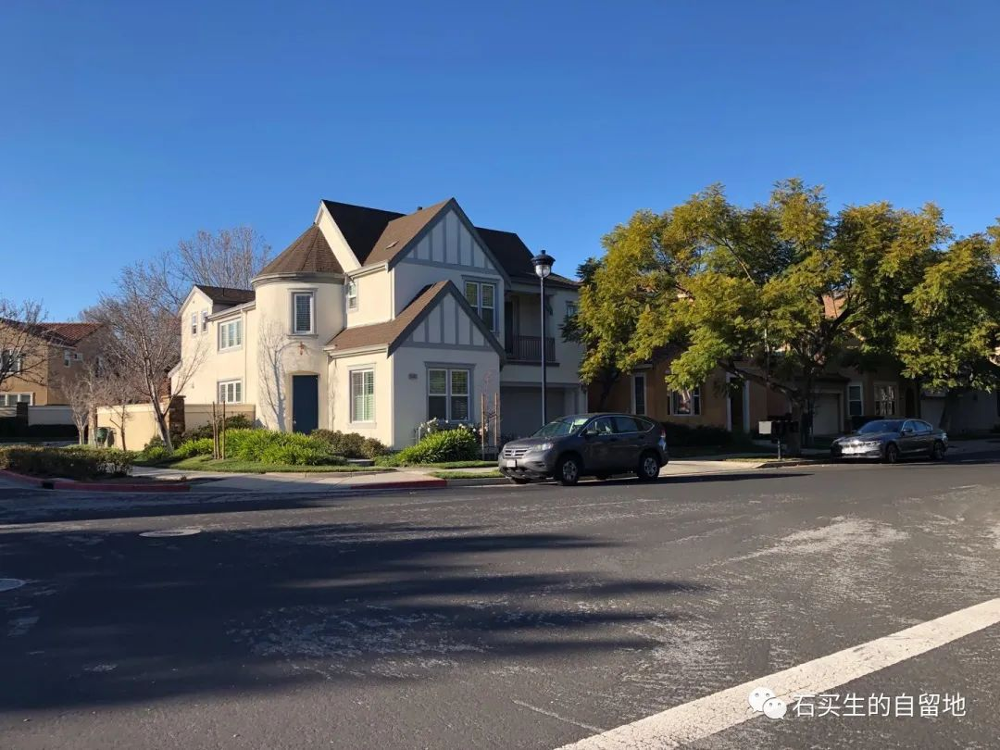
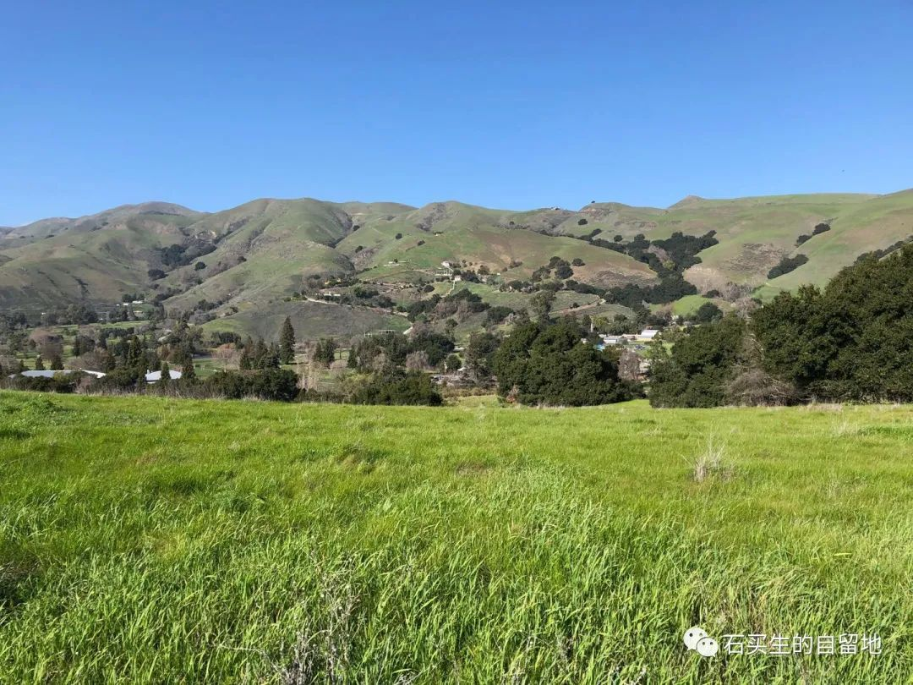

#  影像加州

原创  石买生  [ 石买生的自留地 ](javascript:void\(0\);)

__ _ _ _ _

影象加州

渔人码头

铅灰色的天幕下

海水微澜

显示虚幻的安详

不见意大利人出海打鱼了

海狮或躺或坐比贵妇还慵懒

一只鸽子立于木桩上

入定一般

羡煞我

一位流浪汉赤脚从身边走过

他肩上的吉他

胜过王洛宾的土琵琶

斯坦福草坪

天蓝

草绿

风轻

宁静

尘嚣散尽

大师隐身

谷歌总部

夜幕下竟散发阴冷的光

它的骄傲

总有人不懂

双月湾古树

一棵古树立在路口

肯定不是庐山迎客松

它站得执拗坚韧静穆比岁月更沧桑

可惜

我不知它叫什么名字

公园自饮水

天气再好

环境再清幽

你不吻她

她就孤独

老式火车

老旧

双层

哐当哐当

坐上去不是赶路

总像旅游观光

狗屎桶

商场里有狗粮

路边上有狗屎桶

他娘的

做加州的狗真幸福

民宅

小巧精致

大多两层最多三层

白墙红瓦

橘树门前橙树两边

果实满地堆积

车库并排停两辆车

驶过似水流年

加州的山

真矮

比我老家赣北的丘陵还矮

山中有农场

遍地是牛羊

丰茂的草坡

一堆一堆马粪散发特有的清香

预览时标签不可点

微信扫一扫  
关注该公众号

****

****

×  分析

__

微信扫一扫可打开此内容，  
使用完整服务

：  ，  ，  ，  ，  ，  ，  ，  ，  ，  ，  ，  ，  。  视频  小程序  赞  ，轻点两下取消赞  在看  ，轻点两下取消在看
分享  留言  收藏  听过

