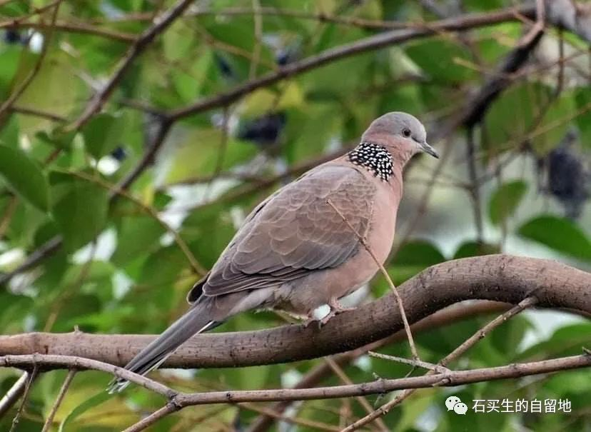
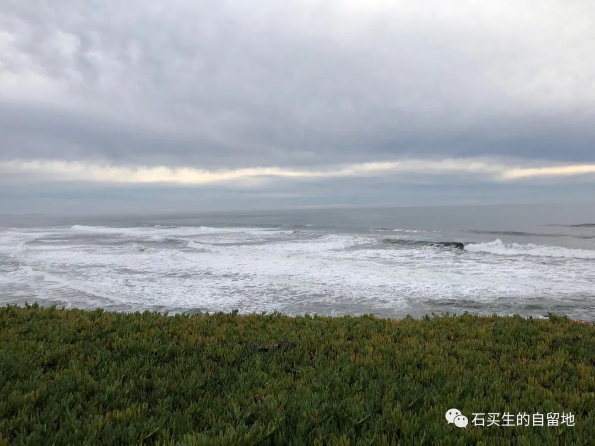
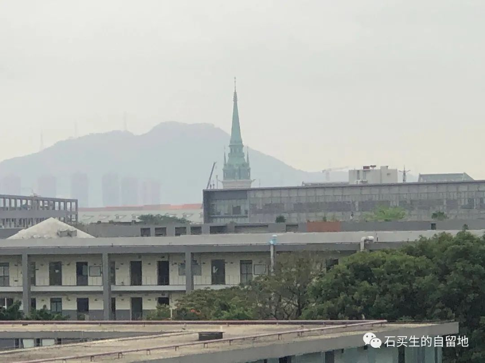

#  三月的诗

原创  石买生  [ 石买生的自留地 ](javascript:void\(0\);)

__ _ _ _ _

春翳

咕咕咕

一只斑鸠在小叶榄仁上叫

把树叶叫得一片翠绿

因为求爱

满心欢喜

它不知道校园之外

这个春天

满世界一片荒寂

与惶恐

方方

当武汉被一只神秘的手

按下了暂停键

她的心命令她开启了

武汉之声

她是中国的索尔仁尼琴

另类的爱

在加州双月湾海滩

一对金发夫妇

带一只纯白的狗在遛

我在绵软的沙滩上

享受海浪海风

突然白狗窜过来

在我面前张牙舞爪

像是跟我招呼

又像要跟我拥抱

吓得我喔喔喔

金发夫妇忙上前sorry、sorry

然后解释

小白见我太激动了

我惊魂稍定

向西望了一眼

我估摸

大洋彼岸是我的祖国胶东半岛

山东烟台

半通神

北京时间2020年元月15日

我和妻儿乘机

从广州白云机场去旧金山

北京时间2020年3月1日

我和儿子乘机

从旧金山去香港国际机场

妻子女儿女婿外孙

留在硅谷圣塔克雷拉

女婿调侃我

最危险的时候

总在最安全的地方

神了

在隔离日眺望华为欧洲小镇

由香港入深圳湾到家

自我居家隔离14天

心情抑郁

既然不能出门下地

就只好上楼顶观天

四周绿树焕然

天空白云闲散

远处华为欧洲小镇

叫心情略微澄明

疫情期读《尤利西斯》

中年油腻男布卢姆

青年屌丝斯蒂芬

一整天

在爱尔兰都柏林大街小巷闲逛

言语颠三倒四

内容情色斑斓

斯蒂芬他爹总在阴影里

布鲁姆老婆摩莉总在阳光下

斯蒂芬在寻找虚无

布鲁姆在醉生梦死

人类精神错乱史

竟深入骨髓

詹姆斯·乔伊斯

这狗娘养的

注：图片1、4来自网络，2、3来自自拍

预览时标签不可点

微信扫一扫  
关注该公众号

****

****

×  分析

__

微信扫一扫可打开此内容，  
使用完整服务

：  ，  ，  ，  ，  ，  ，  ，  ，  ，  ，  ，  ，  。  视频  小程序  赞  ，轻点两下取消赞  在看  ，轻点两下取消在看
分享  留言  收藏  听过

精选留言

Bill来自

方方所谓的“日记”已经被翻译成英语德语等在国外出版了

石买生的自留地来自

你怎么看她的日记在国外出版？[微笑]

🌟星🌟来自

给方方的评价挺高，但她存在很大的争议  [偷笑]

石买生的自留地来自

应该的

