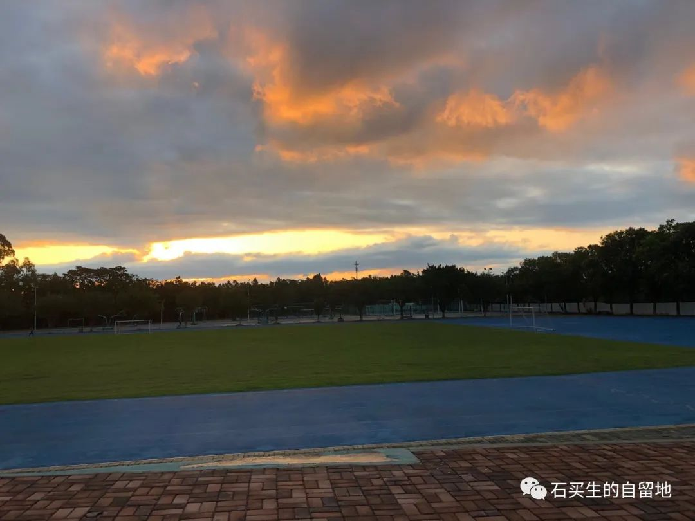
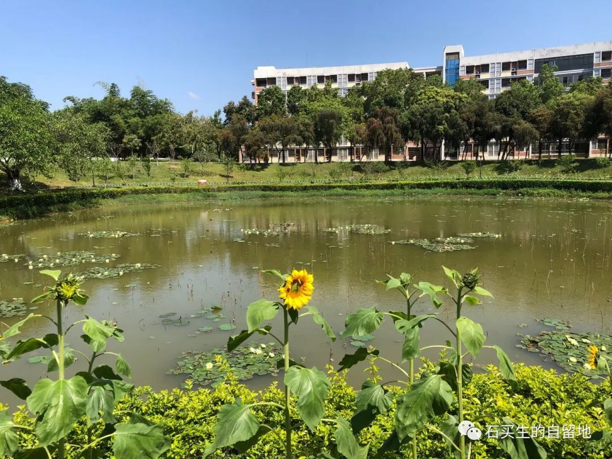

#  真的，我多么希望这个春天好像没有来过

原创  石买生  [ 石买生的自留地 ](javascript:void\(0\);)

__ _ _ _ _

真的，我多么希望这个春天好像没有来过

不是敌人也要躲闪

是亲人也不便见面

地上充满隐患

干脆上楼顶

看天看鸟看池塘里的鱼

看山坡上的荔枝树

只顾开花

忙于凋谢

只结很少的果

每日暮色降临

当夜鸟在门前理工池塘苇草丛中

开始过恩爱的夫妻生活

你眼中没有星斗

更少温馨

你蜷缩在被子里

像童年一只充满恐惧的茧

清明

我在异乡一僻静处

烧纸

供上花生面包饭肉

我弯下身

想和亲人低语

一辆摩托嘟嘟嘟过来了

两个巡警戴着口罩

朝我瞪两双白眼

我和亲人

都惊出一身冷汗

我同时爱上旭日和黄昏

为了消除和世界的紧张关系

我每日在霞光中疾走

我无视旭日的明媚和落日的温柔

白云和百花

他娘的我觉得一点也不美

我只觉得背后有一根无形的鞭子

正在把我驱赶

我手里也有一根鞭子

我正在驱赶春天

我的爱如此野蛮残暴

又绝望

预览时标签不可点

微信扫一扫  
关注该公众号

****

****

×  分析

__

微信扫一扫可打开此内容，  
使用完整服务

：  ，  ，  ，  ，  ，  ，  ，  ，  ，  ，  ，  ，  。  视频  小程序  赞  ，轻点两下取消赞  在看  ，轻点两下取消在看
分享  留言  收藏  听过

