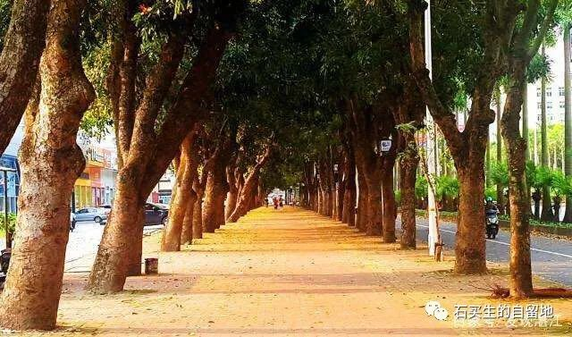

#  幽暗的火

原创  石买生  [ 石买生的自留地 ](javascript:void\(0\);)

__ _ _ _ _

幽暗的火

来自纳博科夫的眸子

来自松毛

来自干柴

来自黑木炭

来自一场大雪

来自百年老屋的袅袅炊烟

祖母的拨火棍

让冬天不再寒凉

老鼠入洞了

穿红夹袄的姑娘快来了

明瓦照着我

瘦猴一样蹲着

看祖母变老

看火变暗

变成一层一层灰衣裳

或轻颺

或寂灭

童年结束了

你不知道哪片叶子写满谎言

每天晨练

清洁阿姨总笑脸相迎

说我最近胖了起码增了十斤

我对她强作欢颜

满肚子苦情

其实年后我瘦了两斤

我每日经过的桃花心木可以作证

它每一片叶子油光闪闪

在风中猎猎作响

好像每一片都在赞美春天

可第二天地上枯黄一片

像童年的鸡毛信

你不知道哪一片叶子写满谎言

再次见到清洁阿姨

我彻底把她原谅

因为

这个春天

万物都在言不由衷

天使之吻

外孙刘其乐100天了

正在尝试吃苹果

小嘴张开

唇碰

舌舔

手脚并动

好像在合奏

一曲纯洁的音乐

他清亮的眸子告诉我

在加州

他的春天在另一维度

预览时标签不可点

微信扫一扫  
关注该公众号

****

****

×  分析

__

微信扫一扫可打开此内容，  
使用完整服务

：  ，  ，  ，  ，  ，  ，  ，  ，  ，  ，  ，  ，  。  视频  小程序  赞  ，轻点两下取消赞  在看  ，轻点两下取消在看
分享  留言  收藏  听过

精选留言

吴丰强来自

看到其乐，看到春天！祝福其乐！[玫瑰][玫瑰][玫瑰]

石买生的自留地来自

[咖啡]

Аврора来自

老师你接不接受图片投稿[旺柴]

