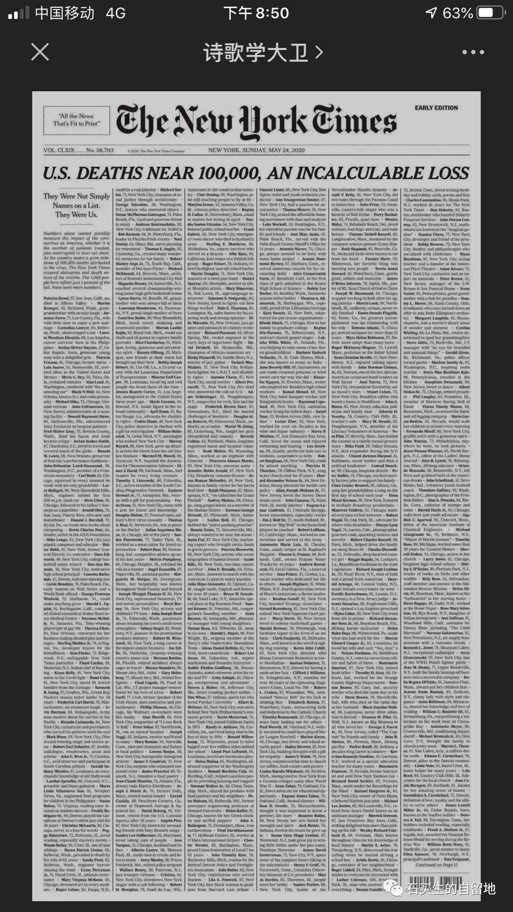
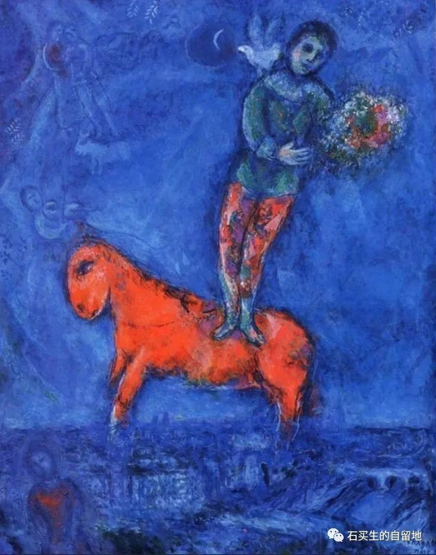
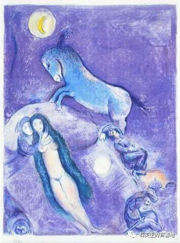

#  五月的诗

原创  石买生  [ 石买生的自留地 ](javascript:void\(0\);)

__ _ _ _ _

这些报人恪守良知心怀悲悯

2020年5月23日

《纽约时报》头版整版

刊登了1000名死者的姓名年龄职业

后面一行小字说明

不久前他们也是我们

没有插图点缀

更没有广告来镶边

亡灵出奇干净肃穆安详

哀悼如此纯洁真诚无声

这些报人恪守良知心怀悲悯

不速之客激起我心中的仁慈

嘭嘭 砰砰 蓬蓬

一只黄褐色的马蜂不停往玻璃上撞

一下一下又一下不知疲倦

窗外明明是小叶榄仁和更广大的天空呀

嘭嘭嘭我要出去我要出去

你是怎么进来的呀我的宝贝

你的家应该在田野森林你该是护花使者

不速之客突然无声不见踪影

我四处搜寻焦急又失望

蹑手蹑脚悄悄打开了一扇纱窗

一枚后疫情时代网虫的独白

我是后疫情时代一枚网虫

整天空虚无聊有时还夹着点恐惧

我沉迷网络被口水淹没不自知

在微信游弋左一口苍蝇有一口老鼠屎

竟吃得我津津有味我知道口味坏了

没法子啦饥饿饱食都容易把胃口弄坏

就像大跃进吃观音土米糠拉不出屎

我老娘照样大口大口吃直至吃成了胃癌

我是啥都有的吃早已食不知味

昏昏然不晓情不明理也不辨南北东西

注：插图来自网络，第一幅《纽约时报》，其余是夏加尔的名画。

预览时标签不可点

微信扫一扫  
关注该公众号

****

****

×  分析

__

微信扫一扫可打开此内容，  
使用完整服务

：  ，  ，  ，  ，  ，  ，  ，  ，  ，  ，  ，  ，  。  视频  小程序  赞  ，轻点两下取消赞  在看  ，轻点两下取消在看
分享  留言  收藏  听过

精选留言

