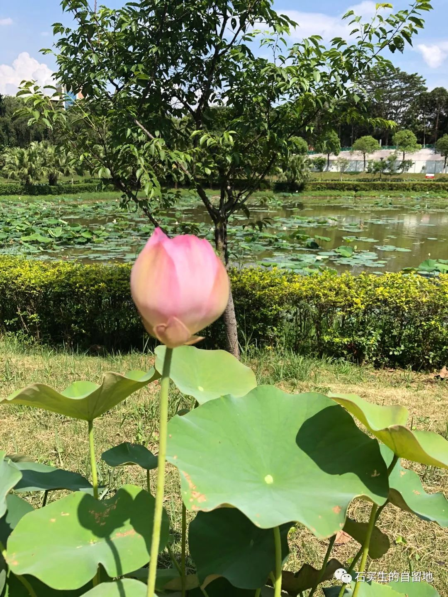
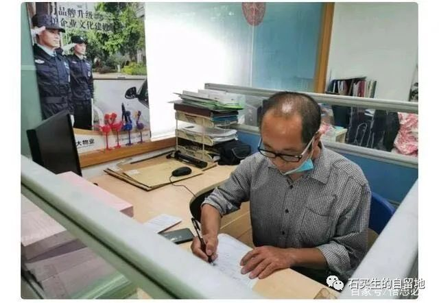

#  十四行诗

原创  石买生  [ 石买生的自留地 ](javascript:void\(0\);)

__ _ _ _ _

悲伤十四行

从微信群看到大学同学德乾发的一个讣告

说是永修的刘芳明因病去世了

他是这几年我大学同学走的第二个

看着讣告我陷入沉默

我见他最后一眼是在2014年国庆

在柘林湖参加毕业30周年同学聚会

他面色黝黑说话慢吞吞声音低沉

不像昔日气压凌霄声如洪钟

我对他的印象定格在激情燃烧的80年代

那时他健硕如一头西班牙公牛

运动场他挥汗如雨雄姿勃发

他赭红的脸胡子拉碴青春洋溢

现在他走了三里街上空啊从此少了一片云

白水湖畔啊从此喑哑了一缕风

悲悯十四行

最近全民都在消费高考冒名顶替者

光荣的90年代啊我看见一个又一个

一个又一个农村女孩从孔孟之乡走失

我把她们看作我的妹妹或侄女

看见她们粗黑的脸我的气愤多于泪水

我知道更多的人想知道黑幕这是对的

这样的时刻上帝和我们站在一起

前天全民又在消费一个农民工读者

他因在东莞图书馆一张留言风靡各大媒体

论年纪他是我弟弟却比我哥哥还苍老

他拿笔时的专注样子真美他想多读书

是想更好养活一家老小没有更高尚的目的

他被曝光肯定身不由己他已看见天堂模样

我看着他亲切博尔赫斯肯定也把他看作兄弟

预览时标签不可点

微信扫一扫  
关注该公众号

****

****

×  分析

__

微信扫一扫可打开此内容，  
使用完整服务

：  ，  ，  ，  ，  ，  ，  ，  ，  ，  ，  ，  ，  。  视频  小程序  赞  ，轻点两下取消赞  在看  ，轻点两下取消在看
分享  留言  收藏  听过

精选留言

wxy来自

我来看啦。（本人真的不想写读后感）

吴丰强来自

为芳明一恸！

select *来自

去东莞图书馆的那位兄弟估计以后去看书都不自在了

Mer_来自

喜欢最后一句[玫瑰]

