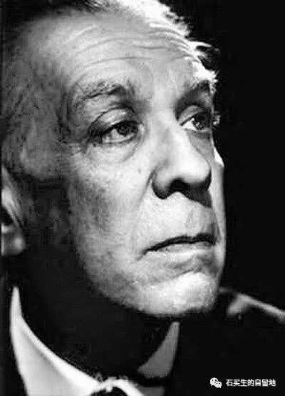

#  博尔赫斯和我与我与博尔赫斯

博尔赫斯  [ 石买生的自留地 ](javascript:void\(0\);)

__ _ _ _ _

博尔赫斯是一个能把灵与肉分开的人，他既看见了天堂的模样，也把梦看做古老的美学活动。我爱这个阿根廷老人，尤其钟爱他的小诗，短文和小说。今天，分享他一篇短文和一首小诗。另录一首小诗以示敬意。

文/豪尔赫·路易斯·博尔赫斯

博尔赫斯和我

事情发生在另外那个人身上，他名叫博尔赫斯。

我走在布宜诺斯艾利斯街头，现在或许正不由自主地驻足片刻，欣赏门廊的起拱或大门上的花格。我是在邮件中得知博尔赫斯，是在教授名单或人名辞典上看到他的名字的。

我喜欢沙漏、地图、18世纪排版术、咖啡的味道、史蒂芬森的文章；他也有这些爱好，不过只是徒劳地把它们变成了表演。

说我们是一对冤家或许有些夸张。我活着，让自己继续活下去，这样博尔赫斯就能构思他的文学，而这些文学又为我的存在“提供了理由”（justify）。

承认他也写了几页有意义的文字，这对我来说不费吹灰之力，不过这些文字拯救不了我，也许是因为其中好的东西不属于任何人，甚至也不属于他，而是属于语言和传统。此外，我注定终将消逝，只有我的某些瞬间能在他身上幸存。我一点点地把什么都给了他，虽然我充分意识到他有弄虚作假和夸大其词的坏习惯。

斯宾诺莎知道，万物都渴望依其所是而持存：石头永远想是石头，老虎也永远想是老虎。我将留存在博尔赫斯身上，而不是我自己身上（如果我真的是什么人的话）。不过比起在他的书里，我却是在很多别人的书中或是费力的吉他弹奏声里，更能认出自己。

几年前，我试图摆脱他，我从乡野神话转向时间与无限的游戏，但这些游戏现在属于博尔赫斯了，我不得不去想象些别的东西。就这样，我的人生就像一次逃亡，我失去了一切，一切都将归于湮灭，或归于他。  
我不知道是我还是博尔赫斯写下了这页文字。

一个盲人

文/豪尔赫·路易斯·博尔赫斯

译/阿丁

我不知道究竟是哪张脸在看着我

当我望着镜子里的那张脸庞

我不知道是什么老人匿伏于映像

怀揣着无声且已疲惫的怒火

阴影里我缓慢地用手探索

我看不见的轮廓。一道闪光

在眼前掠过，隐约中我看见

你头发灰白或依旧金黄

我反复说自己失去的只是

事物虚幻的外表而已

此慰藉出自弥尔顿，颇为勇敢

可我却想到文字和玫瑰

我想倘若我能看见自己的脸

在这奇特的午后就能知道我是谁

我与博尔赫斯

多么幸运，我青年时代就被一道强烈的闪电击中

这闪电来自一个盲人来自遥远的阿根廷

落日、镜子、迷宫、老虎、孤独、梦幻、匕首

这些毫不相干的事物构成布宜诺斯艾利斯的激情

我的心激荡如大海的潮汐奔腾不止

我爱、我想、我要到外面的大世界里去闯

一个老男人仿佛苍穹的一声召唤

一个瘦小的青年从此在大地上跌跌撞撞

我的寻找既像一个古老的游戏，又像一个休止符

这中间隔着近三十年暧昧游弋的时光

我一直怕碰触心中的神明而今沧海尚未变桑田

他那双犹疑的手还在和自己再见吗

只有时听见雨中庭院里葡萄架下传来他没死的父亲的声音

才觉出在异乡发如霜血已冷心如灰身子骨散发中年的悲凉

预览时标签不可点

微信扫一扫  
关注该公众号

****

****

×  分析

__

微信扫一扫可打开此内容，  
使用完整服务

：  ，  ，  ，  ，  ，  ，  ，  ，  ，  ，  ，  ，  。  视频  小程序  赞  ，轻点两下取消赞  在看  ，轻点两下取消在看
分享  留言  收藏  听过

精选留言

秀波来自

流着泪的您的脸[偷笑]

石买生的自留地来自

[咖啡]

Qcxx.来自

最近也在读他的诗歌，很喜欢《英文诗两首：我用什么才能留住你》、《晨曦》和《我的一生》

石买生的自留地来自

[握手][咖啡]

