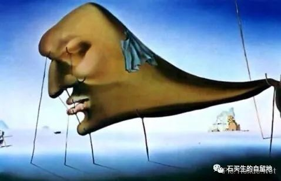
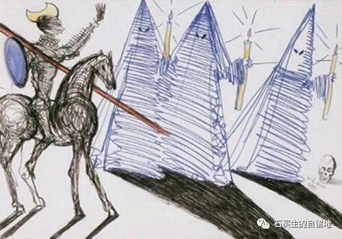
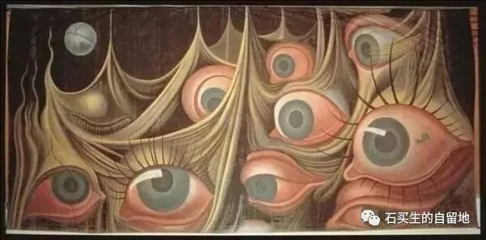
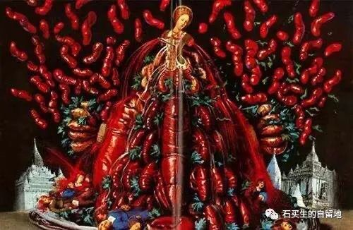

#  不同的命，相似的人

原创  石买生  [ 石买生的自留地 ](javascript:void\(0\);)

__ _ _ _ _

不同的命，相似的人（组诗）

在南方

总有鸟喜欢把巢筑于树杪上

总有鸟天性就喜欢裸露着身子

一边哺育孩子

一边沐浴天光

夏天有数不完的绿呀

还有安恬与慵懒

惩罚没有理由

就不给你冬天

四季暧昧正好

喝茶健身打发流年

好日子都是假象

桃花心木在掉蓝色果子了

成熟等于衰老

没有疼痛生命停滞了

桂花有的开得晚

有的开得早

跟你一样闲散

世界本来参差多态

你再努力又能怎样

不同的命，相似的人

他们，我们

脚总喜欢走直路

有时爬也是

眼睛总是睁着

耳朵闭着

对的事和不对的人

岔路和黑和白

农夫和蛇

分不清

喜欢歇斯底里

盲目又自卑

自闭又警醒

愚蠢还不自知

一辈子假忠诚

把心献给了虚妄

爱财而无道

远离日月星辰

假期

因为新冠

今年暑假特别短

短到甚至来不及惊喜或哀叹

反正假期也就那样也不是什么好日子

再说那么多好日子不也被你虚度了你不也好好的么

你好好的就不要矫情日子有时充实反而显得空虚喧闹中有说不出的孤独

往后的好日子多了去啦就像那未出鞘的宝剑隐忍中闪着寒光做绮丽的梦梦中有无限可能

港珠澳大桥

有一段

从海底穿过

它改变了

海鱼的生活

爱因斯坦

证明时间转弯了吗

我看见窗前小叶榄仁绿色的血

流得更欢快了

自然之道

尼采在照镜子

杜尚在穿女衣

卢梭在撰写做小偷段子

哥仨怎么显摆

都比不上一只麻雀咭咭咭

在银座

在东京最繁华的商业街

银座

我买了一只拉杆箱

银黑的

它对街旁一棵树

含情默默

它们想念海

一场雨把街道洗得清亮

我一阵晕眩

不知所往

不知所终

薰衣草

八木崎公园的草真绿

云也干净

妻子正用手

跟一个日本年轻女子比划

她买香水

她笑

像

乱打节拍的人

我们生性胆小怯懦怕死

我们做事盲目

还喜欢抽风

我们的舞步凌乱

总有人在一旁瞎鼓掌

乱打节拍

高度亢奋

搞得我们情迷意乱

不能自已的人

最容易把自己感动

其实日子如常

人一点未变

不必感恩

我们只是把日子平淡过了

白天没有对我们好一点

晚上没有对我们坏一点

彩虹

最近东莞的天空充满伪装

一边出太阳

一边下小雨

一边现迷你彩虹

或早或晚

或东南或西天

或单环或双环

美得不容争辩

它取消了童年

清贫和故乡

鄱阳湖的水位啊

超过了1998年

诺亚和乡亲

不在一条船上

彩虹你给这个夏天

涂上什么颜色

预览时标签不可点

微信扫一扫  
关注该公众号

****

****

×  分析

__

微信扫一扫可打开此内容，  
使用完整服务

：  ，  ，  ，  ，  ，  ，  ，  ，  ，  ，  ，  ，  。  视频  小程序  赞  ，轻点两下取消赞  在看  ，轻点两下取消在看
分享  留言  收藏  听过

