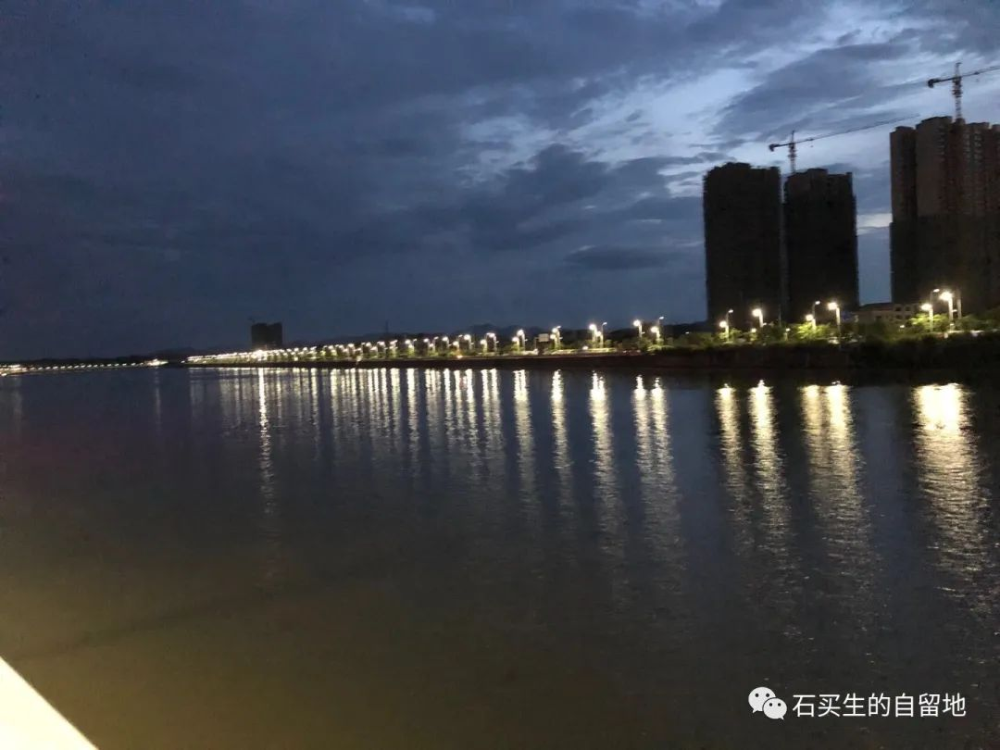
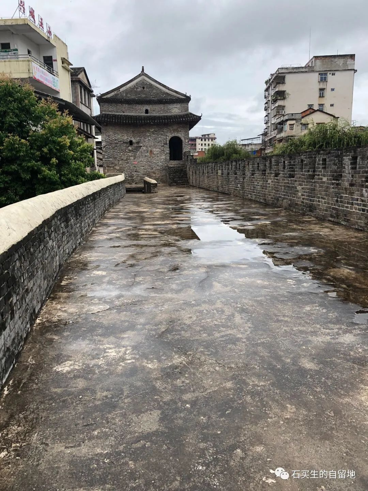
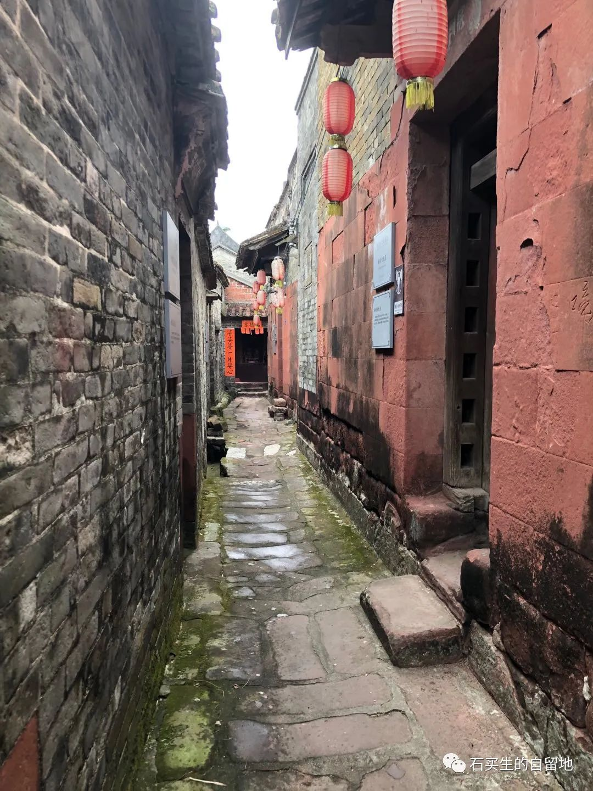

#  琴江怎样成了人间星河

原创  石买生  [ 石买生的自留地 ](javascript:void\(0\);)

__ _ _ _ _

梅州五华琴江夜景

琴江怎样成了人间星河

这么多星子整齐坠落

水面璀璨

夜空才镶有那么多黛绿的宝石

琴江其实是梅州五华一条河

它的夜色美如斯

不是因为穷

而是因为来自江西湖南河南

等各地那么多的打工者

携来粗线条的梦

我大妹夫一家六口

三个泥瓦匠

来五华八年了

他们一家子念琴江

跟念赣江鄱阳湖一样顺口

艰辛之年他们找到了第二故乡

梅州兴宁古城墙

在梅州兴宁看一段古城墙

穿过一条青石板老街

看见许多杂货铺

细雨中许多卖菜小贩

正热情招呼顾客

兴宁给人的印象很古雅

城东北角一段古城墙

让时光倒流

褐色的墙砖斑驳欲语

它身上印有明代马蹄

骑楼间箭簇喑哑

古柳相伴

翘起的屋檐曾挂起一轮残月

三个女子在骑楼围坐

他们一边折金元宝一边闲聊

在逸来的市声里

她们多像姑娘媳妇婆婆

东莞茶山南社古村一景

历史的跫音

在东莞茶山南社古村

我看见许多红石砌成的房子

一栋接一栋

墙脚爬满浅绿的青苔

走在青石铺就的小巷

九位进士牌位渐次映入眼帘

有书香在村巷氤氲

有灵秀在水塘和古树间绵延

在土地庙如果遇见老者

在村拐角如果看见善犬

在水井处如果遇见村姑

我就想是否回到韩婆庄

预览时标签不可点

微信扫一扫  
关注该公众号

****

****

×  分析

__

微信扫一扫可打开此内容，  
使用完整服务

：  ，  ，  ，  ，  ，  ，  ，  ，  ，  ，  ，  ，  。  视频  小程序  赞  ，轻点两下取消赞  在看  ，轻点两下取消在看
分享  留言  收藏  听过

精选留言

吴丰强来自

老石暑假走了不少地方啊，诗看得亲

石买生的自留地来自

两个地方而已[微笑]

Duan先森来自

石老师，梅州应该算广东最穷的三个地级市之一。[微笑][微笑][微笑]

石买生的自留地来自

哦，知道了[握手]

