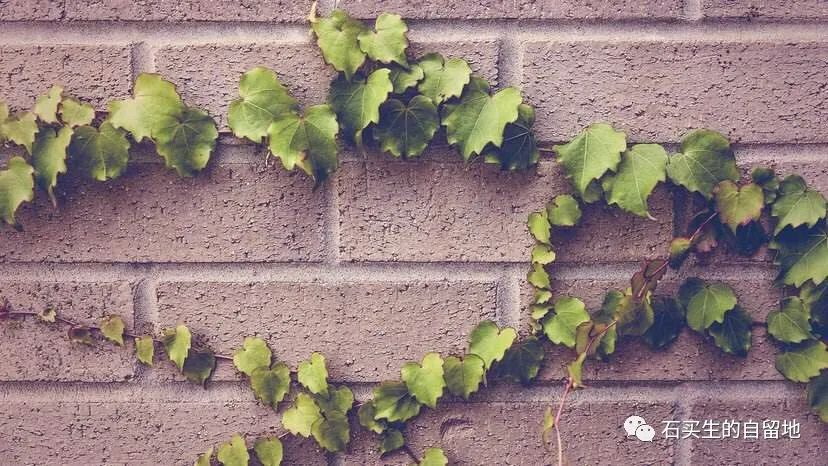

#  亲爱的没有自己

原创  石买生  [ 石买生的自留地 ](javascript:void\(0\);)

__ _ _ _ _

爬山虎

最爱的季节是秋天。

骀荡一晚，梦就由青绿转为深黛。

一个孤独的中年男子从天桥底下经过，

目光触碰藤蔓低头沉思。

千年也许只是一瞬。

在浔阳，白居易的骚是出了名的。

江水不见得比枫叶更易逝。

更早一点，陶潜在东篱饮酒赋诗梦死醉生。

绿青苔缝隙一只壁虎静卧着闭目养神，

它不知道许多实体店已经关门。

男人和女人开始轻度狂躁，

似乎只有不道德才能让生活柳暗花明。

亲爱的没有自己

我正在看青春偶像剧

《亲爱的自己》

男女主角不管脸蛋多漂亮

活着都挺艰难

有的甚至活得很挣扎乃至灵魂撕裂

这很好

尽管生活有时不是这样子的

凭着青春的激情

你们可以热情洋溢

甚至可以张开双臂拥抱世界

甚至可以矫情地呼喊

亲爱的我爱你

但是你你们要有思想准备

热血冷却之后

你拥抱的也许只有空气

你们得到的回声也许只有空虚

注：图片来自网络

预览时标签不可点

微信扫一扫  
关注该公众号

****

****

×  分析

__

微信扫一扫可打开此内容，  
使用完整服务

：  ，  ，  ，  ，  ，  ，  ，  ，  ，  ，  ，  ，  。  视频  小程序  赞  ，轻点两下取消赞  在看  ，轻点两下取消在看
分享  留言  收藏  听过

精选留言

Fernando来自

石老师看比赛了吗，火箭1：4湖人惨遭淘汰。这一年发生了太多事，时过境迁，不甚感叹，怀念和石老师在学校一起支持火箭队的日子，现在只剩下唏嘘

石买生的自留地来自

看了，郁闷死了[发呆][色][得意][发怒][尴尬][抓狂][抓狂]

DDDanie!来自

毕业几年后觉得， 人们相识交往的纽带， 被束缚在经济编织的意义之中。 羡慕像电视剧里可以毫无顾忌得表达情感， 而现实中的表达还需要一番勇气和气量。
曾经可以任意由发散的荷尔蒙去感受世界， 如今要学着使用价值和成本去思量事物。 前段时间知晓了人类学家项飙先生说的这么一个概念——“附近的消失”。
我大意理解为，网络时代是更容易把自己圈养在个人相熟的圈子里。 人们的对话主题常被丢在两个孤立的点，自己家里头与世界发生的事情，对这两者态度是最便捷获取的。
而对两者中间的附近事物的认识却在逐渐消失，因为人们参与到经济生产之外的活动在逐步减少。
并非是大家对此没有感受，而是缺乏以文字作为落脚点来系统描述出来的机会。 所以我尝试着写作，而且要长期写作。 想要在写作中获得面对环境的勇气，
想要在写作中表达自己情感和逻辑， 更想在写作中来促进阅读，寻求更多的知识。 很是惭愧，高中时期未能很好地遵循石老师的教诲，
但好在为时不晚，希望能通过付诸于实践来重新学好语文，即便最后是空虚，我也有勇气面对。

石买生的自留地来自

大赞，哪位弟子？热爱文字、你将拥有诗意的生活！[玫瑰]

DDDanie!来自

谢谢石老师的祝福～实在是久疏问候，我是当年玉兰13班的学生，还祝石老师健康如意[玫瑰]

石买生的自留地来自

没关系呀，哪位弟子？[呲牙]

DDDanie!来自

我是邓瑞涛，不知道老师还记不记得😂

石买生的自留地来自

有点印象，白净、瘦弱。

DDDanie!来自

哈哈哈，实在是受宠若惊，毕业多年仍需老师多多指教，假如有机会要回松湖探望老师。[玫瑰][玫瑰][玫瑰]

石买生的自留地来自

欢迎常回母校看看

