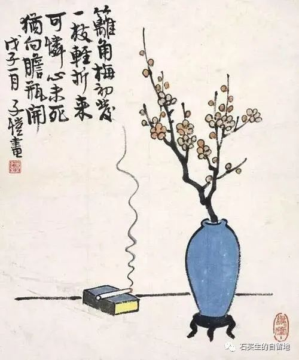
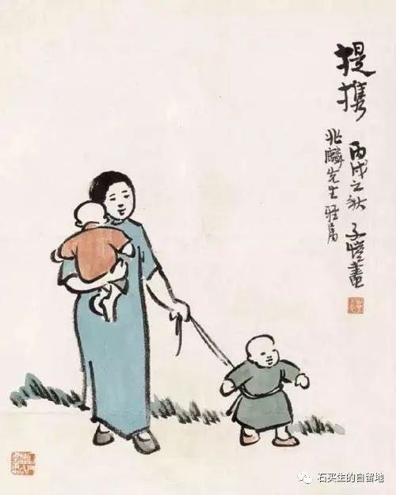
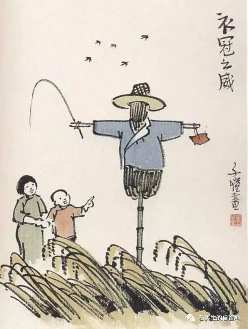

#  烛光

原创  石买生  [ 石买生的自留地 ](javascript:void\(0\);)

__ _ _ _ _

再见啦

在农村作为农民

哪怕再近视再老花

也不戴眼镜

这不

这次在雨雾中

桃生叔开着四轮车嘟嘟嘟

在马路转弯处

隔着雨帘

把迎面而来的老姐

给撞死了

都60好几的人了

老姐弟俩

甚至没有看见一道闪电

就这样不打招呼

再见啦

烛光

你在暗夜燃起一只烛

柔和之光摇曳

亲吻了一群盲者

绝望加深了

世界一片寒凉

你目光清澈

守候在夜的边缘

烛光渐冷

哀伤

让你一点一点致盲

代沟

我父母是老实巴交的农民

典型的30后

生前最大理想

是解决温饱子女活得好

我是典型的60后

一辈子吃皇粮

日子早已达到小康

子女衣食无忧

每日清晨在操场散步

看见东方霞光万道

白云自在游弋

他娘的

我眼里竟莫名充满忧郁

稻草人

兀立田间

一脸严肃肯定是假装的

嘴边的胡须样的白色飘带

也是假的

可这假模假样也厉害呀

不知吓坏了多少麻雀

和不知名的鸟儿

童年

我孤陋寡闻

他是我心中的教授

我常在他身边瞎转

等待风来提问

注：图片来自网络丰子恺名画

预览时标签不可点

微信扫一扫  
关注该公众号

****

****

×  分析

__

微信扫一扫可打开此内容，  
使用完整服务

：  ，  ，  ，  ，  ，  ，  ，  ，  ，  ，  ，  ，  。  视频  小程序  赞  ，轻点两下取消赞  在看  ，轻点两下取消在看
分享  留言  收藏  听过

