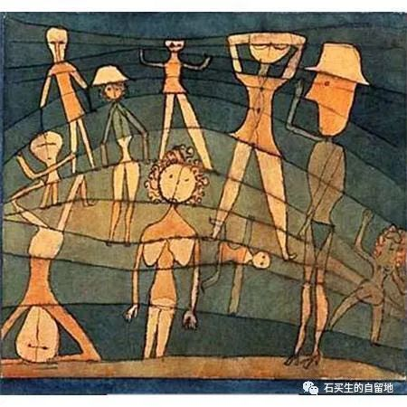
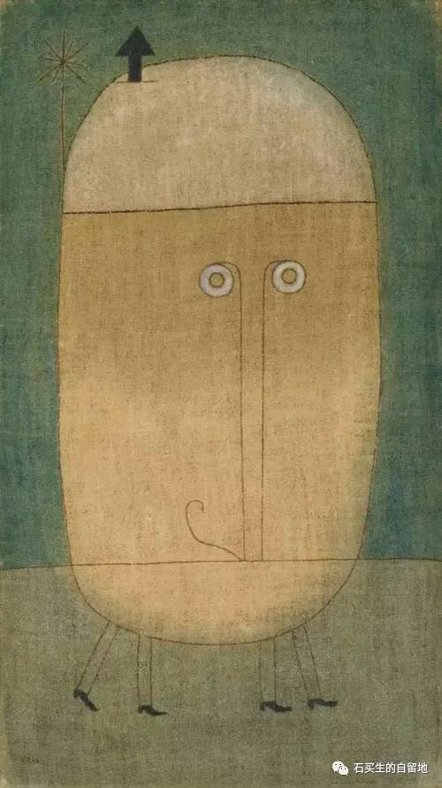
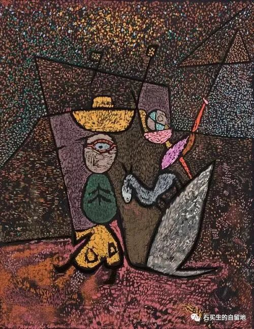
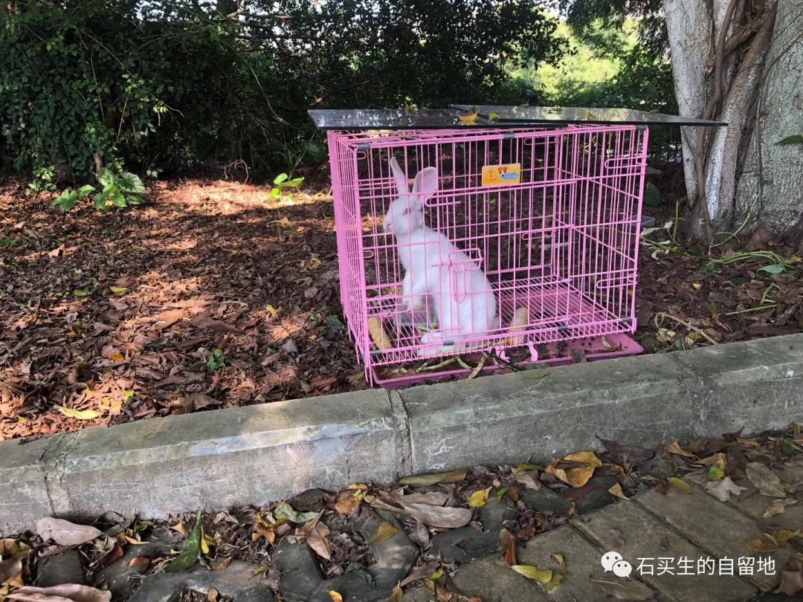

#  哎哟喂

原创  石买生  [ 石买生的自留地 ](javascript:void\(0\);)

__ _ _ _ _

保罗·克利名画

哎哟喂

国庆之夜

到处都听见熟悉的旋律

在梦中我也热血沸腾

撅起嘴正想来一曲

歌唱祖国

却看见

几个面色狐疑家伙

拿着喇叭筒

在宣传作鼓动

貌似在打鸡血搞传销

我突然高喊一句

哎哟喂

结果把自己笑醒了

保罗·克利名画

对对联

双节之夜

万民同欢

老L却不合时宜

仰望明月一脸深沉

在自家庭院

吟一句

旧江山浑是新愁

见老L心思满腹

我邪魅一笑

对一句

新酒肆皆有陈酿

保罗·克利名画

又一个亏欠

像10年前那么多

各种忽略一样

中秋晚上

我又忘了呈给母亲一块月饼

母亲在黑镜框里看着我

一脸慈祥

她又在担心

我头顶白发增多了

2008年冬

她来东莞小住

每天黄昏我去理工学院散步

她总是叮嘱我

崽啊

小心脚下別踩着蛇

自摄

你好，哥们！

又一个长假

车棚空空落落的

宿舍楼C栋后面左边树林里

突然多了一个兔子笼

小白兔在安闲地吃草

我凑上前

它温良地看着我

好像在说

哥们，你好！

预览时标签不可点

微信扫一扫  
关注该公众号

****

****

×  分析

__

微信扫一扫可打开此内容，  
使用完整服务

：  ，  ，  ，  ，  ，  ，  ，  ，  ，  ，  ，  ，  。  视频  小程序  赞  ，轻点两下取消赞  在看  ，轻点两下取消在看
分享  留言  收藏  听过

精选留言

