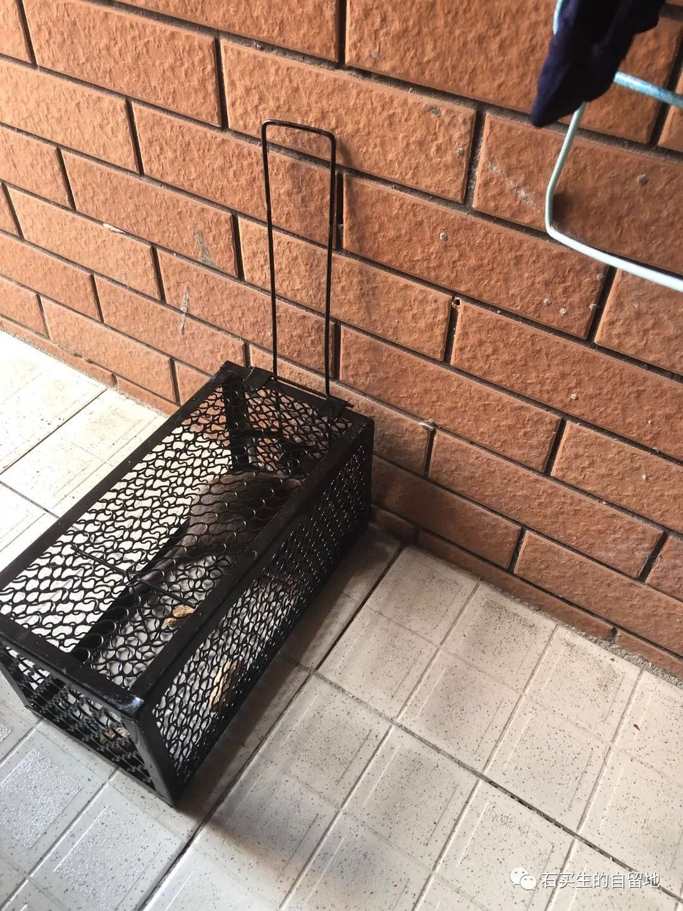

#  捕鼠记

原创  石买生  [ 石买生的自留地 ](javascript:void\(0\);)

__ _ _ _ _

老鼠本领很神奇，肯定有飞檐走壁的能力。不然，我家住在筒子楼四楼，它们怎么能经常光顾，且来去自由呢。

夜里或者日里，它们淡黄或褐色的魅影，老在眼前闪过。你追它们，它们旋即玩消失。无影无踪，只把气恼和憋闷留给你，顺便丢下一粒一粒比米粒大乌黑的老鼠屎。在走廊上，在厨房里，在客厅和房间的旮旯里，叫你看着生厌，嗅着恶心，嘴里不断地吐出污言秽语。俗话说，一粒老鼠屎，坏了一锅粥。这话真是太对啦，许多个清亮明媚的日子，因为几粒乌黑的老鼠屎突然映入眼帘，心情马上就变坏了，日子也瞬间改变了颜色。

还有更坏的呢。夜深人静之时，你才入梦乡，睡意正浓，忽然耳朵里有窸窸窣窣声音，像床底下咬纸屑声音，又像沙发底下咬木头声音，还像房间里翻箱倒柜声音。你起床拿起棍子驱赶瘟神，最气人呀却不见它们踪影，还惊醒了左舍右邻，认为你家晚上发地震（白天他们在微信群含沙射影骂人）。所以这些个夜晚你注定彻夜无眠，即使有明月来装饰你的窗子，你脑子里也杂念纷扰。想起年初起疫情肆虐，又是隔离，又是戴口罩，又是远离亲朋同事，整天担惊受怕，现在到了晚上也不得安宁。此时，对老鼠这瘟神，难免心生怨恨，甚至有一种杀气在心间升腾。

这也难怪呀。因为你不光心生怨恨，还担心家里的食物被老鼠污染，得鼠疫都有可能！鼠疫可比新冠更严重啊，14世纪欧洲爆发鼠疫，死亡2500多万人。一想起这数字，心中恐惧顿生，灭鼠势在必行！

跟儿子商量灭鼠计划，儿子觉得捕鼠笼灭鼠方法颇为常见，于是马上网购了两只捕鼠笼。在阴阳台一角和靠墙各布置好一个笼子，笼子里放些花生，再在笼子里面的小勾勾上挂一只花生，安置好两只捕鼠笼，心中十分熨帖，静待老鼠入笼。

连续几天，阴阳台上静悄悄一片，你左瞧右看，两只捕鼠笼总是空空如也，你无比沮丧。看来老鼠也不是孬种，狡猾得很，就是不进你笼子，就是不如你所愿，就是要搞得你心里直痒痒。你真想捕获它们，还得跟它们斗智斗勇。于是，你决定改变策略。

你把厨房门关死，封严实，不留一丝缝隙。让老鼠进不了屋内，让它们尽管在阴阳台上逍遥逡巡，等它们倦怠了，无聊了，饥肠辘辘了，也许会进到笼子里去探个究竟呢。

这招还真灵！才过一天，第二天上午，你在厕所方便，忽然听到阴阳台上传来吱扭吱扭声，这是老鼠的声音啊。你到阴阳台一看，果然捕获了一只大老鼠，只见它在笼子里瞎撞，时而用小嘴拱笼子门，时而狂咬笼子铁栅栏，疯狂的在笼子里转来转去，看到它一副滑稽相，你的心里呀真是那个蜜呀又是那个甜，一时间超级有成就感。老鼠倦了，就伏在笼子里，像一坨泥，一动不动。有几次，你看它到底折腾成啥模样，它还是一动不动，见你看它，它也看你，一脸憨样。一副坐以待毙的样子。

在阴阳台差不多待了一天了。这哥们又是拉屎，又是撒尿，搞得腥臊不堪。你在想，怎么弄死它。你跟儿子商量，儿子说有三种方法：一是找根绳子吊着笼子放入池塘淹死它，让鱼吃它的尸体；二是将笼子放到楼顶上暴晒，热死它，让它变成鼠干；三是烧一锅热水，往笼子上一浇，烫死它，然后挖个小坑盖上土掩埋。你觉得这三种方法都挺好，都能让老鼠死得其所。可左思右想，实在不知用哪种方法好。

你再次来到阴阳台，看见老鼠浑身松塌绵软，一脸倦容，好像气息奄奄。你定睛再看，它也缓慢伸长颈项看着你，眼神温顺好似有莹莹泪光。你打开笼子门，把它放了。它出笼子门时，

在门口停了一下，回看了你一眼。你到现在都不知道那眼神什么意思。

预览时标签不可点

微信扫一扫  
关注该公众号

****

****

×  分析

__

微信扫一扫可打开此内容，  
使用完整服务

：  ，  ，  ，  ，  ，  ，  ，  ，  ，  ，  ，  ，  。  视频  小程序  赞  ，轻点两下取消赞  在看  ，轻点两下取消在看
分享  留言  收藏  听过

精选留言

吴丰强来自

最后的那个眼神！神来之笔[玫瑰][玫瑰][玫瑰]

石买生的自留地来自

[握手]

天上的飛貓来自

石老师，我们宿舍有闹过，直接杖毙。所以，没有波澜，没有乐子，也没有🐭的眼神和叹息。

石买生的自留地来自

[咖啡]

玉米来自

可能是“下次再来”的意思

石买生的自留地来自

[咖啡]

E来自

天呐，石老师，你竟然还放了，你也太善良了吧[可怜]

石买生的自留地来自

[咖啡][握手]

