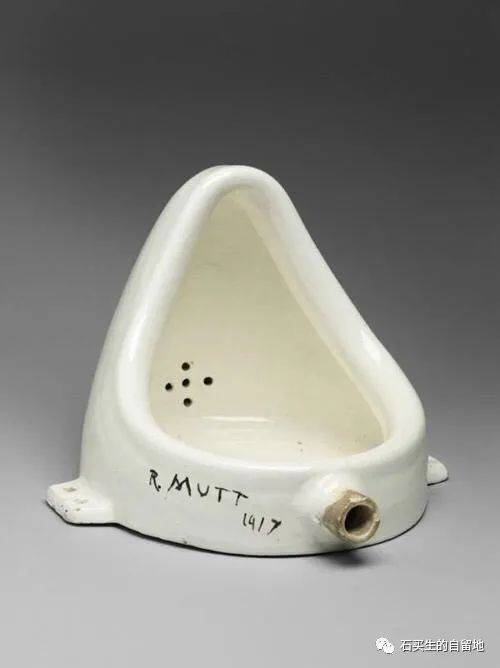
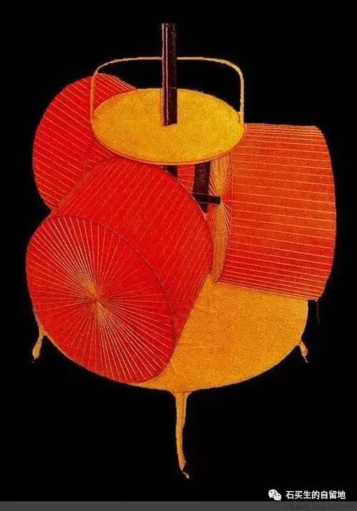

#  羞赧之年

原创  石买生  [ 石买生的自留地 ](javascript:void\(0\);)

__ _ _ _ _

杜尚名画《泉》

羞赧之年

总有某一天，不管多么不情愿，

你都会把自己领到自家门前。

面对杜尚清洁的小便池，

你摸出水枪。（杜尚的笑又干净又狡黠。）

你看见一条银白的弧线，

落到它该去的地方。（被忽视的美真纯粹。）

而另一条弧线旁逸斜出浊中带黄，

故意在你裤子上调皮捣蛋。（请不要羞赧。）

本应是理智之年，即便这一天不是节日，

也不应如此惶恐，沮丧，黯淡。

妻子用微笑、软语表达心疼，不欢。

她不知道你与世界的关系由此而改变。

你再也不能跟余下的日子热烈相拥，

只能勉强和自己握手言欢。

你多羡慕弗罗斯特，面对林中两条路，

他能选择人迹稀少的那一条。

他分清了自己身上的肉、骨头和血，

他找到了他想要过得生活。

就像他的老师陶渊明，41岁那一年，

从自己的躯壳里走了出来。

领着一帮好吃懒做的儿子，在南山下种豆，喝酒，

各过各的生活，自得其乐。

对贤者一辈子心向往之却不能至，

注定只能抱残守缺灵与肉分离。（路已经设定。）

总希望衰老是别人的事，一个孤独的影子，

在运动场蓝色的跑道上疾走。（星辰和霞光看见吗？）

老分不清顺时针逆时针方向，

管他先迈左脚还是先迈右脚，像爱一样盲目。

转眼又是晚秋了。天空格外湛蓝，清澈，高远，

期待一场明天的雪。

杜尚名画《我的艺术不在美的范畴里》

家长会

家长在教室看孩子成绩相关数据。

学生在办公室蜜蜂一样嘤嘤嗡嗡进进出出。

我和老吴等预约家长交流。

因为无聊，我们一起研读博尔赫斯的诗《边界》。

诗人说人到中年有许多禁区不能碰。

我们一边笑一边共鸣一边赞叹说写得真好。

那神情好像我俩人老心不老。

两个糟老头好像能借着飞鸟和玫瑰的语言飞翔。

预览时标签不可点

微信扫一扫  
关注该公众号

****

****

×  分析

__

微信扫一扫可打开此内容，  
使用完整服务

：  ，  ，  ，  ，  ，  ，  ，  ，  ，  ，  ，  ，  。  视频  小程序  赞  ，轻点两下取消赞  在看  ，轻点两下取消在看
分享  留言  收藏  听过

精选留言

吴丰强来自

期待一场明天的雪。一颗年轻的心❤  [玫瑰][玫瑰][玫瑰]

石买生的自留地来自

[握手]

