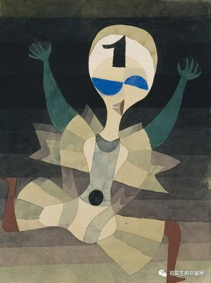
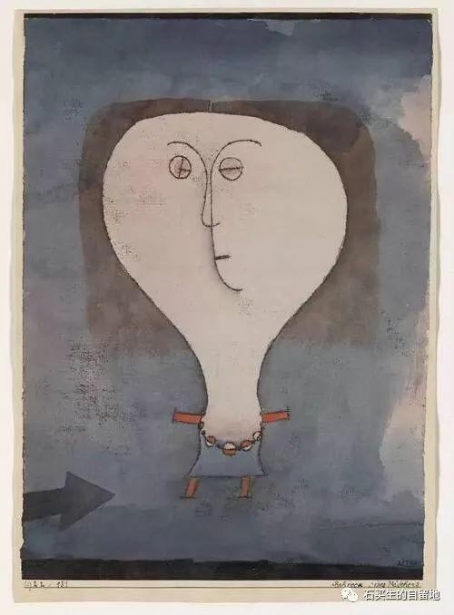

#  都是因为穷

原创  石买生  [ 石买生的自留地 ](javascript:void\(0\);)

__ _ _ _ _

保罗的·克利名画

都是因为穷

儿子说

他大学同学L来自粤西

早餐买了四个面包

吃了一个

又吃了一个

剩下两个拿在手里

左看右看

舍不得吃

他要把它们留到中午

从淡黄面包里

他闻到了来自田间

父母身上的汗水味

自由落体

他读大一

交了一年房租

才仨月

代租中介公司倒闭了

老板卷铺盖走人

房东找上门来

叫他搬出去

他说他交了一年房租

房东说我不找中介

只找你

他欲哭无泪

从窗户上跳下

像一片飘落的树叶

保罗·克利名画

赞美

快竣工的教工宿舍楼里

传出叮叮当当声

那是瓦刀锤子

与水泥地面墙壁在狂吻

有时切割机的嗡----嗡----声

打湿了暮云

惊动了晨星

有一回

我走在下班的校道上

听见未竣工宿舍楼里

飘来歌声

那声音难听有激情

歌词是

我们的生活充满阳光

歌者嗓音粗犷嘹亮不婉转

像个60后

时近年关

他用歌声打包了一年的苦辛

他的眼屎邋遢嘴角扬起

古铜脸颊拉渣胡须

脏兮兮的工作服

跟泥土一样朴实

广告

来自云南红河州的丑苹果

个小皮糙品相差

脆甜爽口感佳

它把天地之灵气

藏入冰糖心

它恪守土地古训

真实坦荡

从不骗人

注：插图来自网络

预览时标签不可点

微信扫一扫  
关注该公众号

****

****

×  分析

__

微信扫一扫可打开此内容，  
使用完整服务

：  ，  ，  ，  ，  ，  ，  ，  ，  ，  ，  ，  ，  。  视频  小程序  赞  ，轻点两下取消赞  在看  ，轻点两下取消在看
分享  留言  收藏  听过

