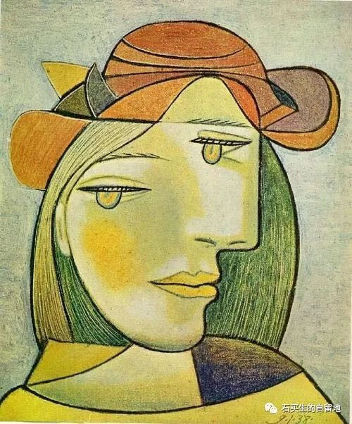
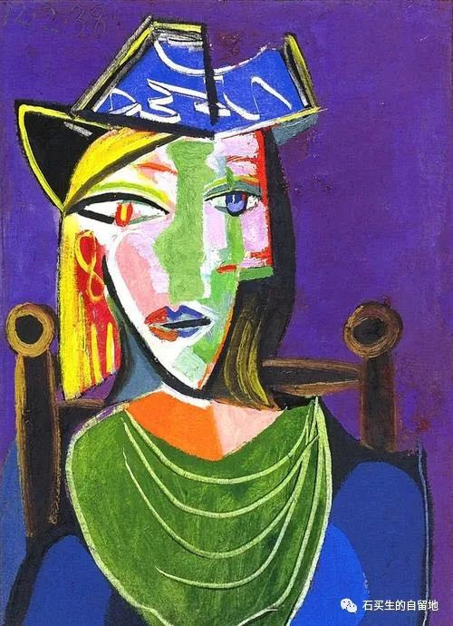
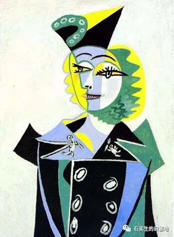
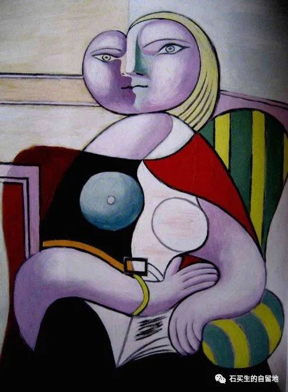
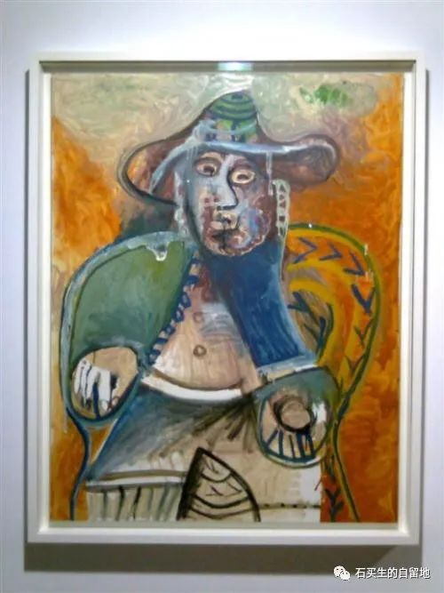
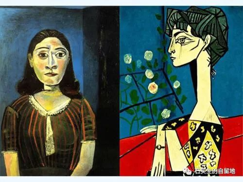
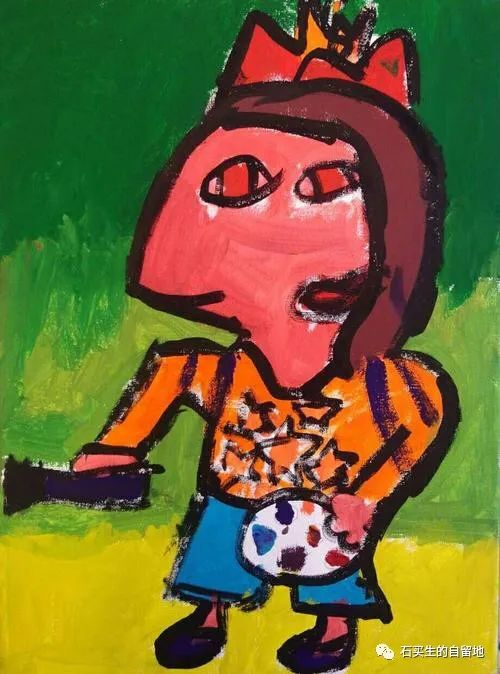

#  我在：后疫情时代的哀歌

原创  石买生  [ 石买生的自留地 ](javascript:void\(0\);)

__ _ _ _ _

我在：后疫情时代的哀歌

——2020年自选诗

毕加索名画

硅谷的樱花开了

满树淡白清香四溢

硅谷的樱花

妩媚烂漫

让大地美如斯

突然

我想起珞珈山的樱花了

它们也开了吗

2020.2.13

斯坦福草坪

天蓝

草绿

风轻

宁静

尘嚣散尽

大师隐身

2020.3.11

谷歌总部

一座银白色普通三层楼房

夜幕下竟散发阴冷的光

它的骄傲

总有人不懂

2020.3.13

毕加索名画

公园自饮水

圆形水泥柱

兀立圣克拉拉未名公园

天气再好

环境再清幽

你不吻她

她就孤独

2020.3.13

疫情后遗症

为了消除和世界的紧张关系

我每日在霞光中疾走

我无视旭日的明媚和落日的温柔

白云和百花

他娘的我觉得一点也不美

我只觉得背后有一根无形的鞭子

正在把我驱赶

我手里也握有一根鞭子

我正在驱赶春天

我的爱如此野蛮残暴

又绝望

2020.4.17

毕加索名画

你不知道哪片叶子写满谎言

每天晨练

清洁阿姨总笑脸相迎

说我最近胖了起码增了十斤

我对她强作欢颜

满肚子苦情

其实年后我瘦了两斤

我每日经过的桃花心木可以作证

它每一片叶子油光闪闪

在风中猎猎作响

好像每一片都在赞美春天

可第二天地上枯黄一片

像童年的鸡毛信

你不知道哪一片叶子写满谎言

再次见到清洁阿姨

我彻底把她原谅

因为

这个春天

万物都在言不由衷

2020.5.5

火的修辞

它伸着绿色的舌头

从不记得普罗米修斯胡须的颜色

它的字典里写着

撕裂

毁灭

至乐

节制约等于福祉

它踩着柴科夫斯基天鹅湖的舞曲

寻找敌人

它睡时多于醒着

它的宿命是成为灰烬

的二次方

凤凰涅槃前夜

它梦见水

2020.7.17

毕加索名画

少女之死

多美啊

面对微澜死水

你纵身一跃

忘川之水也不会扬波

纯洁加双引号的天使啊

刽子手正千夫所指

但，她的无辜大于沉默

三分之一

她的仇恨龌龊无知

谁说

与生俱来

2020.7.17

港珠澳大桥

有一段

从海底穿过

它改变了

海鱼的生活

爱因斯坦

证明时间转弯了吗

我看见窗前小叶榄仁绿色的血

流得更欢快了

2020.8.8

在银座

在东京最繁华的商业街

银座

我买了一只拉杆箱

银黑的

它对街旁一棵树

含情默默

它们想念海

一场雨把街道洗得清亮

我一阵晕眩

不知所往

不知所终

2020.8.8

薰衣草

八木崎公园的草真绿

云也干净

妻子正用手

跟一个日本年轻女子比划

她买香水

她笑

像

2020.8.8

毕加索名画

稻草人

兀立田间

一脸严肃肯定是假装的

嘴边的胡须样的白色飘带

也是假的

可这假模假样也厉害呀

不知吓坏了多少麻雀

和不知名的鸟儿

童年

我孤陋寡闻

他是我心中的教授

我常在他身边瞎转

等待风来提问

2020.9.22

烛光

你在暗夜燃起一只烛

柔和之光摇曳

亲吻了一群盲者

绝望加深了

世界一片寒凉

你目光清澈

守候在夜的边缘

烛光渐冷

哀伤

让你一点一点致盲

2020.9.22

哎哟喂

国庆之夜

到处都听见熟悉的旋律

在梦中我也热血沸腾

撅起嘴正想来一曲

歌唱祖国

却看见

几个面色狐疑家伙

拿着喇叭筒

在宣传作鼓动

貌似在打鸡血搞传销

我突然高喊一句

哎哟喂

结果把自己笑醒了

2020.10.2

对对联

双节之夜

万民同欢

老L却不合时宜

仰望明月一脸深沉

在自家庭院

吟一句

旧江山浑是新愁

见老L心思满腹

我邪魅一笑

对一句

新酒肆皆有陈酿

2020.10.2

毕加索名画

羞赧之年

总有某一天，不管多么不情愿，

你都会把自己领到自家门前。

面对杜尚清洁的小便池，

你摸出水枪。（杜尚的笑又干净又狡黠。）

你看见一条银白的弧线，

落到它该去的地方。（被忽视的美真纯粹。）

而另一条弧线旁逸斜出浊中带黄，

故意在你裤子上调皮捣蛋。（请不要羞赧。）

本应是理智之年，即便这一天不是节日，

也不应如此惶恐，沮丧，黯淡。

妻子用微笑、软语表达心疼，不欢。

她不知道你与世界的关系由此而改变。

你再也不能跟余下的日子热烈相拥，

只能勉强和自己握手言欢。

你多羡慕弗罗斯特，面对林中两条路，

他能选择人迹稀少的那一条。

他分清了自己身上的肉、骨头和血，

他找到了他想要过得生活。

就像他的老师陶渊明，41岁那一年，

从自己的躯壳里走了出来。

领着一帮好吃懒做的儿子，在南山下种豆，喝酒，

各过各的生活，自得其乐。

对贤者一辈子心向往之却不能至，

注定只能抱残守缺灵与肉分离。（路已经设定。）

总希望衰老是别人的事，一个孤独的影子，

在运动场蓝色的跑道上疾走。（星辰和霞光看见吗？）

老分不清顺时针逆时针方向，

管他先迈左脚还是先迈右脚，像爱一样盲目。

转眼又是晚秋了。天空格外湛蓝，清澈，高远，

期待一场明天的雪。

2020.12.3

想起九江

我喜欢陶渊明的柴桑

甚于白居易的浔阳

又一个冬天了

烟水亭的灯光

摇曳千年

小城的宿命

注定成为替身

2020.12.6

没有耐心的爱

毛栗树干上

莫名长起一个包

树干不理它

继续长

绿色的血

就是停不下来

它想早一点

触摸云彩

山雀歇在松树上

它不是欣赏

松节上白色的松脂

它在盯着

一条红色松毛虫

出神

松果受惊吓了

从枝上滚落下来

2020.12.6

毕加索名画

都是因为穷

儿子说

他大学同学L来自粤西

早餐买了四个面包

吃了一个

又吃了一个

剩下两个拿在手里

左看右看

舍不得吃

他要把它们留到中午

从淡黄面包里

他闻到了来自田间

父母身上的汗水味

2020.12.14

自由落体

他读大一

交了一年房租

才仨月

代租中介公司倒闭了

老板卷铺盖走人

房东找上门来

叫他搬出去

他说他交了一年房租

房东说我不找中介

只找你

他欲哭无泪

从窗户上跳下

像一片飘落的树叶

2020.12.14

注：照片来自网络

预览时标签不可点

微信扫一扫  
关注该公众号

****

****

×  分析

__

微信扫一扫可打开此内容，  
使用完整服务

：  ，  ，  ，  ，  ，  ，  ，  ，  ，  ，  ，  ，  。  视频  小程序  赞  ，轻点两下取消赞  在看  ，轻点两下取消在看
分享  留言  收藏  听过

精选留言

我又幻想了来自

[强]

石买生的自留地来自

[咖啡]

