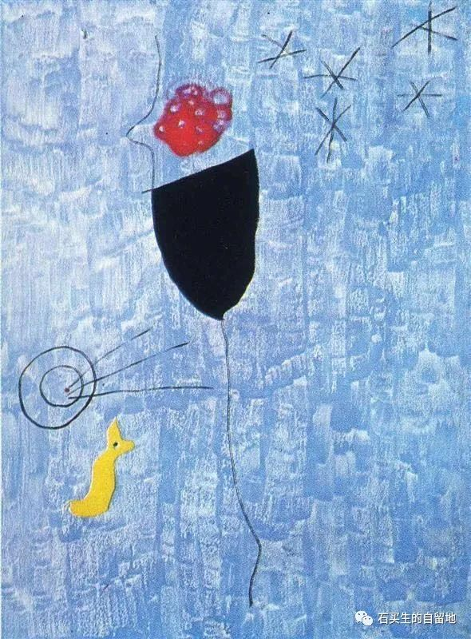

#  关于是否生二宝的对话

原创  石买生  [ 石买生的自留地 ](javascript:void\(0\);)

__ _ _ _ _

米罗名画

海涅的困惑

“如果一个女子将你背叛

你要对她加倍真心。”

海涅倾诉时，

他的眼睛清澈如泉水。

千年只是一瞬。

伊甸园里的亚当，

早已不识苹果树下的夏娃，

更不知爱为何物。

“男人女人都想抓住，

看得见的事物。”

咋办呀？

海涅一脸茫然。

继续歌唱，

弹起你的六弦琴。

米罗名画

关于是否生二宝的问答

同事S头一次跟我同桌用早餐，

他上小学的儿子陪在旁边。

冬日清晨有点冷。

生二宝没有呀，S？

不想生。S一脸严肃，口气很干脆。

为啥呀？

“怕带孩子到世上受苦，

资源都要被有些人占尽了，

让孩子拾捡残羹冷炙，苦逼呀！”

S用眼角余光瞟了儿子一眼，

好像悔不该带他来到世上。

米罗名画

度娘的爱情

一个少女，

总是把自己打扮得楚楚动人。

在星空下张开双臂，

想热烈拥抱爱情。

可每次总是左手右手相拥，

春花秋月相离。

她并不因此怨恨，

也不觉得生无可恋。

一回，

她上度娘寻找爱情，

一支金箭

直入她豌豆大的心：

“两颗心要想在一起待得时间长，

自始至终要保持真心。”

预览时标签不可点

微信扫一扫  
关注该公众号

****

****

×  分析

__

微信扫一扫可打开此内容，  
使用完整服务

：  ，  ，  ，  ，  ，  ，  ，  ，  ，  ，  ，  ，  。  视频  小程序  赞  ，轻点两下取消赞  在看  ，轻点两下取消在看
分享  留言  收藏  听过

精选留言

吴丰强来自

是否生二孩，生活的严峻就在那里，被作者敏锐捕捉到了！

石买生的自留地来自

[咖啡]

鲨鱼来自

这个S老师的想法跟我不谋而合

石买生的自留地来自

[咖啡]

语传来自

石老师好帅！

石买生的自留地来自

[握手]

语传来自

老师隔离结束了吗

石买生的自留地来自

明天结束，谢谢关心！你实名啊[呲牙]

