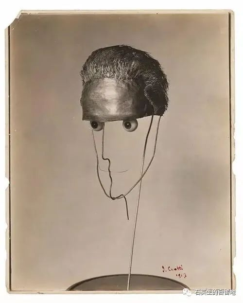

#  一只蜂雀闯进了我的生活

原创  石买生  [ 石买生的自留地 ](javascript:void\(0\);)

__ _ _ _ _

杜尚作品

一只蜂雀闯进了我的生活

一整个下午

我在读玛丽·奥利弗的诗歌

我沉迷美国的黑水塘

长着黑喙的天鹅

漂浮在暗黑的河上

天地契合

山川静穆

万物各得其所

那正是我曾经喜欢的静寂生活

妻子刚从美国来

在上海十四天与世隔绝

她的眼圈比月晕还黑

长长的失眠

上帝再奖赏七天

我们除了在阳台看朝云暮霭

还絮絮回忆

这辈子平淡的婚姻生活

谈到亲人

总觉得留有诸多亏欠

只渴望把余生过得充满温情

虚幻的光中

我突然看见奥利弗的蜂雀

向南向西再向南

不断修改我的生活

大半生一晃就过去了

我多像又不像那只蜂雀啊

平常日子糊涂过

又盲目又坚定

又懒散又执着

杜尚作品

不是十四行

早上的雾霾

不是为了中午天放晴

十八层星月

不是为了照亮城市黑暗心脏

上绣的锁啊

不是为了尘封往事

一只桃子

不是为了夭夭而夭

一头银发

不是为了礼赞中年

一张退了的火车票啊

不是为了疏远故乡亲情

一具躯壳

不是为了灵魂暂时出窍

预览时标签不可点

微信扫一扫  
关注该公众号

****

****

×  分析

__

微信扫一扫可打开此内容，  
使用完整服务

：  ，  ，  ，  ，  ，  ，  ，  ，  ，  ，  ，  ，  。  视频  小程序  赞  ，轻点两下取消赞  在看  ，轻点两下取消在看
分享  留言  收藏  听过

