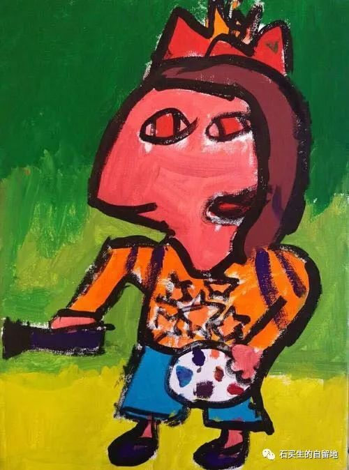

#  春天怎样在故乡开始了

原创  石买生  [ 石买生的自留地 ](javascript:void\(0\);)

__ _ _ _ _

春天怎样在故乡开始了

只有长久的漠视和疏离

才能感受到

对故乡的爱

如此纯朴无邪

它直接从我学生曹戈明心底

唱了出来

他的眼睛里

金黄的油菜花

铺满了赣北的山岭和田垅

天地神秘契合

肯定胜过上帝热烈的吻

更何况游子在远方

残缺的春天

无言的村庄

面对

几只寥落在花丛的蜜蜂蝴蝶

几头老去不会耕田的牛

几条懒得发情的狗

几个得了癌症的老倌

无所适从

一根枯枝在溪水里汩汩作响

它一头埋在泥巴里

一头露在水面上

在清清的溪水里

穿着绿衣裳静静歌唱

不会再吸引山雀

也得不到阳光雨露润泽

干瘦的身子

顶多歇一两尾青虾

附三两只青螺

它似乎比一朵流云更寂寞

不明来路不问归程

也不知悲喜

生死更不成难题

自己成了自己的神明

雷电

电闪雷鸣

经年过

眼袋深深

停

莫想

多余人

青春

同失败

媲美

厌倦

是这时代

代名词

爱

就是胡搞

恨不是

对丑的事物

我们总

无师自通

注：图片来自网络

预览时标签不可点

微信扫一扫  
关注该公众号

****

****

×  分析

__

微信扫一扫可打开此内容，  
使用完整服务

：  ，  ，  ，  ，  ，  ，  ，  ，  ，  ，  ，  ，  。  视频  小程序  赞  ，轻点两下取消赞  在看  ，轻点两下取消在看
分享  留言  收藏  听过

精选留言

0喵了个咪0来自

自己成了自己的神明

石买生的自留地来自

[握手]

阿郎来自

什么时候回九江找丁伯刚老师饮酒

石买生的自留地来自

好啊，书记有空南巡到东莞玩哈[微笑]

秀波来自

想读而不敢读，唉……

秀波来自

明丽而忧伤😔 唉……

石买生的自留地来自

[咖啡]

周歧斌来自

一看标题就勾起了对故乡的记忆。曹戈明同学前几天回老家的朋友圈里的油菜花、田垅、山岭就是是石老师诗里的感觉。

石买生的自留地来自

是呀，故乡是永远的乡愁。[咖啡]

吴丰强来自

一根枯枝在水里汩汩作响 这根枯枝还会泛绿，著花/:rose/:rose/:rose

石买生的自留地来自

[咖啡]

