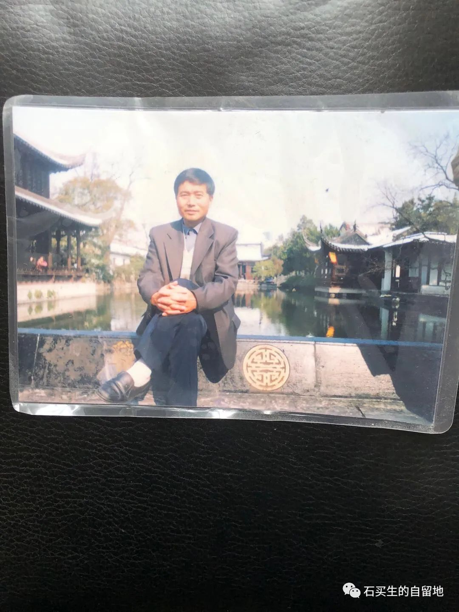
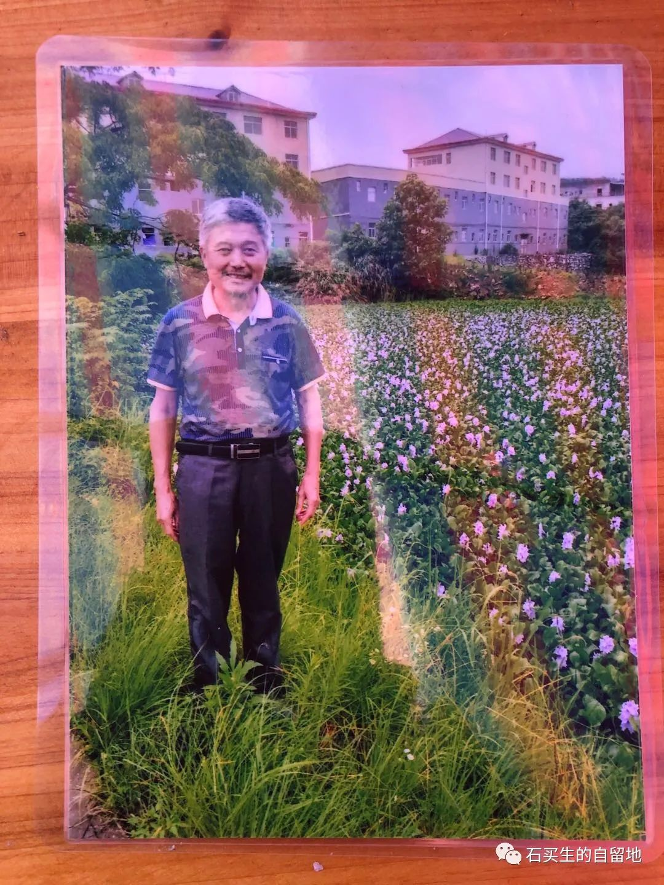
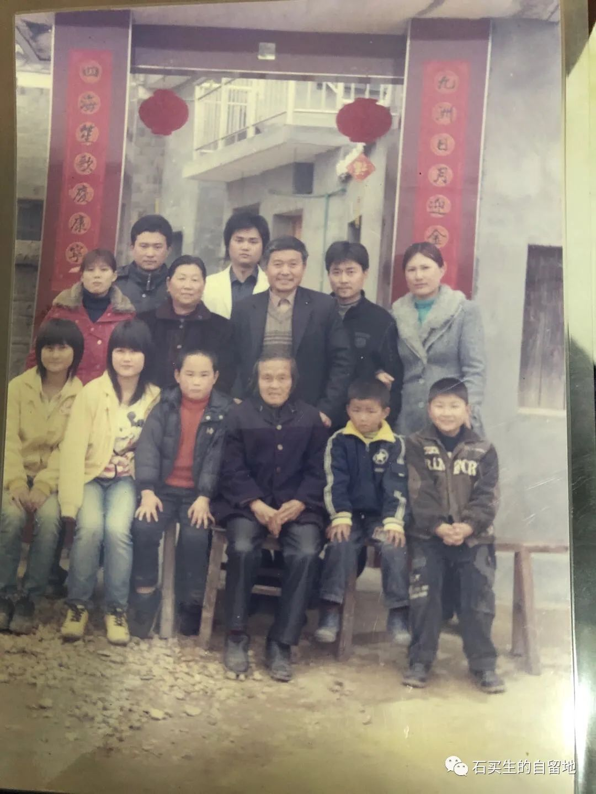
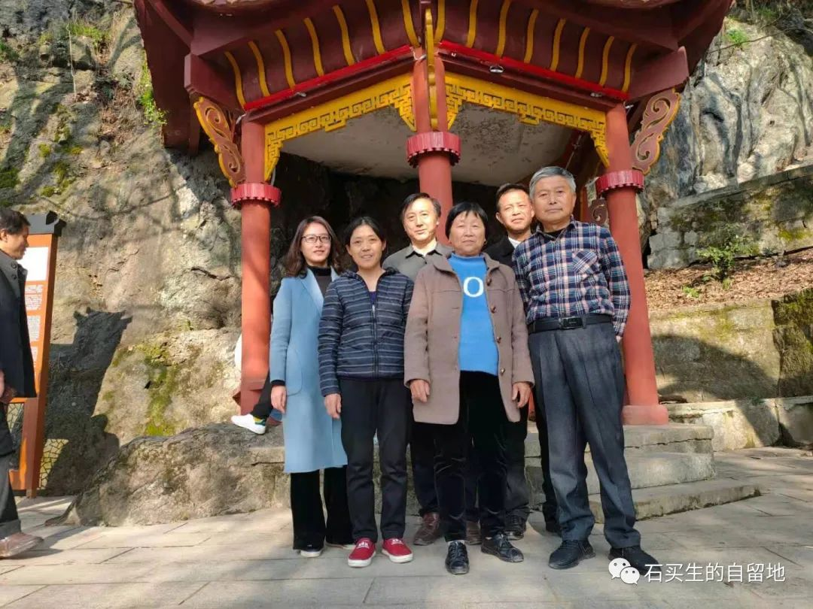
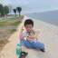
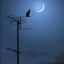
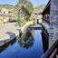

#  悲伤三重奏

原创  石买生  [ 石买生的自留地 ](javascript:void\(0\);)

__ _ _ _ _

三重奏

—沉重悼念兄长去世

兄长遗照

一，细妹冬春祭文

亲爱的大哥，你能听见吗？

你以决绝的方式突然离开了我们，我无比痛苦、煎熬，我彻夜难眠，只想对你说：

亲爱的大哥，你知道吗？以前总是听娘说，你是我们兄妹四个中最能干的一个。13岁就当团干部书记，18岁久担任大队干部，虽然很年轻，但工作很出色，后来你又凭能力调到乡里当出纳，工作兢兢业业，从未出过任何差错。你一丝不苟的工作态度得到领导的一致好评。再后来你又兼职做保险，当上了三汊港分部业务经理，事业更是蒸蒸日上。那是你一生最开心快乐的时光，你一有机会就带领大嫂去旅游观光，见识外面精彩的世界，让大嫂有一种夫荣妻贵的感觉，也成为我们家的骄傲。

亲爱的大哥，你知道吗？命运总是喜欢捉弄人，就在你刚光荣退休不久，可怕的忧郁病症缠上了你，让你食不知味，夜不能寐。这种痛苦的滋味整整折磨了你三年。我每次来看你，你那绝望无助的眼神，让我不知所措。因为不能好好开导你，我也常常自责，痛恨自己无能。

亲爱的大哥，你知道吗？这么多年，你不仅是你们这个家的主心骨，也是我们兄妹的忠实依靠。细哥考大学，你费尽心思，姐姐得病住院，你长时间陪伴照顾。后来爷娘离开得早，你总说兄妹几个在我身上没花多少心血，好像对我有亏欠，其实我从没放心上，如今，你外甥的喜酒都来不及喝，就抛下我们，叫我们如何不难过！

亲爱的大哥，你知道吗？你辛辛苦苦一辈子，倾尽一生为这个家付出，你的子女总是看在眼里，记在心上。都想等你老了，一定会在你膝前尽孝，好好回报你的养育之恩。可你走得这么匆忙，好多事情都没跟子女交代，这成了他们这辈子最大的遗憾，也会终生心痛。

亲爱的大哥，你就安心走吧！希望你在天堂不再痛苦。轻轻松松上路，到那边和父母相聚。愿你们在天堂过得开心快乐！亲爱的大哥，愿你一路走好！

兄长遗照

二，细侄女华妹致谢词

各位亲朋好友：

“树欲静而风不止，子欲养而亲不待”。今天我们全家怀着万分悲痛的心情，悼念亲爱的父亲大人不幸逝世，并向父亲大人的遗体做最后的告别。

父亲一生以公为业，为本，为贵。“两袖清风无私情，一身正气为公事”。这是父亲生前写在房门背后的座右铭。几十年如一日，一切以群众的利益为重，因此父亲大人得到了广大群众的拥护和尊敬！

父亲以家为职，为根，为重，勤俭持家，终致殷实。父亲和母亲为了养育我们姊妹五个，自己节衣缩食，生活再艰难，父亲和母亲也没让我们挨过饿，受过冻。让我们倍感家庭温暖的同时，也常常告诫我们要诚实为人，认真做事。父亲的言传身教，身体力行，我们耳濡目染，让我们懂得了做人的道理，懂得了勤劳勇敢，诚实谦虚，乃是人身之本。父亲一生为人厚道，忠良处世。兢兢业业干事业，耿直无媚，简朴不奢。含辛茹苦一世，兢业操劳终生。父亲现在与世长辞，母亲失去了一位好伴侣。叔叔姑姑，失去了一位好兄长，我们兄弟姊妹失去了一位好父亲，我们兄弟姊妹万分悲痛，再也无法亲耳聆听父亲大人的谆谆教诲，再也无法亲眼面对父亲大人的音容笑貌，只能在心中深深的缅怀和思念。

爹爹，您放心的走吧，我们兄弟姊妹会竭尽全力，孝顺好健在的母亲。让母亲的晚年更幸福，身体更健康。我们牢记父亲的遗训，清清白白做人，勤勤恳恳做事，扎扎实实工作。此时此刻，我们想用一句诗来为您送行:生如春花之灿烂，逝如秋叶之静美。亲爱的父亲大人您安息吧！

最后我代表全家再次向出席告别仪式的各位亲朋好友，表示衷心的感谢，谢谢大家！

2008年家庭合影

三，我的悼亡诗

我哥哥是怎样的人

他好像中国的堂吉诃德

只不过

一辈子不跟风车斗

只跟自己斗

从不妥协

有时他又像红了眼的公鸡

总想站在树杪上

让全世界听他打鸣

我舅舅曾劝他

世上只有第七没有第一

作为农村干部

于村于大队于乡他尽责尽职

贵为家庭长子

他做了能做到的一切

老父清闲弟妹子女长大成人

1980年夏天他风尘仆仆

从景德镇回家为我复读报名

一个乡下娃崽

从此开启了另一扇门

我由此看见了更广大的世界

更广阔的天空

大妹16岁急性肠炎

在县城住院

他10天半月熬红了双眼

母亲心疼

也喑哑了夏天的蝉声

他一生与人为善为人真诚

朋友广布四里八乡

收获人间宝贵友谊之情

哪知命运乖张

65岁那一年生命按下了静音键

因为从乡里从保险公司退休

生活一下子变得空空荡荡

可怕的抑郁症让他变得生无可恋

自卑自闭日夜煎熬怕见熟人

整个世界一片灰暗

多少次想轻生诉苦

换得来的是亲人的麻木不仁

我多少次深信他疼爱自己的生命

没想到这个春天

在他68岁这一年

他用一根柔软的包装带

以一种古老的方式

告别了这他深深依恋的世界

他静静地躺在冰馆里

一脸安详

有好几次我看了一眼

又看了一眼又看了一眼

泪水

让我的心咯噔缺了一角

2021年春节，县城南山哥嫂、妹妹、妹夫合影

预览时标签不可点

微信扫一扫  
关注该公众号

****

****

×  分析

__

微信扫一扫可打开此内容，  
使用完整服务

：  ，  ，  ，  ，  ，  ，  ，  ，  ，  ，  ，  ，  。  视频  小程序  赞  ，轻点两下取消赞  在看  ，轻点两下取消在看
分享  留言  收藏  听过

精选留言

月来悦好来自

叔，节哀，保重！

石买生的自留地来自

[咖啡]

吴崇映语过添情来自

逝者安息，生者平安！

石买生的自留地来自

[咖啡]

平安果来自

节哀顺变，也许天堂没有这么痛苦，我大姨也是抑郁症走的😭😭😭

石买生的自留地来自

[握手]

刘成坤来自

他静静地躺在冰馆里/一脸安详/有好几次我看了一眼/又看了一眼又看了一眼/泪水/让我的心咯噔缺了一角 朴实无华、自然真挚的句子，最能表露悲伤

石买生的自留地来自

[咖啡]

Gomez来自

石老师，节哀顺变

邢祥如来自

节哀顺变[Salute]

青梅来自

节哀顺变/::<

石买生的自留地来自

[咖啡]

林子来自

难过，悲痛！

石买生的自留地来自

[握手]

我又幻想了来自

节哀

吴丰强来自

节哀顺变！大哥安息！

石买生的自留地来自

[握手]

Fernando来自

逝者如斯,生者已矣🕯️

石买生的自留地来自

[咖啡]

Ricardo来自

老师节哀！

