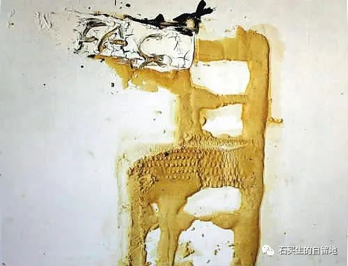
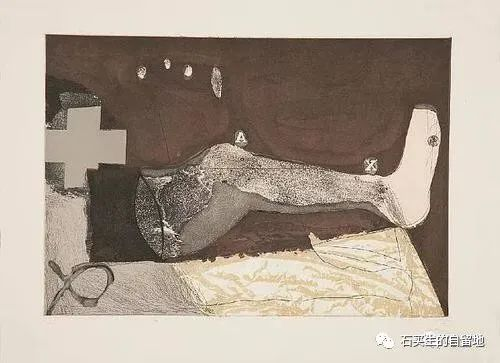
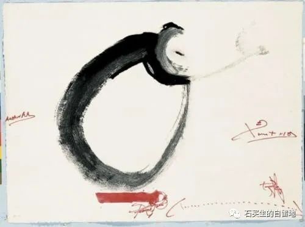
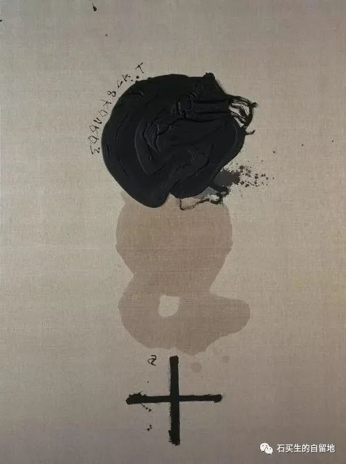

#  五十度灰

原创  石买生  [ 石买生的自留地 ](javascript:void\(0\);)

__ _ _ _ _

塔皮埃斯名画

接近于无

起床

散步

吃饭

上班

吃饭

睡觉

上班

散步

吃饭

睡觉

日子越来越少

且不断重复

总有一天

接近无

另一种死亡

不欺世

不盗名

不骂娘

不愤青

不上天

不入地

不南北

不东西

不咸

不淡

不痛

不痒

不生

不死

不哭

不笑

不三

不四

不伦

不类

塔皮埃斯名画

恐惧

凌晨两点

自然醒

窗前月光

静得

像你眼睛

脚

总沉迷

运动场

蓝色跑道

黄色单杠

一双老手

冲洗20秒

在水龙头

干净得

青筋暴露

绿草坪

一只黑鸟

在嬉戏

翻滚

它知道什么

塔皮埃斯名画

五十度灰

六月的荔枝

悬于枝头

被雨水浸润

颗颗

饱满

鲜艳

欲滴

渴望

被摘

扒皮

被啮

被吮

被吃

变成水

等待

寻找

献身

总算

值得

有形

蜕变

无形

一次次

欣喜

猎物

晕眩

沉沦

注：诗题借用美国同名电影

塔皮埃斯名画

静物画

夏天来啦

海南蒲桃

噗

噗

噗

掉浆果

在草丛

地面

头顶

上帝

雅兴真浓

一鼓捣

蓝色口罩

紫色浆果

相映

成趣

日子

由憋闷灰暗

化作

一片斑斓

注：图片来自网络

预览时标签不可点

微信扫一扫  
关注该公众号

****

****

×  分析

__

微信扫一扫可打开此内容，  
使用完整服务

：  ，  ，  ，  ，  ，  ，  ，  ，  ，  ，  ，  ，  。  视频  小程序  赞  ，轻点两下取消赞  在看  ，轻点两下取消在看
分享  留言  收藏  听过

精选留言

吴丰强来自

老石，都是好诗！ 诗多两言，洁得很！ 特爱《恐惧》。以下几句，读来震动！ “一双老手 冲洗20秒 在水龙头 干净得 青筋暴露”

石买生的自留地来自

谢谢老吴鼓励！[玫瑰]

青瓷在土来自

洒脱自如！

石买生的自留地来自

谢谢郑老师鼓励！[咖啡]

