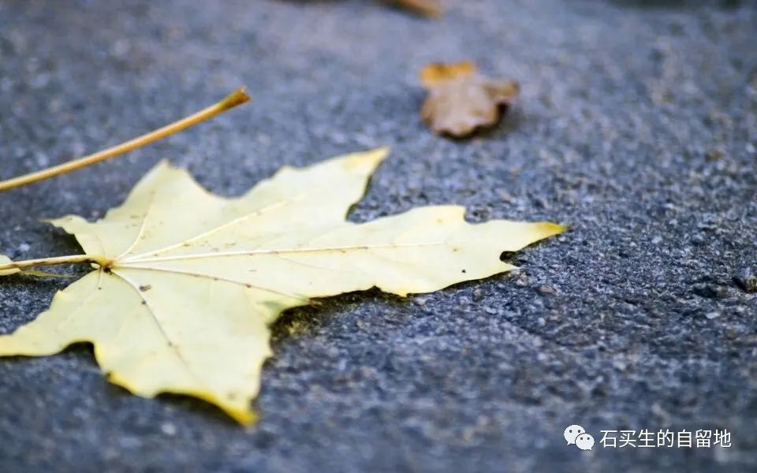
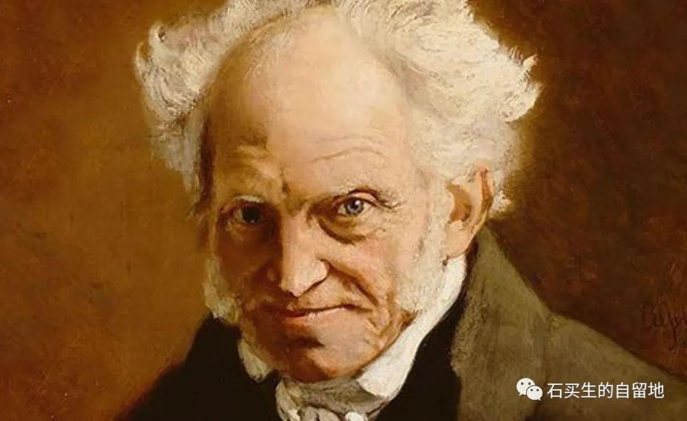
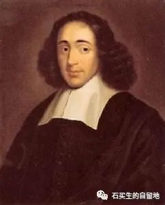

#  读叔本华

原创  石买生  [ 石买生的自留地 ](javascript:void\(0\);)

__ _ _ _ _

网络图片

流变

夏天一个平常的日子

我支部的OY医生因病去世了

54岁，正值盛年

他的妻子悲痛，我在微信上祈祷

他一向温和的微笑

怎么就追不上这时代的流变

另一个世界还辛苦劳碌吗

他的离去

彷佛上帝打了一个呼哨

往后，我也许偶尔会将他想起

但偶然间我将又老了一岁，

我的生活跟以前一样还要继续，

不管好与坏

总之，活着就要小心翼翼

世界的面容越来越模糊

让我分不清南北东西

某一日，希望和恐惧会将我变成夹心饼干

除了沉默，我什么也没有学会

比如赞美、诅咒、等待与爱

德国哲学家叔本华

读叔本华

我惊讶

一个自私、虚伪、好色几乎劣迹斑斑

一生气就将一个女裁缝丢往楼下

嘴里还不停嘟囔的恶棍

竟做成了大哲学家

他唯一的美德

是对动物充满慈悲

他认准了人是欲望的奴隶

为此牛逼哄哄

就算黑格尔也不放在眼里

他以丑为美

一朵花

在他鹅黄色眼珠子里

没有娇嫩与盛开

只有零落与衰败

荷兰哲学家斯宾诺莎

完美的人

斯宾诺莎

因为人格完美

受到博尔赫斯顶礼膜拜

哪怕阿根廷足球赢了荷兰

他的祖国也被他讥讽

我爱斯宾诺莎

缘于他做成了三件事

颂扬快乐

怀疑世界

忠于自己

注：图片来自网络

预览时标签不可点

微信扫一扫  
关注该公众号

****

****

×  分析

__

微信扫一扫可打开此内容，  
使用完整服务

：  ，  ，  ，  ，  ，  ，  ，  ，  ，  ，  ，  ，  。  视频  小程序  赞  ，轻点两下取消赞  在看  ，轻点两下取消在看
分享  留言  收藏  听过

精选留言

秀波来自

人性的龃龉 与生俱来。迷惘和混沌应该是活着的真实样子。哲学来哲学去之后还是迷惘和混沌，唯迷惘和混沌周而复始 持久永恒😳

石买生的自留地来自

经典。赞同！[握手]

