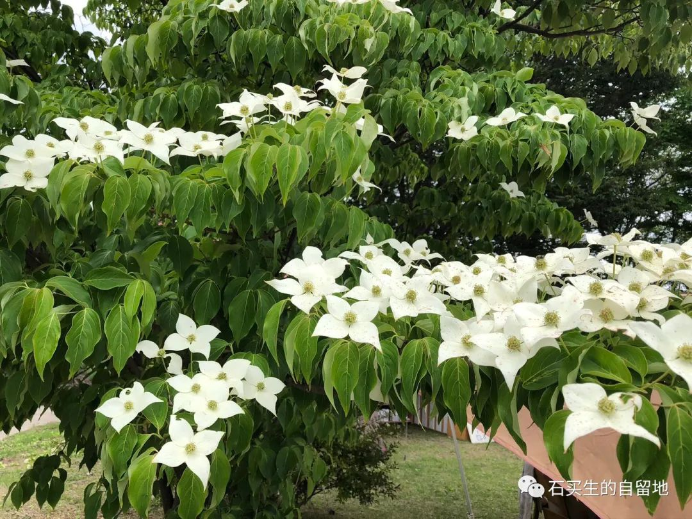
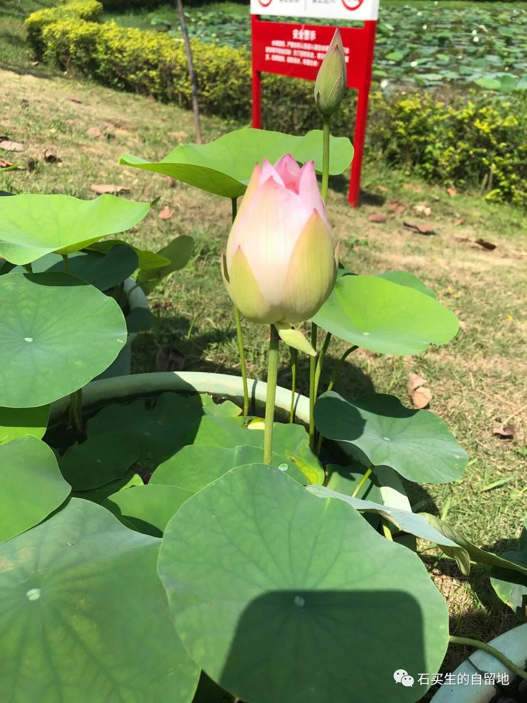

#  微信里那个散步的人不见了

原创  石买生  [ 石买生的自留地 ](javascript:void\(0\);)

__ _ _ _ _

自拍照片

微信里那个散步的人不见了

夕阳无限好，先把春天爱了吧

为了从病躯里走出来

他选择黎明或者黄昏

绕着韩婆庄怯怯地走，一个人走

从村东走到村西，从村南走到村北

生怕被人看见

朦胧中，他看见了熟悉的村庄、公路

模糊的山岭，黛绿的田垄，或明或暗的天空

看见一两方水塘，三四个熟人，

听见五六声鸟鸣

少有人知道，哪怕不幸福

总算又活了一天

管他算不算一种福分

这个春天，似有心灵感应

一到晚上我总是按时打开微信

看微信运动排行榜

我经常看见“石坤富，14586，14387”字样

下边几个稀稀落落点赞

瞬间我心安、熨帖

2021年3月27日

微信里那个散步的人突然不见了

他把命永远留在了老屋的梁上

让我突然失去手足，觉出余生彻骨的寒凉

我的心从此变得空空荡荡

自拍照片

沃尔玛的收银员

像刚来打暑期短工的大学生

他瘦高个皮肤白皙

表情平静温和眼睛沉静如水

他验货动作生疏而缓慢

一袋小面包让验货机卡住了

他也不慌乱小声招呼领班前来指导

超姐说换台机子

于是牛奶、酸奶、鸡蛋、大米、小米、各类蔬菜

肉类、苹果、番薯一字排开

在他手里咚咚咚顺利通过

他心里有一种温柔甜蜜的接触

他看着如许物品渐次进入购物袋

笑了，像凝视自己初生的孩子

纯洁又美好

他的耐心、细心和笨拙

是上帝奖励他未来生活的三张支票

预览时标签不可点

微信扫一扫  
关注该公众号

****

****

×  分析

__

微信扫一扫可打开此内容，  
使用完整服务

：  ，  ，  ，  ，  ，  ，  ，  ，  ，  ，  ，  ，  。  视频  小程序  赞  ，轻点两下取消赞  在看  ，轻点两下取消在看
分享  留言  收藏  听过

精选留言

祥云来自

石老师好，好久没来，一口气读了您的几个篇章，心情复杂[愉快]

石买生的自留地来自

[握手]

秀波来自

不是所有的人都像你这般手足情深。

石买生的自留地来自

[咖啡]

大鱼🐠来自

石老师好[呲牙][呲牙]

石买生的自留地来自

[握手]

