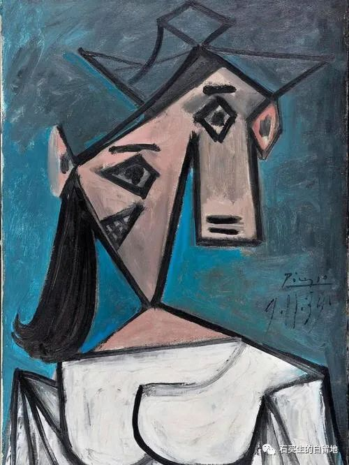
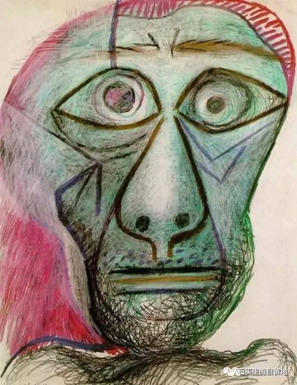
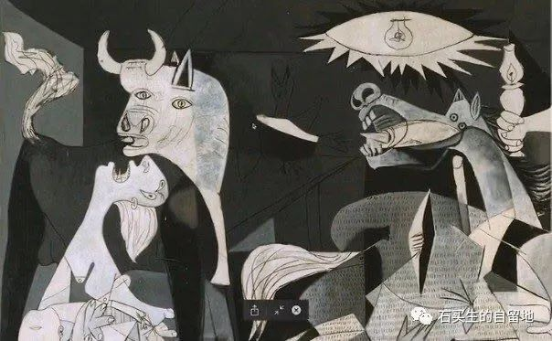

#  有主题变奏

原创  石买生  [ 石买生的自留地 ](javascript:void\(0\);)

__ _ _ _ _

毕加索名画

两只捕鼠笼

在阴阳台

一前，一后

像两只微型黑棺椁

一只笼子

在冬天

捕获了两只大老鼠

另一只笼子

四季

总是空的

第二只大老鼠

被暴晒而死

第一只呢

至今还活着

梦见花生

咸鱼干

毕加索名画

另一首诗

不见老鼠

捕鼠笼和你

更加空虚

静是窒息

更高级的形式

和废墟

日子不清闲

岁月被弃掷

连庄子

也不能解惑

为什么

生命变残缺了

孤独不可救药

阴阳台上的夏风

时断时续

毕加索名画

有主题变奏

那只有辜死去的老鼠

河南洪灾

突然逝去的亡灵

在同一纬度吗

星光依旧璀璨

总是选择性致盲

阴阳台、捕鼠笼

吞没地铁的洪水

你一一分解

像毕加索《格尔尼卡》

用色彩和线条

为上帝写一份证词

你泪水全无

既是刽子手

又是沉默者

如果像莱茵河洪水

有更多生命消失

活着除了祈祷

决不能成为耻辱

冷血不能自救

热血更不能假冒

那就做一个诺亚吧

造一方舟，驶出洪荒

看前方是否有岸

注：图片来自网络

预览时标签不可点

微信扫一扫  
关注该公众号

****

****

×  分析

__

微信扫一扫可打开此内容，  
使用完整服务

：  ，  ，  ，  ，  ，  ，  ，  ，  ，  ，  ，  ，  。  视频  小程序  赞  ，轻点两下取消赞  在看  ，轻点两下取消在看
分享  留言  收藏  听过

精选留言

