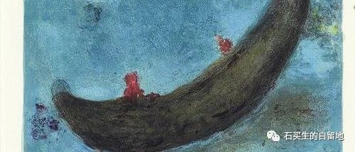
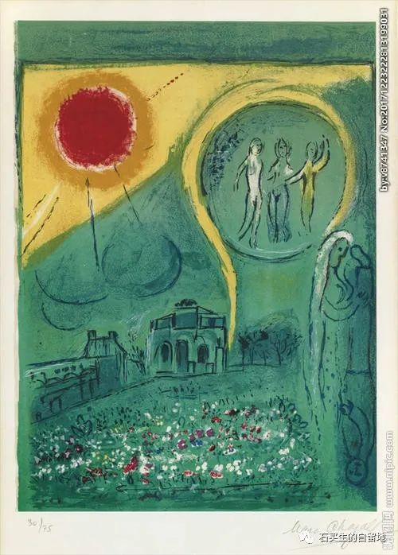
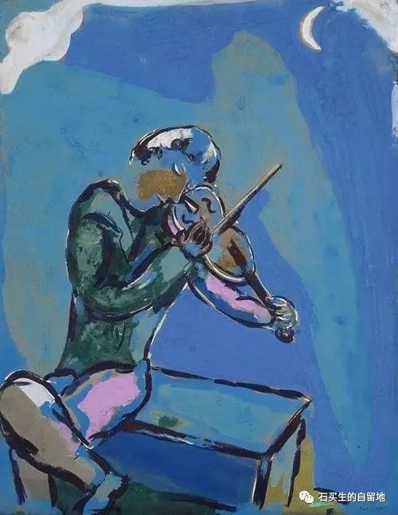
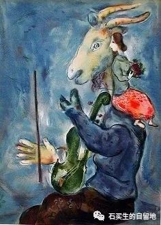

#  虚掩的门

原创  石买生  [ 石买生的自留地 ](javascript:void\(0\);)

__ _ _ _ _

  

  

虚掩的门

  

似乎毫无征兆，

你就进入了昏聩之年。

  

上班在办公室偷偷打盹。

在家看电视悄然打盹。

面对妻除了沉默还是打盹。

  

眼见繁花心不动。

习惯认他乡作故土，

所有的日子都是旧的。

  

梦里自己把自己吓醒。

连拉尿都缺乏激情。

眼前老飘过没有名字的云。

  

多年前因为日子苦，

爷娘总觉得这辈子没活够。

难道你提前把自己厌倦了？

  

暮色渐浓，一只无形的手呀，

正推开一扇虚掩的门。

你茫然不知所措。

  

再进一步，

黑夜将穿越你的一生。

  

  

  

岁月败美人

  

郁达夫诗云

曾因酒醉鞭名马

生怕情多累美人

  

一清洁阿姨跟我一样老了

她扫完厕所来到走廊

乜一眼印趣湖的荷

  

不好看啦这花儿，她说

一脸伤感

  

秋天啦，我说

美人就是这副样子

  

残花败柳，她揶揄一笑

样子好像残荷

  

  

  

  

分居时代

  

  

哀乐中年的标志：

  

眼看父母老去而把悲伤留给自己

把爱人变成亲人

让肉体在夜晚变成双轨

空间既安适又独立

  

灵魂暂时歇息了

  

男人在东边房间里朝右曲躬躺着

像一只大蚕蛹

  

女人在西边房间里四仰八叉躺着

像一只大螃蟹

  

老亚当夏娃用不同姿势迎接黎明

  

  

注：图片来自网络夏加儿名画

预览时标签不可点

微信扫一扫  
关注该公众号

****

****

×  分析

__

微信扫一扫可打开此内容，  
使用完整服务

：  ，  ，  ，  ，  ，  ，  ，  ，  ，  ，  ，  ，  。  视频  小程序  赞  ，轻点两下取消赞  在看  ，轻点两下取消在看
分享  留言  收藏  听过

