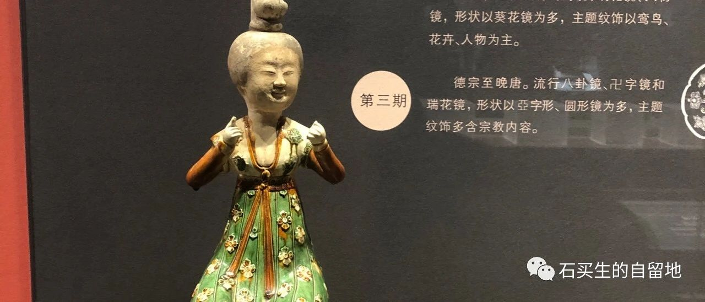
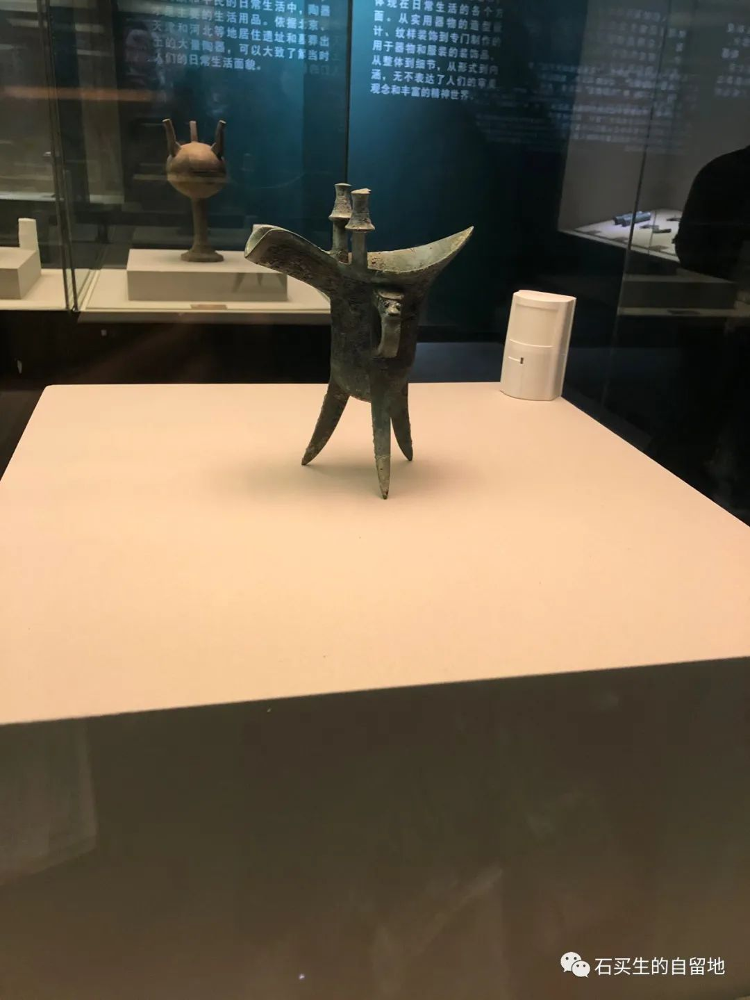
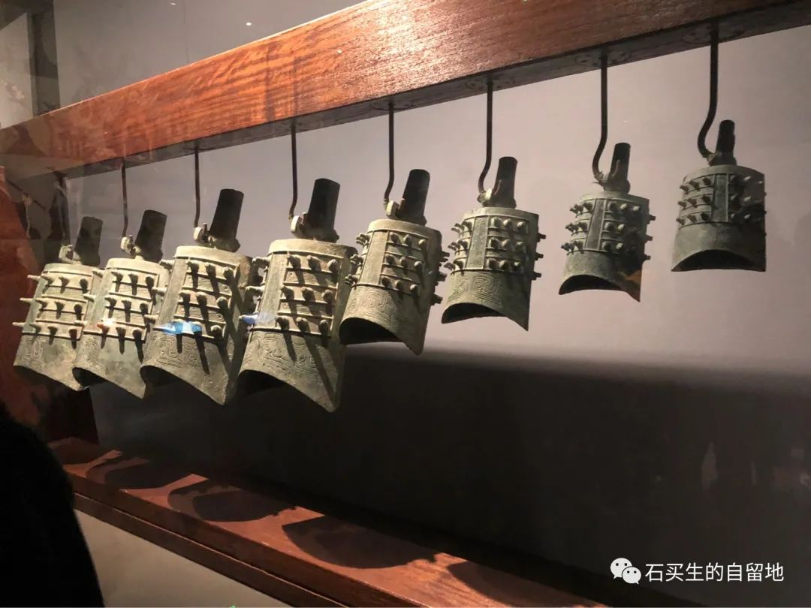
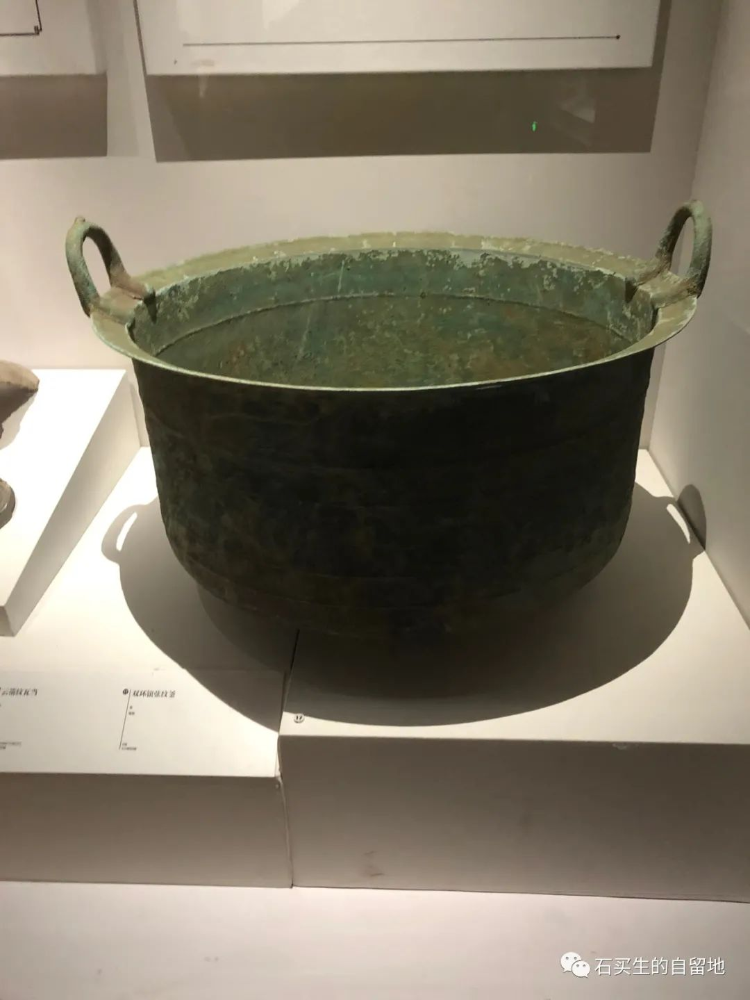

#  清晨之诗

原创  石买生  [ 石买生的自留地 ](javascript:void\(0\);)

__ _ _ _ _

  

​

  
  

清晨之诗

  

  

  

东方橘黄色霞光斑斓一片

  

蓝色运动场在晨风中微微震颤

  

  

  

一个穿深蓝校服的女生在跳高

  

她的双腿和手臂划出一条条不完美的弧线

  

  

  

两个男生站在两旁握着软皮筋线

  

憨憨地看着女生跳啊跳

  

  

  

女生嗨嗨笑成一串串悦耳的音符

  

男生哈哈嗬成一组组刺耳的韵脚

  

  

  

他们的老师啊在校道上边看边走边停

  

他在用一种更笨拙的方式为弟子们押韵

  

​

  

  

  

观别人观金鱼有感

  

  

  

印趣湖里有许多好看的锦鲤

  

常为一片面包或一根菜叶而狂欢

  

  

  

大人带着小孩在铁栅栏外围观

  

看水花四溅或水面泛起动人的涟漪

  

  

  

没有抢到面包或草叶的鱼儿总是失败者

  

得胜者似乎总是这些心满意足的观者

  

  

  

日子永是流逝锦鲤已经看透了观者的心思

  

它们的狡猾就是看你出洋相然后静静沉入水底

  

  

  

我也常驻足观看这庸常场景

  

同鱼儿和观者相比我更显无聊和没心没肺

  

  

​

  

  

电子秤

  

  

  

早晚各一次它蓝色屏幕上

  

几个阿拉伯数字不断打击我

  

看，你快变成猪啰！

  
  
  

注：图片来自自拍

预览时标签不可点

微信扫一扫  
关注该公众号

****

****

×  分析

__

微信扫一扫可打开此内容，  
使用完整服务

：  ，  ，  ，  ，  ，  ，  ，  ，  ，  ，  ，  ，  。  视频  小程序  赞  ，轻点两下取消赞  在看  ，轻点两下取消在看
分享  留言  收藏  听过

