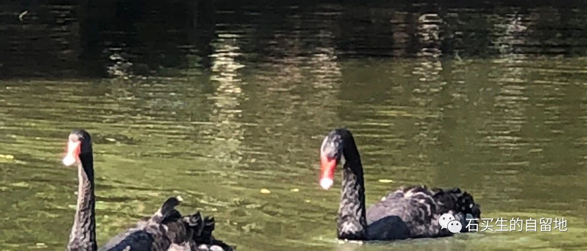
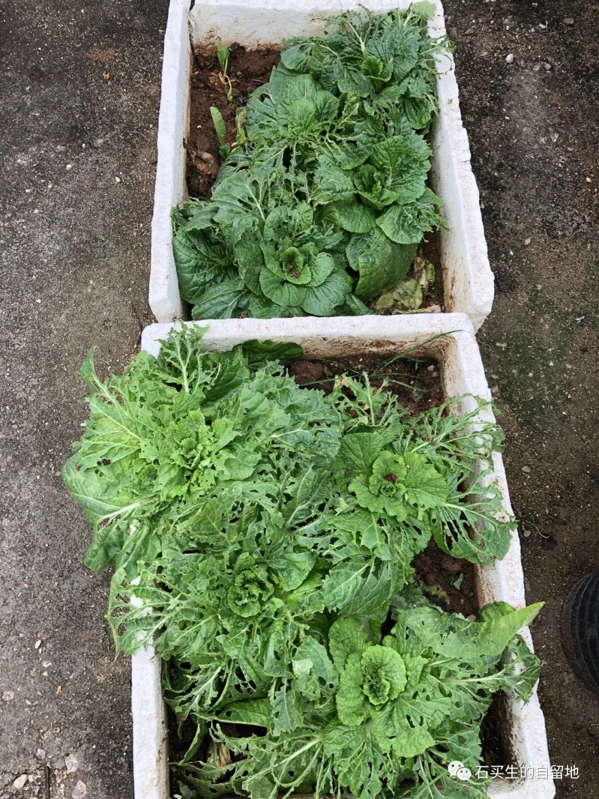
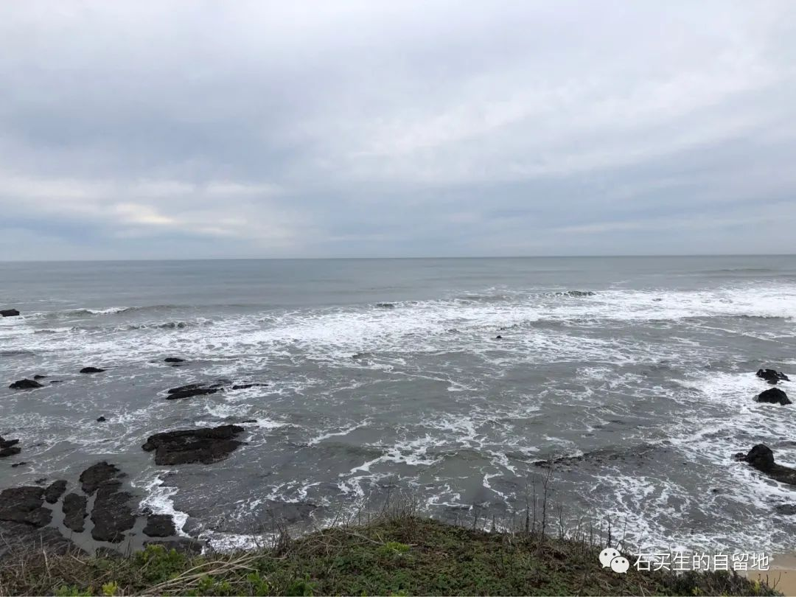
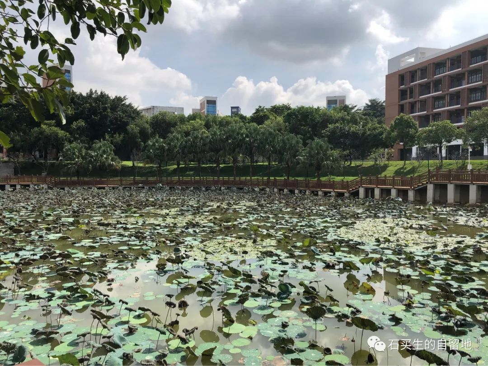

#  少年之死

原创  石买生  [ 石买生的自留地 ](javascript:void\(0\);)

__ _ _ _ _

  

​

自拍照片

  

  

鸟拉屎的地方

  

  

要有农夫的耐心和勤勉

  

才能招引一只鸟

  

  

  

一群鸟

  

悄然潜入空中菜园

  

  

  

时近年关，异乡的鸟

  

一批批返回故园

  

  

  

孤独与空旷

  

总是留给有准备的人

  

  

  

澄澈的目光

  

鸟儿的吻

  

  

  

让冬天残缺不全

  

春天总在另一个纬度

  

  

  

该破坏的早已破坏

  

该重建的还未重建

  

  

  

  

​

自拍照片

  

  

少年之死

  

—-  祭  L.X.Z

  

  

  

一个少年

  

决定把命交给大海

  

  

  

这不是决绝

  

这是彻骨的寒凉

  

  

  

被弃、被黑、被虐

  

上帝都没法说

  

  

  

我很抱歉

  

生于盛世，殒于今冬

  

  

  

这样的遗言

  

飘于水上

  

  

  

不是浪花的谶语

  

救救孩子

  

  

  

竟催生了更多亡魂

  

未亡者手上多有血污

  

  

  

​

自拍照片

  

  

斑鸠叫了

  

  

  

咕咕咕，咕咕咕

  

空荡荡的校园

  

  

  

斑鸠叫了

  

一只叫，一只应

  

  

  

叫醒了茶花、紫荆、紫薇

  

绿树和池水

  

  

  

也叫醒了一个中年男子

  

坐在窗前写诗

  

  

  

他在论证鸟儿、菜园

  

少年与这个世界的关系

  

  

  

他的结论是

  

不管花开得多么艳

  

  

  

鸟叫的多么欢

  

他的看法都是悲观的

  

  

  

  

  

  

  

  

  

  

  

  

  

预览时标签不可点

微信扫一扫  
关注该公众号

****

****

×  分析

__

微信扫一扫可打开此内容，  
使用完整服务

：  ，  ，  ，  ，  ，  ，  ，  ，  ，  ，  ，  ，  。  视频  小程序  赞  ，轻点两下取消赞  在看  ，轻点两下取消在看
分享  留言  收藏  听过

精选留言

秀波来自

石老师：您好 忧愁！[坏笑]

石买生的自留地来自

[咖啡]

