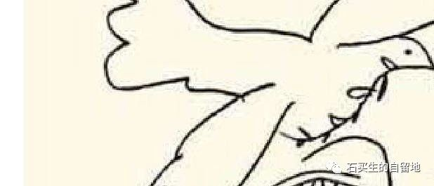

#  前天，我看见一封一群俄罗斯科学家的公开信

原创  石买生  [ 石买生的自留地 ](javascript:void\(0\);)

__ _ _ _ _

​

图片来自网络

  

  

公开信签名是动态的，有三百多人

  

而且人数不断攀升，信的内容是呼吁

  

俄罗斯军人停止进攻乌克兰

  

他们反对战争渴望和平，不希望看见

  

自己的国家成为世界谴责风暴的中心

  

他们说七十多年前，在抗击纳粹伟大战争中

  

乌克兰人民是自己的兄弟和亲人

  

现在攻打他们岂不是“煮豆燃豆萁，豆在釜中泣”！充满血腥和野蛮，一群知识分子

  

对自己的祖国如此披肝沥胆，日月可鉴

  

我把信看了一遍又一遍，感慨又神伤

  

索尔仁尼琴曾是一个时代的良心

  

托尔斯泰曾给俄罗斯带来无上荣光

  

肖斯塔科维奇的音乐曾在莫斯科上空久久回荡

  

让处在战争阴霾中的人们热血沸腾

  

现在我在鲜红的血色中看见俄罗斯

  

一些高贵的灵混没有沉默沉沦和疯狂

  

让我依稀看见浓云中一丝曙光，我希望

  

这封信和我的诗能变成和平鸽穿过隆隆炮声

  

带给世界安宁吉祥，而不是在无聊冷漠暴力

  

狂欢中变得下落不明

  

预览时标签不可点

微信扫一扫  
关注该公众号

****

****

×  分析

__

微信扫一扫可打开此内容，  
使用完整服务

：  ，  ，  ，  ，  ，  ，  ，  ，  ，  ，  ，  ，  。  视频  小程序  赞  ，轻点两下取消赞  在看  ，轻点两下取消在看
分享  留言  收藏  听过

精选留言

