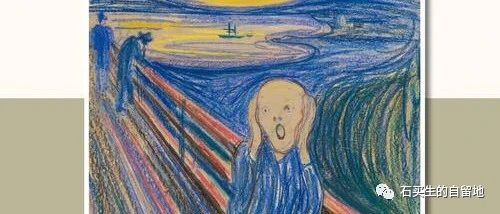
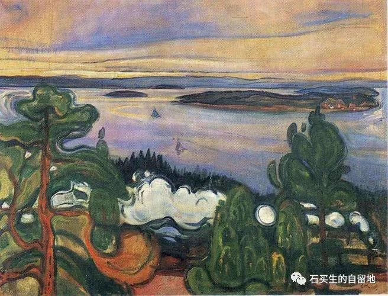
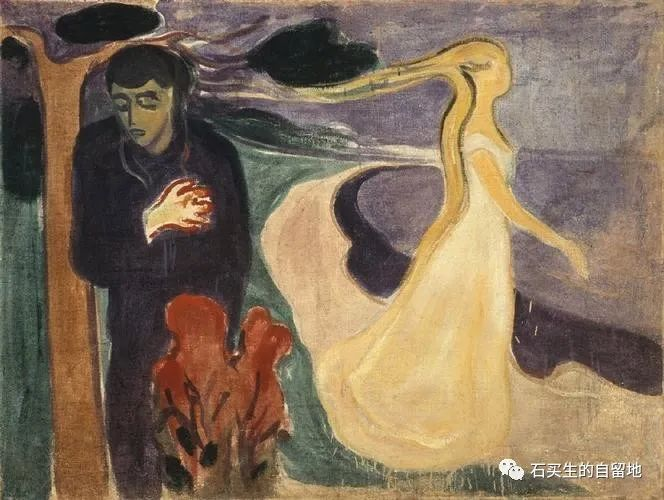
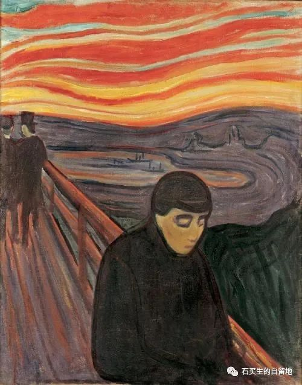

#  有一个民间段子显露迤逦揶揄之美

原创  石买生  [ 石买生的自留地 ](javascript:void\(0\);)

__ _ _ _ _

  

​

蒙克名画

  

  

有一个民间段子显露迤逦揶揄之美

  

  

  

我惊讶

  

有些民间段子有迤逦揶揄之美

  

  

  

昨天上午打开微信

  

跳出一幅画面

  

孙悟空

  

伏在花果山水帘洞口翘首盼望

  

见师父唐僧缓步走来

  

心中一喜

  

问一句

  

师傅可是解封来啦？

  

  

  

NO  ！  NO  ！  NO  ！

  

我奉玉帝旨意来做核酸检测

  

师傅一脸严肃

  

  

  

​

蒙克名画

  

  

一个偏执狂

  

  

  

有一个人啊

  

明明知道所有的信息源

  

充斥着狗血偏执癫狂

  

还是忍不住天天看

  

看一次

  

他的理智就丧失一点

  

离疯狂就近一点

  

慢慢地他吸毒一样

  

患上了依赖症

  

他麻木的神经

  

渴望时不时来一下

  

星辰与天籁

  

几乎从他的世界里同时消失

  

他几乎同时患上了

  

失明症失语症

  

  

  

我的老哥朋霍费尔啊

  

你的金玉良言  —-

  

“愚蠢是一种道德缺陷！”

  

已对我丝毫不管用

  

不可救药的我

  

除了偏执继续偏执

  

余生拿什么向你致敬？

  

  

  

​

蒙克名画

  

  

一则寓言

  

  

  

一只好斗的公鸡

  

未经允许

  

闯入另一只鸡窝

  

找一只瘦弱的公鸡打斗

  

瘦公鸡高喊

  

“救我！”

  

  

  

面对两只打斗公鸡

  

远近声音吵得不亦乐乎

  

“强盗！”

  

“罪犯”

  

“坚持住！”

  

“别打啦！”

  

众声喧哗掩不住

  

黎明和黄昏染上血色

  

  

  

注：以上图片来自网络

预览时标签不可点

微信扫一扫  
关注该公众号

****

****

×  分析

__

微信扫一扫可打开此内容，  
使用完整服务

：  ，  ，  ，  ，  ，  ，  ，  ，  ，  ，  ，  ，  。  视频  小程序  赞  ，轻点两下取消赞  在看  ，轻点两下取消在看
分享  留言  收藏  听过

精选留言

吴丰强来自

看了诗歌，觉得解封了！[玫瑰][玫瑰][玫瑰]

