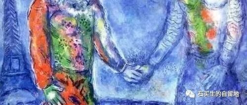
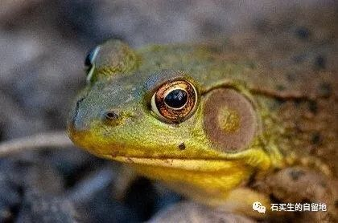
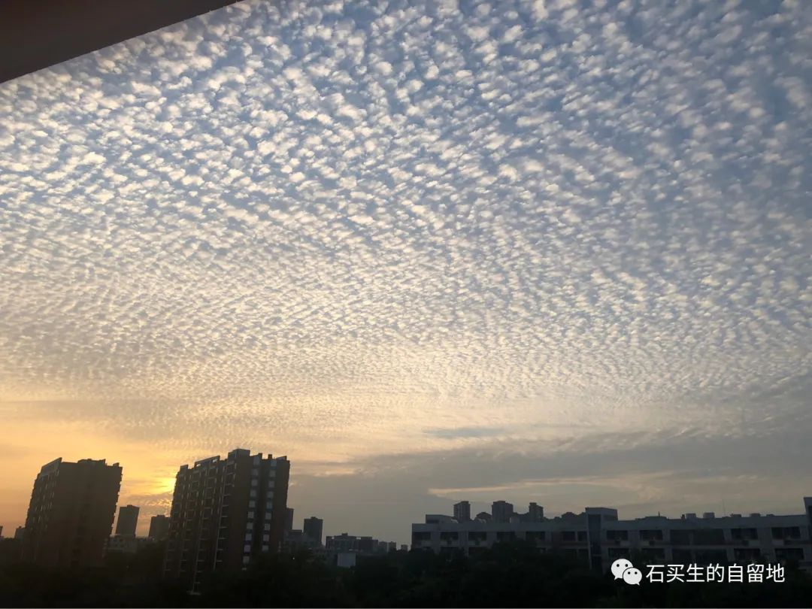

#  无辜的牛蛙是怎样被我毁掉的？

原创  石买生  [ 石买生的自留地 ](javascript:void\(0\);)

__ _ _ _ _

​

图片来自网络

  

  

无辜的牛蛙是怎样被我毁掉的？

  

  

东莞的雨夜湿意氤氲

  

也许是憋久了

  

牛蛙在下水道因发情而狂叫

  

我接连三个晚上

  

被迫听不堪忍受的恼人音乐

  

被迫拿起一只拆开的铁丝衣架

  

在下水道一阵猛搅

  

感谢上帝

  

第四晚深夜

  

我再也没有被凌厉声吵醒

  

牛蛙的声音喑哑了

  

只时断时续

  

再也没有前几日狂放的激情

  

他好像被我彻底阉割了

  

我的欣喜跟放晴的天空一样明媚

  

  

  

今早

  

我看见印趣湖里的荷花开得娇美

  

突然我觉得

  

那只被我阉割的牛蛙是无辜的

  

这个静默的春天

  

我成了无数扼杀生灵的刽子手中的一个

  

酿成了无法挽回的平庸的恶

  

娘希匹

  

  

​

图片来自自拍

  

  

鱼肚白的云把我灼伤了

  

  

  

在致远楼四楼西边走廊上

  

我看见黄昏的云

  

鱼肚白的云

  

我的心竟有了久违的激动

  

我激动

  

你千万别说我老得不对劲

  

千万别说我又呆又蠢

  

你一说

  

我的心就会留下一道伤痕

  

在一无所爱的时代

  

我甚至想邀请你一起看天上的云

  

邀我的学生一起看天上的云

  

轻盈飘逸云啊

  

你转瞬即逝

  

在疫情四起的时代

  

是你的美

  

使我对天边外那自由广阔的世界

  

还怀有处子般的渴望

  

转瞬亚当降临

  

转瞬就将过完一生

  

预览时标签不可点

微信扫一扫  
关注该公众号

****

****

×  分析

__

微信扫一扫可打开此内容，  
使用完整服务

：  ，  ，  ，  ，  ，  ，  ，  ，  ，  ，  ，  ，  。  视频  小程序  赞  ，轻点两下取消赞  在看  ，轻点两下取消在看
分享  留言  收藏  听过

