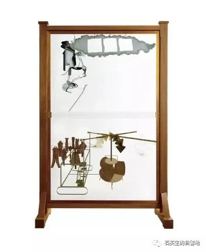
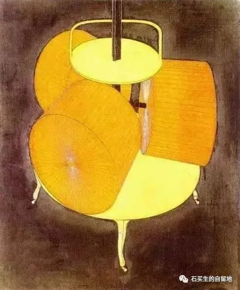
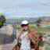
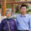

#  虚伪的慈悲

原创  石买生  [ 石买生的自留地 ](javascript:void\(0\);)

__ _ _ _ _

​

杜尚的名画

  

  

雪的残忍

  

我的父母有一些朴素的愿望。

村人眼里韩婆庄的聋子啊

我父亲

没人知道

他喜欢吃炒花生

豆条煮鱼

奢侈一点的豆豉烧肉

他一辈子最大的愿望

上北京纪念堂看水晶棺里那个伟人遗容

我母亲的胃

像一段山梁上干渴的渠

填些酸菜

素面条

黑糯米汤圆就好了

她更爱看儿孙吃更好一点的食物

乐此不疲

她一辈子最大的心愿是多看看世事

活到八十岁

2003年，2010年两场大雪

把二老的愿望一一收留了

从此我对人世间的雪

有了复杂的情感。

​

杜尚的名画

  

  

虚伪的慈悲

一个宁静的午后

我正在看电视

淡黄地面瓷砖上

一只蚂蚁在爬

我抽出一张餐巾纸

按死了它

过了几天我心里嘀咕

别忏悔呀  这世界天天死人

我残忍事出有因

某一日我也会成为

别人手下一只待死的蚂蚁

别人是否跟我一样无动于衷

除了上帝的慈悲

我的心中只有苟且

​

杜尚的名画

  

  

画一个圆

放假啦

我哪儿也不想去

我的血

流得越来越慢了

风景比不上风险

熟悉总是好过陌生

想去远方

有这想法就蠢得不行

真要走

除了后悔

你将看见无数绳索

无数虚妄之门

小时候我娘说

崽啊我给你画一个圆

你哪也别去又稳又安全

看看今天  我娘真英明

  

注：图片来自网络

预览时标签不可点

微信扫一扫  
关注该公众号

****

****

×  分析

__

微信扫一扫可打开此内容，  
使用完整服务

：  ，  ，  ，  ，  ，  ，  ，  ，  ，  ，  ，  ，  。  视频  小程序  赞  ，轻点两下取消赞  在看  ，轻点两下取消在看
分享  留言  收藏  听过

精选留言

青瓷在土来自广东

石老师这一组诗写尽了生活的无力与无奈。感人。

石买生的自留地来自

谢谢郑老师鼓励！[玫瑰]

吴丰强来自广东

那是怎样的胃，山梁上干渴的渠！

石买生的自留地来自

一代人饥饿的记忆！

南希来自江西

[强][强]石老师诗令人感动

石买生的自留地来自

谢谢张老师鼓励！[咖啡]

乾运基础老石来自广东

人生大事，莫不是迎来送往！ 儿时脑海中的二老，一位敦厚本分，一位和蔼可亲，恍如昨日，一转眼就是半生的光阴！ 哥、嫂多保重！

石买生的自留地来自

老四好！[握手][咖啡]

谈华楼来自江西

除了上帝的慈悲，我的心中只有苟且。清醒者的精准定位！

石买生的自留地来自

华楼兄好！久违了，谢谢鼓励！[握手][咖啡]

Duan先森来自湖南

时光是无情的 经历过，才能感同身受 这就是人生，没有害怕和遗憾。[憨笑][憨笑][憨笑][憨笑]

石买生的自留地来自

[握手]

