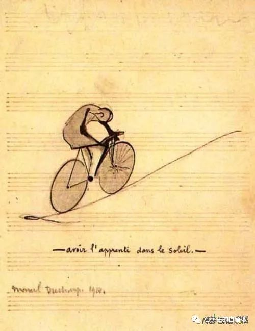

#  哑叔

原创  石买生  [ 石买生的自留地 ](javascript:void\(0\);)

__ _ _ _ _

​

杜尚名画

  

嘿，别看

几棵小叶榄仁挤在一块

一道绿色屏障

让夏天和高远的天空

在想象中延伸

树叶时动时静

不见一只鸟

但有声音从池塘迤逦而来

日子显出虚假的隐忍

似乎只有台风

让一切显示真容

渴望被蹂躏

期待最后的疯狂

​

杜尚名画

  

虚无的注脚

一个带金丝眼镜的糟老头

在印趣湖栅栏边

看锦鲤

一对黑天鹅过来哥哥哥

声音难听死了

湖那头的荷花开得寂寞

老头无心晤对

乜了几眼湖边的青草和绿树

和远一点的致远楼

走了

​

杜尚名画

  

哑叔

死了好多年了

生前村里没有多少人知道

他有一个名字

叫乾锦

山岭田垅各种庄稼和几口水塘

还有坏天气

当然更不知道他的名

他逢人便打手语

他如果向你指指点点

一定是有个什么节日正在临近

清明啦端午啦中秋啦

过节总让他像怀春的猫一样兴奋

能吃上米粑或者粽子或者打糖

是他一年中最有盼头的事

他也有忧伤

不管什么时候

只要碰见村中年轻女子

他就手舞足蹈六神找不到北

他的眼睛里

有蓝幽幽的火苗在闪

像笑又像哭

​

杜尚名画

怜悯

一个老者

在大地上踽踽独行

被王尔德撞见了

老哥为啥愁容满面

心事重重

他娘的都怪你呀

叨什么狗屁

人最怕的是身体老了

可心还年轻

  

预览时标签不可点

微信扫一扫  
关注该公众号

****

****

×  分析

__

微信扫一扫可打开此内容，  
使用完整服务

：  ，  ，  ，  ，  ，  ，  ，  ，  ，  ，  ，  ，  。  视频  小程序  赞  ，轻点两下取消赞  在看  ，轻点两下取消在看
分享  留言  收藏  听过

