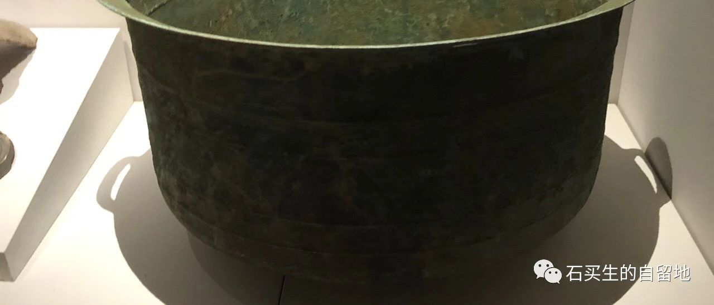
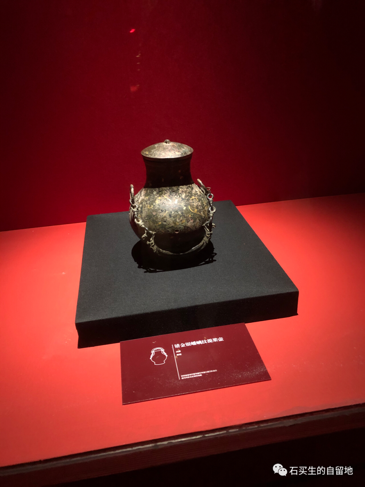
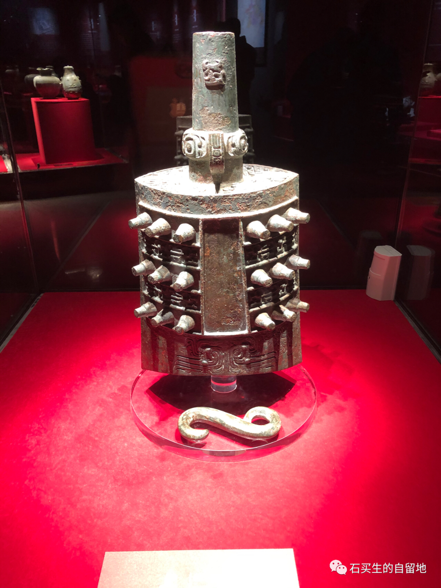

#  酷暑记

原创  石买生  [ 石买生的自留地 ](javascript:void\(0\);)

__ _ _ _ _

​

自拍照片

  

酷暑记

  

白日下割稻子

打谷子

星斗下插秧

是上世纪八零年代

农村三伏天

必须干的事儿

  

当然那时啊

生活尽管穷但充满阳光

远方也有召唤

下海

激扬青春

追逐绮梦

  

2022  年三伏天

地上到处火烫火烫

从城里到乡村

人们蜷缩在空调下

像一只一只避暑的獾

连做家庭作业

也缺乏激情

偶尔关心一下肮脏的政治

过过嘴瘾

无聊透顶

  

白日里

星斗下

人们必须做的事儿

做核酸

看行程

好像每个人都有病

有病没病

你说了不算

张开嘴

证明证明

  

​

自拍照片

  

代价

  

儿子住院

我陪护

除了做核酸

还不能外出

类似软禁

病房那一扇玻璃门

是一道天堑

你和外面的世界

画了一道分界线

要僭越

必须乔装

在护士眼皮底下

做送餐人员跟班

康复人员影子

医生的尾巴

一闪而过的小偷

总之要想跟外面酷热

并不完美的世界联络

不能说真话

也不能做真我

必须彻底迷失

才能换来短暂的自由

与偷欢

  

预览时标签不可点

微信扫一扫  
关注该公众号

****

****

×  分析

__

微信扫一扫可打开此内容，  
使用完整服务

：  ，  ，  ，  ，  ，  ，  ，  ，  ，  ，  ，  ，  。  视频  小程序  赞  ，轻点两下取消赞  在看  ，轻点两下取消在看
分享  留言  收藏  听过

精选留言

