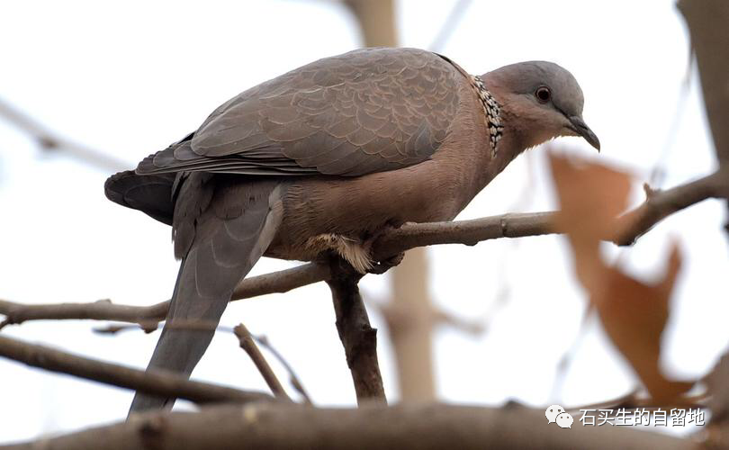

#  在K678次列车上

原创  石买生  [ 石买生的自留地 ](javascript:void\(0\);)

__ _ _ _ _

​

图片来自网络

  
  

斑鸠想，这是怎么了？

  

列车由北向南

经过向塘车站

  

一节废弃铁轨上

立一只褐色斑鸠

  

它骨碌碌的眼珠

往车上瞅

它看见车上那么多

蓝色口罩

  

一闪而过

好像飘扬的旗帜

它充满疑惑

这是怎么了？

难道天空破碎了？

它的脚

  

似乎突然被粘住了

它陷入间歇性沉默

  

它的翅膀

也不知往哪个方向飞翔

  

​

毕加索名画

  

  

南迁的大鸟

  

头一次见

一个粗壮的东北大汉

他声如洪钟目光如炬

面色如古铜

帆布旅行包鼓鼓囊囊

塞满了家乡特产

他的自豪停在遥远的年代

好像历史的跫音

他的失落就在今天

牡丹江的房子由  50  万降到  5  万

而且都是空的

他背井离乡充满悲壮

他本次列车终点

是惠州车站

  

​

毕加索名画

  

吊诡的事儿

  

  

列车正经过定南

青白相间的房子

散落在山山岭岭之间

散发徽派建筑特有的气息

一个中年大叔

头发斑白正兴冲冲刷微信

他看见乌军围攻哈尔科夫

嫣然一笑

他想起央视  4  套每晚  9:30  分

那几个专家分析俄乌战争

  

老是口是而心不至

他心中对他们充满同情和怜悯

最近俄在乌东四州搞公投

那几个专家神秘消失了

搞得我一打开电视还不习惯

我甚至有点想念他们

  

预览时标签不可点

微信扫一扫  
关注该公众号

****

****

×  分析

__

微信扫一扫可打开此内容，  
使用完整服务

：  ，  ，  ，  ，  ，  ，  ，  ，  ，  ，  ，  ，  。  视频  小程序  赞  ，轻点两下取消赞  在看  ，轻点两下取消在看
分享  留言  收藏  听过

精选留言

