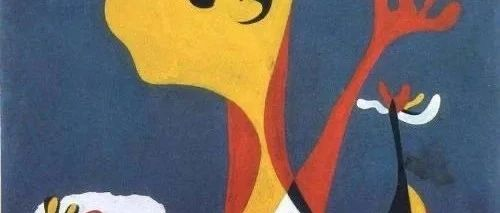
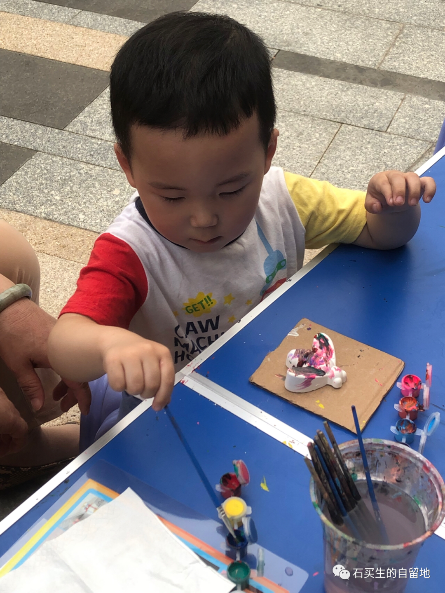
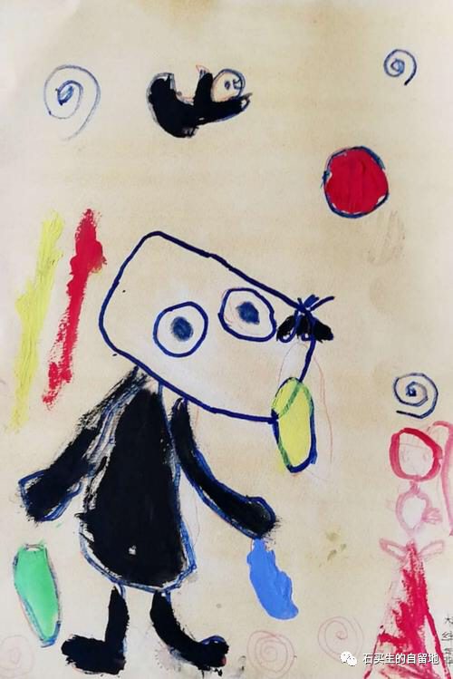
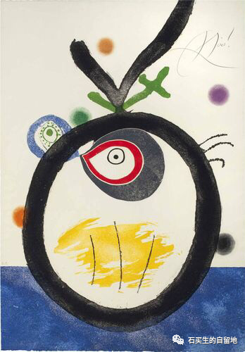
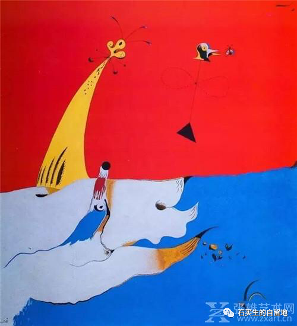
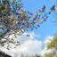

#  天使的诗

原创  石买生  [ 石买生的自留地 ](javascript:void\(0\);)

__ _ _ _ _

天使的诗

外孙  QQ两岁零九个月啦  。  满世界物象在他眼里充满新奇，目光触碰皆为小诗。信口呀语，有童稚之美。

\-----题记

​

QQ在给蝴蝶模型着色

  

星星叫什么名字？

QQ喜欢玩沙子

用小棍棍

画圈圈

一个又一个

又戳小洞洞

一个又一个

沉浸在自己的世界里

自得其乐

玩累了

仰头看见星星

我问

天上那发亮的叫什么？

叫星星

星星叫什么名字？

叫最美丽

  

​

米罗名画

  

  

老虎在树上

天黑了

打印趣湖边经过

风好大

桃花心木窸窸窣窣

阴森恐怖

有老虎！

QQ说

老虎在哪？

老虎在树上！

老虎冷吗？

老虎穿灰衣服

这个傍晚

我不知道

老虎怎样住进了

他小小的

心里

​

米罗名画

  

  

蛇吃什么？

夜幕中紫荆树下

满地落英缤纷

紫红淡黄相间

有蛇

QQ说

哪里有蛇？

这是紫荆花呀，宝贝

你见过蛇吗？

见过，在那小山坡上

公公，蛇吃什么？

蛇吃青蛙

你带我去看看

我不，我怕

你抱着我站远一点

就不怕呀

​

米罗名画

  

  

背背驮

QQ喜欢满校园遛弯

见到天鹅鸭鸭

都说，你好

你好

在健身路上走疼了脚

仰头撒娇

到家还有好远呀

潜台词是

公公，背背驮

我自然配合

下蹲弯腰

将他背到背上

顺势侧起右脸

只听见“嗞”地一声

我被奖赏

一个蓝色的吻

  

注：图片来自网络

预览时标签不可点

微信扫一扫  
关注该公众号

****

****

×  分析

__

微信扫一扫可打开此内容，  
使用完整服务

：  ，  ，  ，  ，  ，  ，  ，  ，  ，  ，  ，  ，  。  视频  小程序  赞  ，轻点两下取消赞  在看  ，轻点两下取消在看
分享  留言  收藏  听过

精选留言

Ricardo来自广东

看完以后复习焦躁的心顿时平静了许多[玫瑰][咖啡]

石买生的自留地来自

[玫瑰][握手]

木子每来自广东

诗很美，孩童的世界比诗更美[爱心]

石买生的自留地来自

所以每个孩子都是天使！[握手][玫瑰]

PoTATOoO来自广东

童语也是诗啊[玫瑰]

石买生的自留地来自

是滴[呲牙]

青瓷在土来自广东

咦？亲人们都回来了？

石买生的自留地来自

郑老师好！夫人和外孙来小住，过几天回九江呢！[咖啡][握手]

吴丰强来自广东

小可爱！[玫瑰][玫瑰][玫瑰]

石买生的自留地来自

[咖啡][呲牙]

自习女孩来自湖南

[玫瑰][玫瑰][玫瑰][玫瑰]

石买生的自留地来自

[咖啡]

花生人儿(-.-)来自广东

沉浸在小QQ和石伯的温馨甜蜜里了[流泪][流泪][流泪]

石买生的自留地来自

[拥抱]

PEANUT LA来自广东

老师，为什么QQ的吻是蓝色的呢?[嘿哈][疑问]

石买生的自留地来自

我俩的T恤是蓝色的，月光映照反光显示的颜色。[呲牙]

PEANUT LA来自广东

哈哈哈哈好！💙💙

