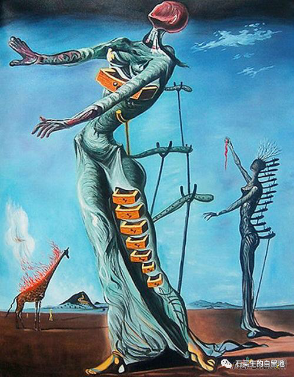
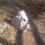

#  Not necessary

原创  石买生  [ 石买生的自留地 ](javascript:void\(0\);)

__ _ _ _ _

Not necessary

  

​

达利名画

  

因为  Not  necessary

  

命不如草芥

  

日子被打折甩卖

  

想说的话又被咽回来

  

亲情在发霉

  

返乡的路正被荒草覆盖

  

恐惧绝望爱

  

早已分不清东西南北

  

天空啊

  

明明阳光普照

  

可有人说到了至暗时刻

  

花儿未开先败

  

蝴蝶无力飞过沧海

  

梦中之梦啊

  

不可能是绿色的

  

习惯性低头默许

  

享受奴隶般的屈辱和安稳

  

连雷声都喑哑了

  

心不如止水

  

也不如纸灰

  

只知道有必要

  

每天

  

张开嘴

  

渴望那白色小魔棒

  

捅进来

  

  

​

达利名画

  

一个好端端的人被什么掏空了

  

  

  

他在饭堂吃饭吃到一半

  

突然停止了

  

因为筷子在他面前写下

  

三个字

  

  

  

他在家里喝水喝到半杯

  

突然停住了

  

因为杯水在他眼前晃悠

  

三个字

  

  

  

他在红棉路玉兰路上散步

  

突然折回了

  

因为他狂乱的脚步不停在写

  

三个字

  

  

  

他在课堂给学生讲生命的诗意

  

突然终止了

  

因为他笨拙的嘴反复念叨

  

三个字

  

  

注：图片来自网络

预览时标签不可点

微信扫一扫  
关注该公众号

****

****

×  分析

__

微信扫一扫可打开此内容，  
使用完整服务

：  ，  ，  ，  ，  ，  ，  ，  ，  ，  ，  ，  ，  。  视频  小程序  赞  ，轻点两下取消赞  在看  ，轻点两下取消在看
分享  留言  收藏  听过

精选留言

吴丰强来自广东

淤泥一样的生活

石买生的自留地来自

[咖啡]

周涛来自江西

哪三个字？

石买生的自留地来自

非必要[握手]

秀波来自江西

石老师 怒了[脸红]

石买生的自留地来自

[握手][玫瑰]

