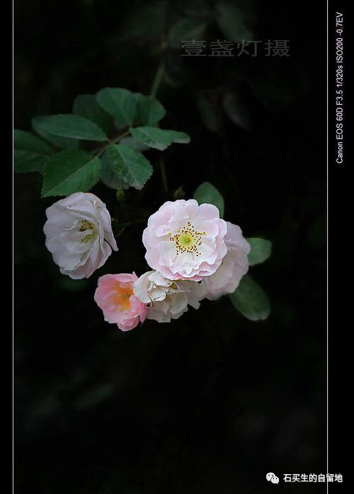
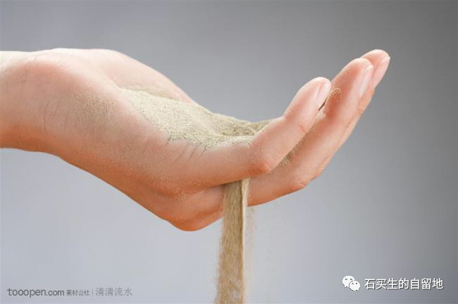
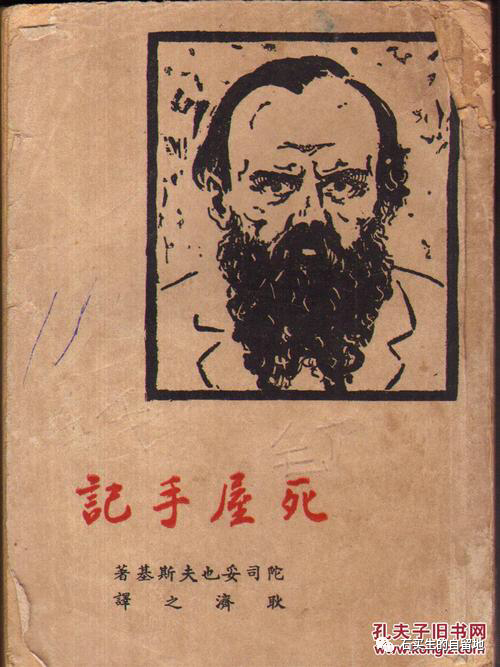

#  素年锦时，笔底生花

原创  马晴等  [ 石买生的自留地 ](javascript:void\(0\);)

__ _ _ _ _

\----东莞中学松山湖学校2022级高一（20）班优秀周记选

  

​

  
努力的日子会发光

马晴  
那些努力的人像在夜空中一颗颗恒星，散发着耀眼的光。他们可以完成你不能完成的事，他们可以取得你羡慕的成绩，而不努力的你，在他们身旁只会越来越黯淡。  
同在一个教室学习，为什么人与人之间的差距如此之大？不是你不行。而是不够努力。努力仅仅九笔，可做起来却是那样的困难。在晚上，你因眼睛都睁不开了只想进入梦乡时，那些努力的人正连夜刷题。在清早，你还在为了起床离开温暖的被窝犹豫时，那些努力的人早已利用宝贵的早晨开始了学习。每天早上，我们都在面临一个选择，有些人选择盖上被子做未做完的梦，有些人选择掀开被子完成未完成的梦。  
最近网上流行一个词“内卷”，意思是同行间竞相付出更多努力以争取有限资源。这个词在学生中流行后、却渐渐成为一个讽刺成债好的人的专用名词。在我看来，那些比我们优秀的人不是“内卷”而是“努力”。努力使他们发光。使我们黯然。  
这一生我们会犯很多错误，但我们不能以“明天为借口:从明天起再努力。我不愿意用一生的时间去弥补曾经的不努力，我希望用我现在的努力使我的未来繁花满枝。  
你背单词时，阿拉斯加的鳕鱼正在跃出水面;你算数学时,太平洋彼羊的海鸥振翅掠过城市上方；你挑灯夜读时，极圈的夜晚散漫着五彩斑斓。但是啊，你别着急!当你为了你的未来努力奋斗时，那些你觉得一辈子都不会见到的景色，那些你觉得终身不会遇见的人,正在一步一步地朝你走来。  
，如果你觉得生活烦闷，那就跑起来，因为会有风。如果你觉得日子黑暗无光，那就努力吧，努力的日子会发光。

  

  

  
记我的奶奶

陈荣兴  
我的奶奶，应该七十多岁了吧，她个子不高，也很瘦，看起来很小，据说小时候她也矮而胖，被娘家人那边称为diézhu
bo(地主婆)，自从我和堂弟得知这个事后,还开了她几年的玩笑,当然这是小时候,现在的我已没了那个心。  
奶奶是全家唯一没有智能手机且会用的人。暑假她和爷爷来广东看病，一直到现在,我一直不知她该如何打发时间。这里不比农村,鸡鸭相伴,稻麦相陪,宽阔清静,偶尔上附近的旧学校做些工、家里待些客人。广东，发达是发达，即便我还不会走路便来了此,也觉这地不如老家。她老人家怎么想我不知道，只知道如果是我,我大概定是会疯的。  
其完爸爸和叔叔有一直想给奶奶买智能手机,奶奶总是拒绝的,她说她不爱动脑。当有好吃的东西要给奶奶吃时,她说现在不做事了，不容易饿,多半如此言。奶奶喜欢塞钱给我，都是红色的，我这是拒绝的，她也总是拒绝我绝然后强行给我。奶奶的手不怕烫，有一次吃饭我捞汤时这迟不下手，因是太烫了，奶奶帮我捞了，她一点感觉没有，我想应该是她的手是辛勤汗水努办、毅力下长成的,是老好几辈劳动者的手,而我,新时代下惯环的身躯与自私鬼。

  

​

  

时间流隙

廖苑婷  
周围，优秀的人很多。  
追看那些自己向往的背影，有时眼前会朦胧的显出一点昏黄的图象。银杏，一片银杏,身姿优雅而高贵，它悠悠地在风中飘荡。细尘,一粒细尘,隐没在银杏漆黑的阴影里
-----追逐呀,追逐呀,永远得不到光彩的眷顾。  
我是那粒灰尘吗?我就是那粒灰尘的吧。  
最近常常回顾往昔了，怀旧并非老年人的专属。有时在睡梦中,在跑步时,在听《goover》时,在此时写文章时，脑海中是总是不住地播放过去的胶片。  
忆起我曾在无边的星光下阅读《克鲁布林的树林》，手指曾抚一页又页纸张。忆起窗边的书桌上总是推满我的稿件
----那些因热爱而写下的文草、因心动而精心勾勒的书法。  
忆起我也有辉煌而灿烂的初中时期,喷涌而来的肯定。

母亲在过去的十五年里一遍又一遍地夸我长得好看。  
妹妹与同学注视而来的目光像古堡里的木柴注视炉火般热切。  
怀旧是一台留声机,那张缓缓转动的光碟，悠扬复古的乐声，怀旧令我终于想起-----  
我也是被别人追逐的那片优雅的银杏。  
时间就悄悄在不断的、循环的肯定与否定中溜走，我的高一，其实什么都没有长进。  
  

​

  
崇高的苦难还是廉价的幸福

李雨晴  
周六喜欢泡在书店写作业，点一杯热摩卡，配一块小蛋糕。橘黄色的光丛玻璃窗斜射进来,晕染着尘埃,裹携着书本纸张“哗-哗”翻动时散发的静谧木香,一切美好得仿佛将人置身于时间之外。  
置笔、抬头，偷得片刻停歇，漫步在层层书架间，流连于中外古今经典。角落里一本不起眼的书吸引了我的注意:黯淡的灰褐色封面，简单明了的黑体字--”廉价的幸福?还是柴高的苦难?”,来自俄国作家陀思妥耶夫斯基的《地下室手记》  
“崇高的苦难？还是廉价的幸福？”,不同的人有不同的看法。太宰治，日本无赖派文学大师。他的小说《人间失格》被世人所熟知，这本书没有剧烈的情感喷涌，但字里行间都淡淡地透露出一种令人紧息的绝望:角色间平直无聊”的对话,单调麻木的生活。以致于这本书在很长一段时间被列为教育中的“禁书”,也不被大众价值观认可。纵观太宰治的一生，我们也不难发现，不幸的家庭和童年塑造了他敏感细腻的性格,成人后在生活与工作路上四处碰壁加剧了他的“孤僻”，四次自杀未遂，在30多岁时死于投河自杀。或许在很多人眼里，对比社会上报导残疾人顽强生活，歌颂勇敢不屈的品质，太宰治的一生是失败的。而在我眼里，他对生命的思考却比常人更加深入。  
”死亡不是生存的反义，不过是生存中蕴含的一部分机能。所以不近距离的观察死亡,就没办法把握生存的全貌。”太军治说。一个对死亡都饱有积极心态的人，难道不值得我门敬佩?但俗话又说“傻人有傻福”。世上有如此觉语的人毕竟少之又少，参透的东西多了，理解你的人少了，谓之“高处不胜寒”你便感到了孤独。所以圣人往住会承受更多苦难，应承担更多社会责任，还面临着被世人视作异类的风险，可“会当凌绝顶”，当你站得高了,看到的风景多了，也必将收获更多体悟与幸福。太宰治在作品《女生徒》里写到“现在我开始相信神明的存在了。天空的颜色该算什么色呢?蔷薇?火焰?彩虹?天使的羽翼?大佛院?不对,不是这样,应该要更庄严。”"我轻轻触摸草地，好想美丽的活下去。”.  
伟人推动人类文明进程，所以注定承担更为社会责任。而作为普通人，我认为顺其自然便好:风雨过后有彩虹，乐观面对每一次挫折，也尽力捕捉每天的一丝微风,一缕日照。  
所以春花灼灼,难免林小姐葬花之悲;秋色妻凄,亦有刘禹锡豪言壮志。  
顺着自然之理,倒也是一种感慨。  
  
  

人偶

黄逸晋  
我是一人偶,本为神而所用,其被力量所左右,舍弃无用的我。  
被舍去的我沉睡多年。终被人们所寻。我和他们一起生活，情同手足。其却被阴谋所害。留下孤独的我。

孤独的我遇到同样孤独的同类，其因病而早逝，我也从而被世界遗弃。我踏入深渊,憎恨着这个虚伪的世界。  
我不会再爱人,也不会再爱神,我是一只人偶,仅此而已。  
  
  

  
浅淡rap圈

李泱伶  
如今,说唱算不上小众文化，随着《中国新说唱》的出圈，越来越多人认没到了这种文化,但在现实中它仍熟饱受争议,有人认为聒躁,只是喊麦,有人认为俗气，上不得台面。可予我而言,它却是像光一样存在的。  
说唱最开始源于黑人奴隶,通过激情的音乐释放内心的不满，随着发展有越来越多的风格出现。随主流的多的旋律说唱，一些很多的歌都是它。但我更喜欢硬核说唱。歌里的人是热烈且真挚的,有看自己的个性,撕下成人世界里虚伪的面具。听着歌,心中的不满也会随着歌的结束而结束.刚听到的时候,就像没电关机的手机遇上数据线,也许无法成为
rapper,但到如今，仍向往于歌中的也界。厂牌里的只要有难每个必第一个出声。社会中有各种各类的圈子有娱乐圈、漫画圈,至百个圈子里都有自己的蹚浑水，但只有这个圈子里的人,敢于发声。圈子里不公平的现象敢唱出来。他们忠义，真性情，也许也会有许许多多的缺点,但我认为他们才是真的keepreal”,当他们不爽时，直接发歌dìsst怼]，他们也会为校园霸凌,毒品交易,女性歧视等会问题发声。印象深刻的是滴滴司机杀人案地界不断发生时,她们告诉女孩““”穿自己的衣服，不堪的是他人,明明是女孩受伤,违法的人铃铛入狱，可女孩却在这世界里不得安息"她懂不懂爱啊”“她就是一活该。”  
每个人都有自己的爱好，有人喜欢重金属，有人喜欢轻音乐。音乐于每个人而言都有不同的意义,说唱于我,是信仰,是我与无限袒护的存在。  
  
  

注：图片来自网络

预览时标签不可点

微信扫一扫  
关注该公众号

****

****

×  分析

__

微信扫一扫可打开此内容，  
使用完整服务

：  ，  ，  ，  ，  ，  ，  ，  ，  ，  ，  ，  ，  。  视频  小程序  赞  ，轻点两下取消赞  在看  ，轻点两下取消在看
分享  留言  收藏  听过

精选留言

言来自广东

学弟学妹们太优秀了

石买生的自留地来自

[咖啡]

