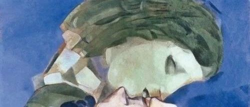
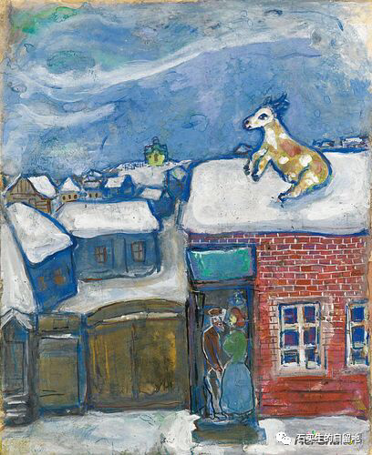
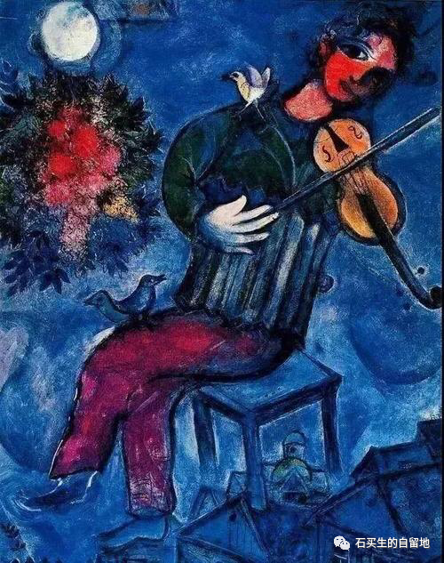

#  本命年

原创  石买生  [ 石买生的自留地 ](javascript:void\(0\);)

__ _ _ _ _

​

夏加尔名画

  

本命年

  

  

在一个充满虚假的宁静安详的晚上

  

我告别了不堪回首的一年

  

快三岁的外孙乐乐因为在家憋得难受

  

多次用他的小手手牵着我的老手

  

说公公去楼顶看看风景

  

我的心都要化了好像提前看见春天

  

看见了许多亲切的事物

  

在旖旎的日子里徜徉

  

史铁生曾带着感恩之心

  

把死亡看作一个必然要降临的节日

  

他面对苦难表现得多么坚忍

  

他的生命由此得以重生

  

我在脆弱和轻悄中迎来了本命年

  

此时面对许多莫名逝去的生命

  

我无法感恩我只能祈祷

  

祈祷悲苦不要轮回，新的日子

  

大地呈现真实的宁静和安详

  

鸟儿欢唱，阳光熙暖，心情熨帖

  

我和我的亲人朋友想要的其实不多

  

普通百姓庸常甚至俗气的幸福

  

有时哪怕一点点我们也心满意足

  

我们只想希望不被剥夺

  

就像小草亲吻大地

  

就像清风陪伴月明

  

我们从没有高贵的宣言  ，我们的心声

  

轻微如尘埃，我们的勤勉

  

如亘古如斯的流水，我现在甚至没有梦想

  

我想用雪和流水一起润泽余下的日子

  

新的一年，我的生活在斑鸠的咕咕声中

  

掀开了新的一页

  

世界将向我敞开无数扇门，新的生活

  

在向我召唤，我将细细打开一扇扇可能之门

  

尽享第二生命，我的朋友

  

我给你们的祝福是过好每一天

  

在一个不确定的时代做你力所能及之事

  

各自珍重！

​

夏加尔名画

  

注：图片来自网络

预览时标签不可点

微信扫一扫  
关注该公众号

****

****

×  分析

__

微信扫一扫可打开此内容，  
使用完整服务

：  ，  ，  ，  ，  ，  ，  ，  ，  ，  ，  ，  ，  。  视频  小程序  赞  ，轻点两下取消赞  在看  ，轻点两下取消在看
分享  留言  收藏  听过

精选留言

吴丰强来自广东

尽享第二生命，我的朋友！[玫瑰][玫瑰][玫瑰]

石买生的自留地来自

一轮松湖月，一生兄弟情！[咖啡]

秀波来自江西

在新年的第一天  感受到了您温暖的湿润的真的心❤️！

石买生的自留地来自

新年吉祥如意！[咖啡]

