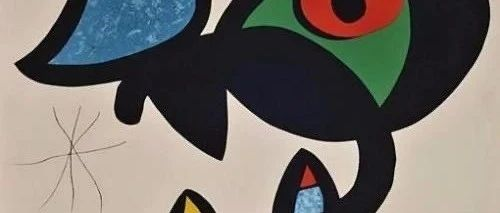
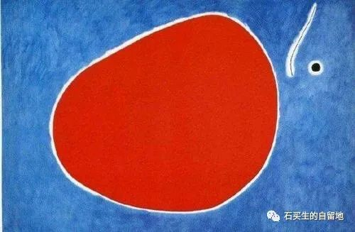
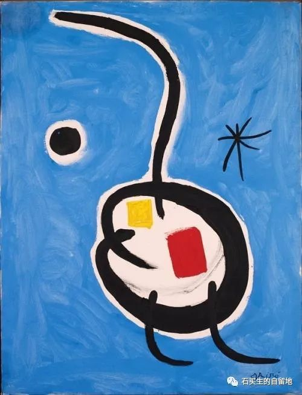
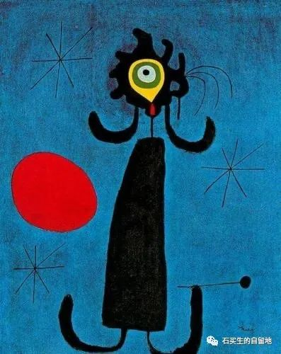
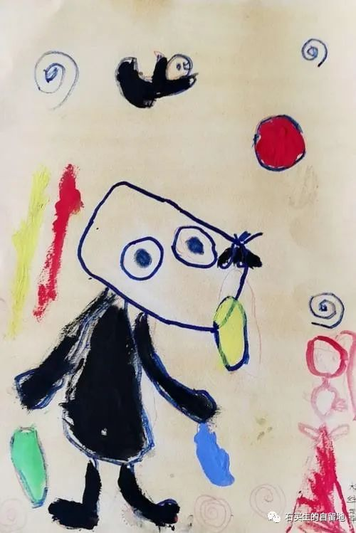
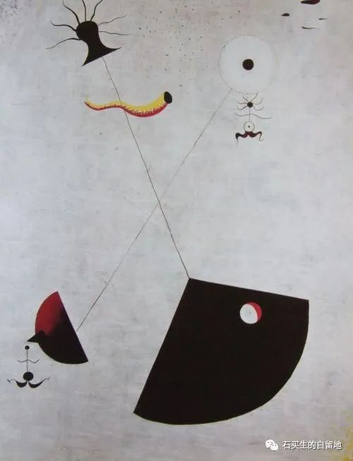

#  小荷才露尖尖角

原创  曹嵘 柯乐恒等  [ 石买生的自留地 ](javascript:void\(0\);)

__ _ _ _ _

小荷才露尖尖角

\----高一（17）、（20）班第二周周记选

高一（17）班

  

  

​

米罗名画

  

谈死亡

曹嵘

似  乎  长这么大  ，  我对死亡的概念也一直还是很模糊，我并没有接受到过许多关  于
死亡的教育、似乎它是一个很沉重的话题，一个离我很遥远的词语而已。

儿时听到医院里去世患者亲属哀嚎的哭泣声,声嘶力竭却又低沉呜咽。才隐隐有感觉，有人离开这个世界了，他再也不存在了吗?小时候只会想  ，  哦，如果他是个好人
，  那他一定会去天堂享福的，如果他是个坏人，那就要下地狱了。这便是我儿时对死亡的想法。可是长大以后便没有了这种想法。死亡好像离我也并不遥远。

那死亡一定是痛苦可怕的吗?我想不是的。世界上现在似乎有许多悲观的人,因为一些事情想要过早的结束自己的生命。我想起史铁生的一段  话  :不要急  ，
死亡一直在等着你,好像死亡是一个你非常讨厌的结婚对象。那么好吧.既然必须和这个无聊的家伙结婚、我一定要把我的忠贞、我的热情、我的好奇心,我的爱浪费在这个世界上，把一副空壳留给它。”这段话让我对死
亡  有了很大的改观。如果死、既然死亡是必然的，那就慢慢享受这个世界吧，不要行色匆匆  ，
不要像从倒映的眼中看见车窗外不断飞逝而过的风景,要像满载的大巴悠然前进、沿途绵长而安静。不要怕途经颠簸就过早下车、允许一切凄风苦雨的发生，让死亡变得简单轻松一些。

有个词叫“向死而生”  ，  它的意思是明白了生与死的关系  ，  因而能勇敢地面对死亡，积极地生活。或许每个人对它都有不一样的理解。我认为就像每天  升
起又落下的太阳  ，  死并不是生命的终点。它像  太  阳、生生不息、每一天都是新的开始、享受初  升  的太阳吧、每一秒每一分每一天。

艺术和审美分高低吗  ？

禹剑

艺术是否分高低?审美是否分对错?这是一个值得讨论的问题。那么我们先来说艺术,并且给艺术下个定义。我认为艺术是一种表达人们心中的感受的,并且能够传递美感,引发共鸣的行为。那么什么样叫做表达?随性的涂抹叫表达么
？  熊  孩子搞破坏叫做行为艺术吗  ？  当然不是  。  因为它们没有传递美,更没有“限制”。

有人要问:“表达情感不应该要自然吗?莫非艺术就是戴着镣铐的舞蹈?”其实自然并不意味着脑子中洁如白纸,更不意味着心中想做什么就做什么。就好比写作,没有文学或情感其积累的人,写不出好的语言,表达不出自己的心中所想,而当他们看到写得好的文章时,便会惊呼写得好好!把我想得全表达出来了!这跟“妙手偶得之是一个道理,只有训练的次数多了(实践)才有机会“偶得
”。

实践是一种“限制”,而“规矩”(即所谓镣铐)也是一种“限制”对于规矩的限制,就更加浅显了:任何事都有“规矩自由有限制，道德有底线。艺术也当然有“矩”。规矩是从实践中来的,当实践足够多了之后,舞蹈时的“镣铐”便已不存在。“随心所欲,不逾矩”所以先前所说的自然便是在实践基础上的,而关于艺术是否分高低答案也便出来了。

关于审美,与艺术密不可分。审美是人们对于美的选择,有人喜“重意趣”有人喜“重严谨”;有人爱刚强,有人爱飘逸。这些都是好的艺术,各有所美。可若有人说:我喜爱法西斯的威武”,我喜爱江湖的“雄健”
之
风。这时候我们便要说:"你错了。”因为它们越过了底线，而由干人的见识和实践之错误的缺乏,便有可能形成错误的审美观。我们不了解时应尊重和学习，不能盲目出发和自欺
欺人。

所以，艺术和审美都是分高低的,有时候狭隘的不是世界的道路,而是人的心。有些词也并非天生俱来褒贬义,只是一种描叙。

(美当然不是只指好看,以上也仅代表我个人观点)

如  何  做一个自洽的人？

贺丽萍

自洽源于对自身的接受程度,同理,自洽也可以认为自我的一种配得感。本周周记的灵感来源于网络上的一个视频、大致是讲述了自恰的本身含义与其好处。而我认为的自洽则是从自身找到与世界的归属感。

自洽首先需要自悦，认识自己，接受自己是我们来到这个世界所要面对的第一课题，如果把人生比作一场高自由的全景虚拟现实的游戏，那么作为玩家的我们应理应优先考虑自己的游戏体验。所以在日常生活中学会取悦自己是一件至关重要的入事，余华在《活着》-书中说到:人是为]活着本身后活着，而不是为了活着之外的任何事物所活着。”如果说活着本身即是一种意义，那么我相信,为了自己而活将会把这一意义推上“新的高潮。

当我讲到这,或许有人会说了'难道所为谓的自洽就是完会以自己的利益出发,以自己的感受为第一要务,不顾及别人的感受,这不是高度的个人主义吗?”

实则不然，接下来就要淡到自洽的第二个方面了，  自  洽需要保留自我,一个人如果  只  从别人的角度出发,只在  乎
别人的感受,这样的人在日常生活中不见得会被大家所喜爱,反倒会被打上“老妇人的其标签。相反的，一个人在一件事上表现的有自己主观意识判断，敢于发表自己的意见,则会更容易获得他人的欣裳。自洽并不指极度的个人主义，
而  我们学习自洽并不是也不应过度的看重他人对自己的感受,自洽的人  之  所以自治大致是因为他是知道我本就如此，无需为了任向人隐藏或是  怕
压抑原本为真实的我。并且我也乐于接受这份真实的我，这样的人  需
要对自我有一种高度以同感，这份认同感不是出于自负,自负一词的引申含义对我来说是自卑。是一种极度渴望他人以同而衍生出而的情感。自治的人不是自负的，其是自信的。

而自洽不应称为极度个人主义,它应是集体主义的个人表现形式，就像是只有尊重自己，才会尊重他人，只有爱护自己的生命,才会爱护他人的生命，同样的,只有接纳自己,取悦自己才会接纳他人,与他人共乐。

而我所追求的就是一条以我为中心向四周辐射他人的消遥大  道  。

​

米罗名画

  

  

徐海琳

上善若水

在读《道德经》的时候,看到了这一句"上善若水。

以我从字  面  粗浅的管理解，大概就是最好的善像水一样。在我为自己的理解能力  沾沾  自喜时,  当看到  关于这句  话
及相关解析后,才发现自己的浅薄。

"我只从生活  层  面上来去理解水，它可以洗去  污垢  ，然后又有沉  淀  的能力，还能海纳  百
川,不仅可以因外在形状而改变的包容之心,同时它就是我们生命的起源。”

在那些解  析  中，我看到了更多关于它的品德，它可以居于低处，人们所不  愿  触及的地方,这代表着谦卑，却能包容，  汇  集。所以上善若水，就是对于
一个  人  品  德的指引,学会水的柔  和  与包容,同时也会顺势而攻变。

可以因为环境的炎热,变成  水  蒸汽,  化为云朵  ,再因压力变  为  雨水。可以因为温度下降,变成了寒冰,成霜,  成  雪。

它千变万化,却最终都能以柔和的水  的  形象呈现。也难怪有人说,女人如水，如果大人的性格真如同水一般，那这个人一定是个有大每慧的人。

202年2月18日

陈卓妍

有人永远死在了想象里

死在别人的定义里，

死在自己手里

不同的人对我的行为都会产生不同的解读，

很想知道如何去清醒，

如何留有余地

什么才是真正的漂亮，

什么才  是  真正的美好，

什么又才是正确的选择

此时此刻，

我被定义，

我被评价

大雾之中，

我似  乎  忘了，

存在即为美好，

自己就是漂亮，

不用去反驳与证明

因为那毫无意义

心太小了，

所以  容  不下一点恶意

高一（20）班周记

  

​

米罗名画

  

克隆猴

柯乐恒

现实世界是有失败的。

与令人沉迷的书中世界不同,现实世界不是预先设定好的故事,期待与兴奋的高潮过后，不一定有美好的结局。无法挽回的失败必然伴随着失去,既使再珍贵的东西也会毫不留情地失去。

现实不是小说。

冒险不一定就能成功,不管多用力。都可能遭受毫无理由的失败，所有努力都会化成灰烬。

现实世界与小说世界不同。

小说世界是作者书写的、但现实世界中，每个人都有书写世界的权力,每个人都可以尽情书写。

尽管有失败，尽管会有珍视之物的失去。可,这,才是每个人共同书写出的世界。去冒险，去努力、去书写自己的世界。

选择

邓佳慧

“渔夫出海前并不知道鱼在哪儿，但还是出海是因为相信会满载而旧。很多时候选择了才有机会，根信了才有可能。

董卿曾说:“我们的时代不缺机会，所以势必会让每个人面临很多选择,那么,是遵从自己的内心还是随波逐流;是直面挑战还是落荒而逃;是选择喧器一时的功利，还是恒久平静的善良;无论如何，希望每一个人，都能做出一个在以后回想不让自己后悔的选择。”许多事情看起来希望渺茫，但人生永远是贵在坚持,成在勤勉，既然选择了一条路,那就要勇敢地走下去，我们要做的是坚持初心,做好眼下该做的事，根信自己，简单点、努力点、乐观点，豁达点，惊喜就会多一点。今日踽踽独行,他日化蝶飞去。

选择无处不在,面朝大海春暖花开是海子的选择;人不是生来就被打败的是海明威的选择;人固有一死或重于泰山或轻于鸿毛是司马迁的选择。选择是一次又一次自我重塑的过程，让我们不断地成长，不断地完普。如果说人生是一个不断选择的过程，那么当千帆阅尽最终留下的就是一片属于自己的,独一无二的风景。

我们很难在自己选择的道路上做好每件事,让人生不留遗憾,尽力而为就好,享受过程,接受结果。

品九转一周，过十味人生

陈潮聪

已过两周，我的心情实是五味杂陈,有对同学过了一个很有意义的假期的酸,有学到新知识的甜,有清醒却仍坠落的甘苦,也有那繁忙的咸。

很多时候我都在想，为啥我现在变得这么蠢了变得懒于思考懒于动手。为啥李白一挥衣袖酒出半个盛唐,而我绞尽脑汁却想不出半句佳话。

很感谢能为我这苦闷两周所调味的班赛,让我去尝试到绿茵场上踢球,让我感受到了运动的美好。一周九转,繁忙而多变的生活让我难以适应,转的我晕头转向。我去逃避，但也只能去一片埋满地雷的土地上,因为前几步的错误,现在每走一步都也许在死亡的边缘徘徊。很庆辛在绿茵场上能找到短暂的自我,让我能去挥酒汗水,去追寻自己的曾经的影子。

人生的轮船飘忽不定,尽管是在黑暗中,追寻那唯一的一束光,去尝试去努力,很有可能,会到达最光明的彼岸,最起码,虽败犹荣。

  

​

米罗名画

  

乌鸦

谢子涵

怀揣汹涌喷薄的热情

与生俱来却无法讨喜

纯黑的外形隐忍怯弱

月落时分却不啼。

造物的安排神秘无形

就当作是我不吉无利

不能够勉强合群。

当鸟儿回到这里，

俯看着模糊山顶，

你孤身藏在夜控里偷偷地回应。

我不能拥有美好命运，

但想到你，

心头却没了忧郁。

死亡”的意义

王佳音  ​

在饭堂吃饭的时候,一个人的话，思绪会随风飘得很远很远。听着饭堂冗杂的各种声音,身在其中的话,仔细静心听一下,会友现周围闹哄哄的声音裹挟着自己,让空气中的因子变得条乱了起来，使声音似真似幻，似近似远。在此环境下，纷杂中，思绪找到了我。

我问自己：既然总有一天要面对死亡，那么"生"的意义又在哪里？”我看着饭堂中来来往往,去向漫无目地的目的地，在一个又一个空间中穿梭的人群，不禁想“他们为什么没有这样的想法呢?”
​  ​

有这样想法的我，的的确确对着不可估测的死亡有着难以言喻的恐惧，即使现在的我很年轻。我不禁想到生的快乐--
阳光!雨露、鲜花、气息、喜欢和欣赏着的人，无穷又无的远方;我不禁想,如征战成功的拿破仑，如创造出更深思想的尼采，如写出“名人传》的罗曼、罗兰乃至更多的人类群星在他们闪耀的时刻，有没有感受过死临近的恐惧,或是在功成名就登锋造极时脑中浮现“死亡”二字。我想,以他们伟人的闪烁来推高我的问题再好不过。伟大以死亡为终结于沉寂，那其意又在哪里?难道生的功都是徒劳?

我让世间一切的美好涌入脑海,那些美好的词句，春花秋月的美景,字字泣心的话语,我仍认为这个答案无解，仍任人怎么绞尽脑汁，可生命的箴言怎能由一句简洁明了的话能慨括?这是对“生”的极其不尊重。生的奥必是无解的，因为它有尽头，终要终结,既使现在的我很年轻。它的答案在人的PNA里,在任何地方，却无法从口中说出。身在圈中的人永远无法跳出这个圈一一生命的圈。

但如果讨论起死亡的意义那就无容易多了一一给生了个结，让生更有永恒的意义。因为了死亡的总比正活着的更可贵,更稳定，更久，它让流动的被定格,让美好永恒停留在最美好的那刻。

  

  

​

米罗名画

  

  

宿舍门口那棵树

黄圣菲

宿舍大门口的那棵树落叶了，是冬天吧。当我放完寒假回到校园时。一眼便望见了它,那棵巨大无比的、光秀秃的树。南方的冬天,寒风中夹杂着一丝暖意,这边多的常绿阔叶林,校园里树林仍然茂盛。只有它,好像只有它过了冬天,光秃秃地,好丑啊。我想那天中午，起床走出大门,经过它时，忍不住看了一眼。从前那样看去,是枝繁叶茂。那树实在是大，视野都被翠色占据。今日看去，没有熟悉的绿色。但透过灰白树枝我看见了蓝色的天，白色的云,清澈的湖水和高大的建筑,视野一开阔。一片绿换出五彩斑斓。

宿舍门前的的那棵树开始抽芽了，我突然希望它长慢点，慢点。

吾友子涵

郑金鹏

本周识一友,姓谢名子涵,字邦，。

吾友乃理科之奇才,物理、化学为年级前五十,,实乃民族之希望,国家之栋梁。

吾故虽身处教室之中，然心系天下,耳闻四海之事,眼观八荒之中,在政治上颇有建村。屡获年级前列,以天人为已任,实乃吾辈档模。

然吾友刚正不阿，嫉恶如仇,从而屡遭排挤。鸣呼，如此之人，岂能没于尘土之中？其常博觉群书,学富五年,愿在语文课上献言。

  

预览时标签不可点

微信扫一扫  
关注该公众号

****

****

×  分析

__

微信扫一扫可打开此内容，  
使用完整服务

：  ，  ，  ，  ，  ，  ，  ，  ，  ，  ，  ，  ，  。  视频  小程序  赞  ，轻点两下取消赞  在看  ，轻点两下取消在看
分享  留言  收藏  听过

