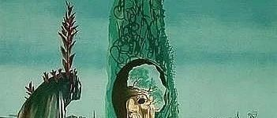
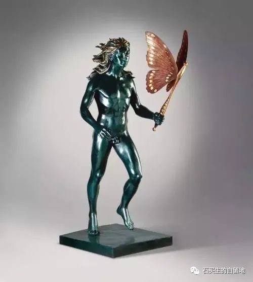
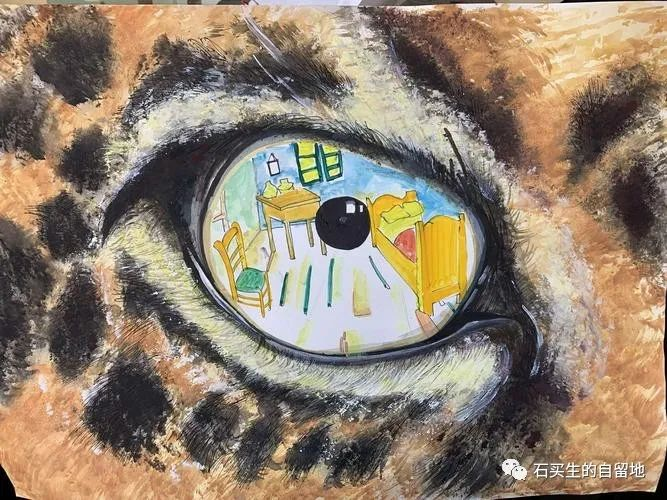
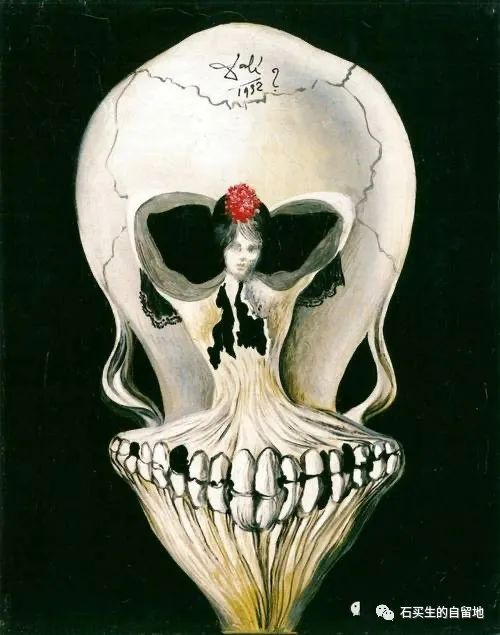

#  青春的样子

原创  周子尧等  [ 石买生的自留地 ](javascript:void\(0\);)

__ _ _ _ _

  

​

达利名画

  

  

青春的样子

\-------  高一（20）班第四周优秀周记选

  

难以回望的故乡

周  子尧

2022年2月24日，俄罗斯在乌克兰境内实施“特别军事行动”。标致着俄手乌冲突的开始。到现在，已经过了一年的时间了，在这一年时间中，30000名以上的俄军，60000名以上的乌军折载于沙场之上。俄罗斯阵亡了189位校级率以上的军官,其中包括了4名陆军上将。这一组组数字令人触目惊心,更何况,这不只是一串数字,而是已经逝去的一条条生命。这不得不令人深思战争，究竟给人类带来了什么。

这一年中，乌克兰人口流失数竟占人口总数的一半，不光是战死沙场的人，还包括离开自己故土，到他国去避难的。他们离开的原因不难猜测，就是为了躲避战火，自开战以来，俄罗斯占领了乌克兰26%的领士，各个大城市也是满目疮痍,国民经济崩溃，故乡
失  去了他原有的模样，成为每一个乌克兰人心中的痛。他们不愿再见到那面目全非的故乡，只得远走他乡。

为何看不清故乡的模样?即使她就在心的中央。我认  为
，身居异国的乌克兰人是有资格回答这个问题的。他们那回不去的故乡,就好似丢失了国土的王,空留下一身的彷徨  。

战争蕴孕着和平，和平蕴孕着战争。但我衷心的希望，不再有战争发生。

人 这一生

黎思涵

当我的灵魂与身体同在时，我可以敏锐而清晰地感知这个世界的存在，我用我的感官通过世界去触碰另一个人的灵魂并被他人触碰着，我从我所经过的每一个地方而来并去向我将会存在时时刻。我曾去到风吹过我后，又吹向的某个地方。同样的，每时每刻的，我和某一刻的自己来了个措不及防的拥抱,我是我的宇宙中心，是无数的星球物种与无尽穷的思想，也是某一粒尘埃的尘埃
。

某一天，我的身体会衰弱，直至不能装下我沧桑的灵魂，于是我会嘱咐我的亲友，在身体与灵魂分离的第一周，为这操劳一生的躯壳举行一次盛大的烟花葬。我会一飞冲天，飞得很高很高，也许我会摸到星星
\-----  那我曾无数次仰望的浪漫。如果他们愿意，我想，他们  可以
留下一些我燃烧后的灰白，装在一个小瓶子里,或是制成饰品,然后带着我去看我末看过的风景，见我未  曾见  过的人  \-----  只要他们愿意。.

终于，许多许多年以后，久到他们也不在了，久到这个世界将我  彻底  遗望。于是，我死了。

梦想的种子

李沛莹

总会有人问我未来想做什么职业，每提及至此，我都会毫不犹豫地回答:老师”，我有一那明确的选科方向，或许会被认为这些想法为时过早，但我有一所梦想大学，一个  固
定的就业方向，成为一名老师是不会被轻易动摇  的  了  。

成为老师的这颗种子,很早之前就埋  下了  .幼儿园的时候，对职业的认识寥寥无几,就迷迷糊糊地写下自己未来职业“老  师  ”  ，
随着我的成长，逐渐脱去了儿时的椎气，变得沉稳，踏实，每走一步路似乎都是在稳中求进，这便让我对相对稳定的教师职业增添了几分好感。就这样，种子不断被滋养着,直到在我初中的时候，它发势了.看着班主任的来回奔波，学习生活上的烦琐小事使她不断操劳,但她总是会用温柔的语气与我讲话。物理老师下班后特意跑来教室为我解决问题。
英语老
师总能细致地观察我的情绪变化并及时开导我，历史老师总会深夜加班,并一同期力。来自他们的爱与温暖，让我切身地感受到了我想像他们一样每天充满正能量，将善意与温柔传递给他人，陪伴一个人成长也是一种无满意义与幸福
的
事。或许会经常加班，工作量大。但在她们的影响下，这颗种子总要经历一场血雨腥风，才能苗壮成长。所以高中作业多，学科多，压力大，正是一种考验,也是我向未来职业迈出的重要
一  步  ，  通往梦想的道路很长，但每一步都算数  。

我相信,十年之约,终会实现。种子自  有  花开满园的那一日.

​

达利名画

  

对右眼的一则忏悔

张怡婷

我  右
眼晶状体在长期挤压之下终是不堪重负地变形了。但它在我这么久的摧残之下,居然现在才近视,我还挺为它骄傲的。可随之而来的沮丧和不甘却占据了我全部的思绪。我抗拒戴眼镜，也更不愿接受一直引似为傲的视力就这样毁于一旦;说是一旦许是不准确。它是在我不正确的写字姿势,过度的熬夜上网和长时间用眼后从不放松中劳累而死。但我很难说我到底后不后悔曾在浑夜也执意借着那点微弱的月光去读所中意的佳作。因为这虽模糊了我的右眼,却明了我的心境。

前路漫漫愿你囱风热满袖

\---- 读《红楼梦刀有感

廖苑婷

我没怎么见过满花纷飞的场景，但偶一次，在深春，无人的青石柏路上，春天曾不期而至地  予  了我一场落花。

红而烂漫鲜妍向我扑酒而落,刹那倾了满身满头满脸。向前,我不  敢迈  步;向后,又不忍退却;因为那是一片盛大的花海，我  置身于
这深海之中,往前往后，都几欲窒息。那桃丝榆荚……似乎要将人淹没。

惊心动魄的壮美，我几欲、难忍，不-  姗姗  落下泪味。我是为了黛玉而哭的，我是,我是,我是为了黛玉葬花而哭的。

她怜惜  飘
落的飞红，她不舍濒去的暮春,其实都是在心痛寄人篱下,看心难抑的自己。”三月香巢已垒成，梁间燕子太无情”，是在怨宝玉不懂风情。”一年三百六十日,风霜刀剑严相逼。”又是凄苦,又是悲枪。我想何必呢?你只是凭天地独生的一株仙草,九重天上的孤离,偏为了还那日夕的浇灌之恩,于是投了这莽莽红尘,为了一块呆玉流尽今生今世的泪。盼林妹妹呀，我只盼她，快快乐乐地同诸姐妹玩玩乐乐，可是天无不散之宴，贾府的凋落也是一个必然的定局。

葬花  吟  ,我儿时总笑宝黛,不忍洁净的花落入污沟泥渠,于是锦袋收之，净土埋之。我曾不解风情地想过，丝编成的绸袋是不可降解的  埋入土里，也算是污染土质，
,他们两人这般,真是又呆又天真。

可是曹公,曹雪芹,他说:"侬今葬花人笑痴，他年葬侬知是谁?

过滤型人格

张誉涵

“没有人是一座孤岛。可能处于真空中的生活会更自在,安静,但不可避免地是离开幻想还有回到与人接触的世界。有声音的世界。

面对杂音，那怕无法做到听过就忘,我仍尝试把它  。
从自己大脑中过滤,与人争得目面红耳赤,有什么好处呢?对待一些越界干预和道德绑架,与其费尽心思反抗,不如远离静心,专注于自身。

也许认识到自己的不足会产生仰望式”羡慕,看着别人现充的生活,焦虑难免浮上心头。事实上,是我与他人的时区不同,所以我不会”拿着别人的地图,寻找自己的方向”莫言是这样评价:"人之所以会感到痛苦,不过是站在了自己的烦恼里仰望着他人的幸福。

尽管我并不优秀,从步入校园后的生活里,还是不乏见到“酸葡萄”干扰。对于我不了解且不会去了解的“酸葡萄”争论必然是仅仅是浪费时间。“有心者有所累,无心者无所谓。关心是必备品,无法控制环境,也能改变自己的态度
。

余生很贵,愿得安心,前提是学会过滤。

等

肖蕴玲

他们说，你再也不会回来。

流逝的光阴里，

我等了你7年。

夜幕里的每-次仰望,都寄托着我无垠的念想。

为你,我泪湿了青衣，

为你,我寸断了肝肠。

他们说，你已落入深渊

我不怕堕落深渊,

我偏要踮起脚尖

纵仍然前路茫茫

似乎毫无希望。

可我还想等等  ，  等一个  步  可能  的  可能

​

达利名画

  

  

一封留给  未来  回答的信

李泱伶

这周的周记,我想写给一个我很感谢的人,她长得很漂亮,成绩非常好爸妈的管理不严但有爱，我很羡慕她。她在学校的人脉一贯很好,不会百很讨厌她的人，她看起来像一块宝石,但永远也看不透她的内心,她爱憎分明,讨厌的人不会主动接触,活得张扬肆意。

但我不一样，我内心敏感,多愁善感。,在交往方面小  心
翼翼,其实表面上看起来热情开朗但内心里总会想她是不是不喜欢我。但是是她告诉我别人只是别人，做自己就好，没素质才能过得快乐。我成绩乎平,相貌平乎,可能花了很多时间写的数学
卷  子都没  有  她随手一写来得历害。我的父母总施加很多的压力给我，但她总会告诉我,我很好.只是有点傻。所以,每当我看到身边的同学没  有  朋友可倾
诉  的  候  我常常庆辛于拥  有  一段这样的  友
情.拉住我，不许我此沉沦不允许我迷失自我，不会厌恶我的缺点，不会在我喳喳吐糟时打断,相似讨厌的人一样,无法  容  忍的底线一样.

当我再次和她见面，我发现无法触入她的话题里，从“你今天上课…到“我们  班  上有个…”我发现无从下手,只能随口应付,像是相  交
线短暂的相交后背道而驰，我还能做些什么?有种眼睛睁睁看着东西掉碎的无力感。但不是所有问题都有答  案  ,又不甘  于  几年后说当时我要是  这样
就好了这问题又是个末解之迷,可能我们只是彼此生命的过害,没  有  完美的结局,从彼此的  全世界  路过。

当我正年轻，我会想到什么

王佳音

  

当我  正  年轻

我会想到

教学校和宿舍间的那棵  树

在春天

吐出嫩芽

在日光轮转下

泛着  粼粼  的青绿色光

当我正年轻

我会想到

翱翔过田野，溪流、森林的飞  鸟

在天际从远方飞来

又  飞向远方

非常自由非常无忧 从不依靠从不寻找

当我年轻

我会想到

同龄人的肌肤·脸庞，瞳仁手指的纹路

那蕴藏着青春，生命的奥妙与禁忌

在脉搏处

跳动的心脏

鲜活地

同我一样

当我正年转

我会想到

无穷又无尽的远方

在内心深处

未知  、  不安  、  变局、恐惧发出深深战栗

我所活着为遇见的人

和 为遇见我而活着的人

那些 命中注定

与 形同陌路、  萍  水相逢

当我正年轻

我会想到

我的老去

头友白  了  、睡意昏沉

炉火旁打  盹

想着

年轻的我在会在想着什么

  

  

注：图片来自网络

  

预览时标签不可点

微信扫一扫  
关注该公众号

****

****

×  分析

__

微信扫一扫可打开此内容，  
使用完整服务

：  ，  ，  ，  ，  ，  ，  ，  ，  ，  ，  ，  ，  。  视频  小程序  赞  ，轻点两下取消赞  在看  ，轻点两下取消在看
分享  留言  收藏  听过

精选留言

