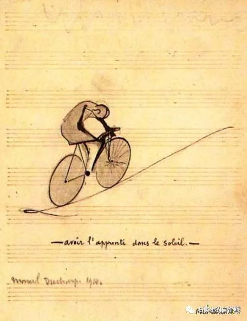
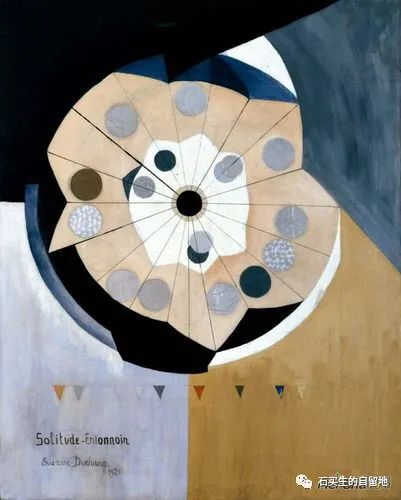
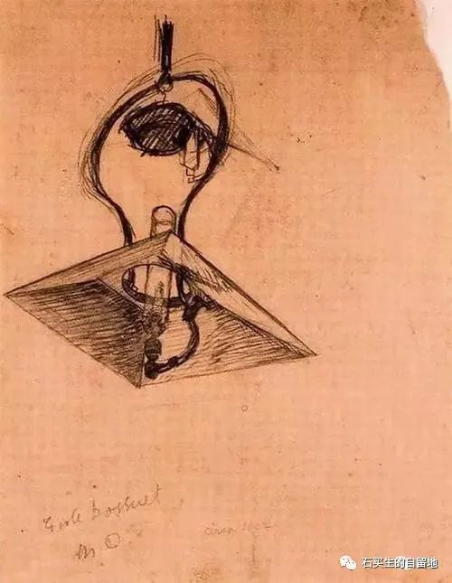
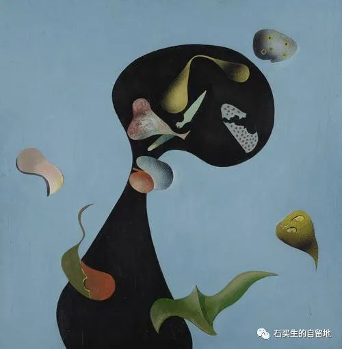
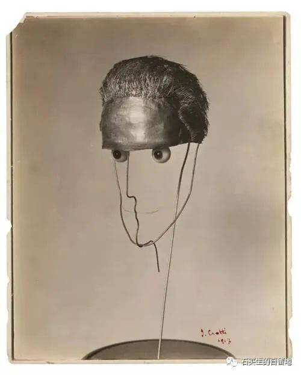

#  我思故我在

原创  石买生  [ 石买生的自留地 ](javascript:void\(0\);)

__ _ _ _ _

  

​

杜尚名画

  

  

我思故我在

\--------2022届高一（17）（20）班第10周优秀周记欣赏

张  耀元：  权力即上帝  \-----  读《1984》有感

在阅读完《1984》这本书后，我对里面  党  的口号记  忆  深刻  ：  战争即和平，自由即奴役，无知即力量。

所谓战争即和平是什么?根据书中的表达，我有了以下解读。在生产力不断发展后，人们会要求更高级的上层建筑，如果要制止这种行为，就可以去采取消耗过剩产品，产能的方式。但又如何实现这种消耗呢?毫无疑问，发动战争成了最快捷、便利的方式。无需去关心发动战争的主体是堆，因为战争的意义已经发生改变
，  不再是烧杀抢掠，而是一种控制人民、维护统治的工具。而党的其他两条口号意义也与之大相经庭，都是以控制思想为中心。

小说  以
一名有反抗思想的党员温斯顿的视角来展现故事内容。温斯顿这类人是典型的有想法却不去做事的人，他从一开始买笔记本到后来被捕入狱都是思想上的反抗，没有起到一点作用。更令人反差的是，他在被捕入狱后才知道，自己曾做过的一切行为都在党的监
视
之下。他简直就像一个在给别人以欢乐的小丑。他在狱中最后还是出卖了自己的思想，出卖了一切，令人唏嘘不已。而他的情人秋莉亚更是一种毫无思想的利已主义者，在被捕后立刻出卖了温斯顿
。  他们互相出卖的情节让人觉得可笑，更令人觉得悲哀。在黑暗的政治统治下，  人  们连没有一  点  自由可言。

书中有这么一个情节令我印家深刻。奥勃良，即诱骗温斯顿的核心党员在审讯温斯顿时告诉他，  党
追求的不是其他的，而是纯粹的权力。就是把别人的意志撕碎，再用自己的意志粘  合  起来。”他狂热的语气让人不寒而栗  。
再结合党对于历史的任意篡改、编造，我不禁对温斯顿的将未来交给无产者的看法嗤之以鼻。没有思想，理想，不知道过去与现在，只生活在被权力控制的泥沼之中。这样的无产者有什么
未  来?

如何对抗“权力即上  帝  ”这样的黑暗?我相信这也是奥威尔耗费巨大的精力写这本书的原因。只有人人都有反马托邦的意识，才能预防这片无边的黑暗。

曹建业：  从瓦尔登湖到  献  血宿舍

人与自然是否能真正友好相处，维系住那  弥  足珍贵的友谊，为  环  境出一份绵薄之力  ？  这是一个充满悬念的问题，正如你  面前有一棵树
，你会为了钱财狠  心  ，用手中被  磨  得反光的刃去亲吻树的  肌  肤吗?你可能会回答不会，但我若又告诉你这种种树是唯一  的  一棵，是这个种族最
后  的希望，承载了复兴种族的愿景，因此它的价格在市场中更是有  市  无价，那么你会作如何回应呢?动摇说不  定  会撬开你的心  房
中紧锁的底线，让你作出疯狂  的  举动吧  。

但梭罗却不会有如此  犹豫  ，他可能会放过这棵希望，也可砍下  它  作为某天的柴火，让它发挥  另  类的价值，但决不会把它卖到贸易市场。那么  ，
梭罗看似也不能处理好人与自然的关系?并非如此，他恰恰是发择了更好的价值，让环境不受  破  坏  。

喂养地下室的盗食客，把豆子赠与  误  入小屋的松鼠，自己动手种植植物  ，  恬静安然地泛舟，无不昭  示  他  恬
淡安宁的性格，及孤若自赏，看透生活本质  ，  摆脱金钱道义拘  束  的生活态度。这样的人，怎能不与自然和谐相处?

我建起这座小屋所花费的钱，与大学学生交的一年住宿费差不多”  ，  30美元搭建，却可受一辈子，节俭与随遇而安亦是他的闪光点，只有如此，才能在这人际罕至的地
方  生活十七年吧。

那么只有梭罗才能做到与自然和谐共生吗?只有  瓦  尔登  湖  才有他的佳所吗?有没有住所我不知，但与自然和谐共生倒是一抓一大把，若你实在好奇在哪儿  ，
我可以明确说，去宿  舍  中  ，松  莞的宿生中洁白的薄纱蚊帐中会给出答案。

陈瑶：  烟火气  \----  读“家人闲坐，灯火可亲》有感

作为汪曾祺的一本散文集，这本书将汪老质朴的生活，随遇  而  安的精神世界展现在读者眼前  。

不用细数，文中绝大多篇文章都描写了各式美食，他写道，人的口味要杂点，于是大江南北的美食都可以在他书中找到:云南珥块、北京炸酱  面
，咸豆花….当地的家常菜被  描绘  得同满汉主席，令人心向往之  。

其实看书时遇到最多的情况是根本不知汪老在写些什么食物，很少逛菜市  场  的我认识的食材屈指可数，充满烟火气的文章到头来根本想象不出是何物。

最能想象出的是汪老的独创美食，似在书中提到了两次。做法简单，食材才见  \---  -将油条切成两段，用肉填充，蒸或炒，便是一道菜。

不由反省自己，我的生活未免太缺少烟火气了-在学校，每日三点一线:在家，将自己关在  屋
内不愿出门，刚从睡梦中醒来，父母早已卖好菜了。日复一日，年复一年，实在是枯燥无味。

艺术来源于生活，只有热爱生活，享受生活的人才能写出充满烟火气的文章，迁老曾被划为“右派，下乡改造，于是写出了“  葡  萄月令》，他曾在云南上大学，  于
是写了各种菌。称鸡丛为上上品，他在北京定居，于是写自己如何吃生蒜吃大葱……用丰富的阅历和对生活的热爱  写  成的文章给了我们一个  警  醒  \---
要去感受生活的美，要让烟火气沾染全身，要  多  逛  逛  菜市场，去认识那多样的食材。

曾  在“意林》杂女志里看到过一篇文章，说中国的美食与国外很大不同的一点在于中国的食物充满烟  火  气。我想:  汪
老之所以被冠上各类文学称号，成为知名作家，也是因为他的文章充满烟火气。

​

杜尚名画

  

  

谢子涵：  无题

最近，好几个初中同学都谈了恋爱，朋友圈里成双入对，出去玩  也  是空留我一人尴尬。总感觉心里有些别扭。

对于我而言，不论是喜欢或是爱都是一个难以轻易开口的话，从小到大，我从没有这样具体的情感。我不认为可以有所谓“一见钟情”抑或“怦然心动”，这些钟”的不是爱情，动”的也不是真心。

恋爱是一个特殊的话题，其实喜欢和爱是有区别的，好感与恋  爱
也不一样。没有一直长久的相处，是顶多有一丝好感又或是一点悸动的，可我们要谈的是“恋”和“爱”。

一个要好同学上次聚会时说，他爱他女朋友，可我  耸  耸肩，不置可否。

当你喜欢一个人时，其实应该也不会有什么很特别的变化吧。也许是不经意间朋友圈里不再只有游戏截圈，不经意间起床会把蓬乱的头发轻轻梳好，不经意间注意自己的人际关系，不经意间懂得
尊  重他人。

身边总会有人非要给你  绑  定一个所谓你喜欢的人，  然后还肆意地传播，从不尊重别人。
从小学到高中，也总有人认为外貌比内在更重要，这些自认成熟，觉得自己了解感情的人其实也是最缺乏感情的。他们口中的喜欢也只是嘴上说说，只是因为对方符合他们的标准罢了。

少年时期的情愫或许也有不少是认真的，但最重要是对别人的尊重，不伤害他人不打扰他人，才  配得  上说“喜欢二字。

也许是我非要固执地去做那个迁腐的卫道士，守着那些  固  执愚钝的想法  ，  但这都无所谓。

刘诗绚：  划去期待，留下快乐

周末在家收拾东西时，偶然看见了上次开家长会时父亲写下的十条对自己孩子的期待。本着好奇的心情，拿起一看，纸上只留  着
他对我唯一的期望:快乐生活。其余的“成绩优异，好好学习”等九条已被一一  划  去。

当时的心情难以言喻，唯一能感受到的便是划痕后汹涌的情感。

当我第一次翻到她的日记

廖花婷

九岁那年，我的尸体漫山遍野的跑。

因为我的生命已经没有存在的意义了，没有灵魂的行户走肉的人，是不能称之为活物的。我不在母亲的左右，却被她左右。我将嘴角扬起35°，太低了，不够灿烂，于是拍了拍脸，更加用力的笑起来，转身向母亲奔去。

一定要贞洁又热烈，玫瑰般盛放。可是小孩子的演技是很拙劣的  ，
小孩子的讨好虚伪令人厌恶。母亲看向别处，两条长长的手臂抓住我，环着我。我感觉自己是被螃蟹剥着，看着母亲的眼睛投向我不在的世界。她很爱我，或许她不懂表达爱，于是仿佛。我就像被自己的妈妈深深讨厌那样。

人有时候不能想太多，想着想着容易陷入一种迷茫，想的太透太深了平时看起来很好庞大的基石就是像细沙般散去，或许会陷入一种虚无的空气。老师，您别误会，上面那个不是我的经历，可是她确实已经快崩溃了。因为我们总是需要一点支撑一种寄托，所以会渴望去爱什么人，渴望有什么人去爱我，抱看她……她的母亲都不爱她，她的父亲刻意去提了一辆新车，一套新房，只为自己出行，自己居住。

我害怕她，远离她，恐惧她曾经的占有欲，所以她没有爱她的父母她的朋友跟她一起吃饭，回宿舍，有时也会开朗地一起大笑，却在心里对她无时不刻的吃醋心生厌烦。我不知道她有什么活着的必要，因为她没有可以支撑的
倚  杆。

很开心她喜欢追星，家境富有，这样至少人生会有很多  向往，
毕业也没联系了，不知道她在新的高中怎么样?想起以前的冷漠，对她的那种害怕不知道发现没有，那是我最愧  疚  的存在。这是我处理得最糟糕的友谊，真的很对不起。

毕业一年，我还有什么方法能挽回这段友谊，以期  为  我曾经的冷漠赎  罪  呢  。

​

杜尚名画

  

苏泰宁  ：大哥

我和我的两个外校的朋友参加了学校的开放日，放学了，我去找班主任拿手机顺便和她介绍我的两个好朋友，但是，她却用一股  诧
异的语气说:“咦，苏泰宁你这样的人也能  交  到朋友?“我不知道我在哪里得罪了她，也不知道自己是怎么  交  到朋友的。

说起我那两个朋友，一个是在幼儿园认识的，算大哥，一个是在小学认识的，算同学。初中三年和他们的记忆也就像伯牙的琴一样破碎。开放日相逢，  说
话也没了以前熟悉的味道，即使肩并  肩  走在阳光下也像萍水相逢一般客气。这么想来，我也确实不会友朋友了  ，  我  既
听不懂伯乐弹的是什么，也不会指出王  安  石哪里变得不好，简直一无是处了。

我想知道我为什么  找  不到一个知音，我试着深思熟虑后再说话，大哥却敲敲我:“苏泰宁，怎么啦?一句话都不  说  。“我试着分享我的爱好，大哥却说:“我
穿  的板鞋，怎么打?”我试着认真倾听，大哥却说:“又怎么啦?我在问你话呢。”我的尝试失败了我也知道我为什么感到孤独  ？

见我总是不谈话  ，  大哥问“你不开心吗  ”  ?我没有镜子，但大哥却映出了我。

我有时会在人潮中慢慢地走，看着身边的人从我旁边穿过，蒙胧之中会有一种往过去的时光走的感觉。我为什么这么做?可能是我想找回我在成长时丢掉的东西吧。

马晴  ：  落日升起，日落西山。

我真的很喜欢日出和日落，像是阴阳切换的瞬间，只有那段时间，才能真真切切感受到“时间”的概念.….流逝…….

从黑暗到光明，从光明落入  黑  暗就像心情逐渐明亮又逐渐低  沉  。白天好像在逼着我们用尽所有力气去微  笑
，夜晚又好像冷得让人拉下了嘴角，但我却沉醉于夜晚的安静  \-----

只有那两段时光，才可以让灵魂占据主导、  掌  握时间，掌握情绪  。

我和城市一起醒来，又与它一同入眠，它因我而成，我因它而生。

喜欢清冷的早晨，也喜欢傍晚的柔光，能有人与此时相伴或许是我想过最浪漫的事情之一。

吴彤：  幸运的孩子

我是一个幸运的孩子，

考试时我总能蒙对几道题  ，

开心时有人听我滔滔不绝，

难过时可以抱着电话哭诉。

我是一个幸运的孩子，

抬头，可以看见自由翱翔的鸟，

低头，可以俯视欢快戏水的鱼  ，

远处，有声声蝉鸣入耳，

近处，有阵阵花香氤氲。

我是一个幸运的孩子  ，

我生在华夏大地长在岭南沃土，

我可以在教室里拥有一张平稳的课桌。

可以在这大千世界中拥有一片属于我的

小小的天地。

我是一个幸运的孩子，

我拥有决定自己未来的权力。

我是一个幸运的孩子，

我被耶蘇选中，来到人间。

  

  

​

杜尚名画

  

  

高一（17）班优秀周记讲评

贺丽萍：  爱 或自由

在传统观念，我们似  乎  认为爱与自由是相互  矛盾  的，认为爱是禁  锢  性的物品，只有摆脱了爱的束  敷  ，我们才能去追寻自由，  而
我认为，爱与自由是相统一的。

因为爱，所以自由，人在田地里像  野  免般的奔跑时  会  感到自由，当在高山顶瞭  望  开阅的远  方  时，会感到自由。这类的自由源  于
大自然所为我们提供的能量，其产生的本质原因是人与自然之间本能的  吸  引，这是最为质朴的爱，而远离自然时，我们所喜爱的物品，也能  称  之为自由，

有一种爱叫放手，  而  有一种自由叫在限制范围内的自由  。
在传统中式教育中，大多数人最常听到的一句活是“我们这都是为你好，”往往听到这话的人都会觉得爱是枷锁，是何等的压抑，犹如终  日
在下水道的老鼠，他们多么渴望在  白  日自由行走的快乐啊，于是他们选择  逃  离，出来后，  空
无一人，随之后来的是无尽的孤独。这是爱吗?我想不是的，这应是自私的产物，最终导致了双方过不好过的结  局  。风等线提得太紧会断，而完  全
放松手这同样不知它会飞到向方，只有  松  驰有度，把握好二  者  的  节奏  ，风等才会飞得又高又  远  ，爱与白由同样也此，

我们应在爱中寻找自由，在自由中收获爱，我所以为的自由是心境开阔，就如现在折魔人的996”，大多数人常会抱怨过于压抑，不自由。压折的环境使得人们的心境趋于狭小。而因此进一步使得我们对亲人朋友所表现出来的关爱感到厌烦，所以导致我们对爱与自由观点看待的根本原因来源
于  我们的心境。想要二  者  相统一  首  先太需要有一个良好的心态，而一个良好的心态从每天早上对自己的一个微笑开始。

所以，阻碍我们自由的从来不是爱。

岑诗晴  ：  法医

一桩桩骇人听闻的杀人案被破案的背后，都有一个伟大的法医的功劳  。

法医，顾名思义，与法律  、
正义有关的专业医师，经常与命案打交道。命案发生后，人们唯恐避之不及，可这群逆行者却毫不畏惧，忍着血腥的气味，替冤死的魂灵说话。

最近看了一个  访  谈纪录片片段，我不仅看到了人性的扭曲，还看到了一个  法
医的敬业和负责。据邓亚军法医回忆，1998年6月，一桩惨绝人寰的碎尸案让她时隔23年都忘不了。进到现场，成堆的嗜血绿头苍蝇像乌云般笼罩着，  令
人空息。光是听她描述，我都感到生理不适，更别说碰了。这还没完，她环绕四周，却没看到死者。可当她定睛在那个血迹斑斑的冰箱上时，她倒吸一口冷气，最  令
她担心的事可能就藏在冰箱里一碎尸。打开冰箱，凌乱的肢体、骨头和一些人体组织都在震慑着她。强忍着发麻的头皮，她镇定地取样、化验、缝合尽量还原死者样貌。最终破案。

当被问及当法医最害怕的是什么时，我的脑海中浮现了好多肮脏的词语“蛆、尸臭横遍  野，  碎尸  ，  面自全非  ”
等，她答道:“我最怕不能确定死者的死亡时间，死因。”也许和许多优秀的法医一样，他们害怕的从来不是令人作呕的环境，而是不能为死者  昭
雪沉冤。花花白骨、残忍手段、人性黑暗，普通人连听都瑟发抖的词，法却不知经历了多少次。所以为什么对这样一个伟大，辛苦却不被理解的职业有这么多  恶
意呢?嫌她们脏，干这行不吉利，法医这个词被很多偏见裹挟着，可是她们凭借着为死者昭雪让真相水  落
石出的信念负重前行，她们更应该被敬意包围。视觉嗅觉双重冲击不是普通人能忍的，但法医又是一个普通人，她们也会做噩梦，也会吃不下饭。她们这份工作在与死者打交道，即使对方连一句“谢谢”都说不了。他们只是选择做更坚强、更有力
量  的普通人，即使不被理解，不被大众看见，他们仍默默在第一线，选择守护真相。

“以平凡身躯在荆麻中寻找真相的法医，每一位都值得  尊  敬。  ”

​

杜尚名画

  

  

詹依晴  ：  厌女

我们总是会不由自主的厌女，包括女性  。

比如我，在写理科题目时，总是会抱怨，“下辈子一定要做个理科猛男!这种潜意识的排  斥
女性的心理，我才意识到。又比如在父母教育男孩子时总是说:“不要哭哭啼啼的，像个女孩子，你是个男子汉……”是谁给女孩子贴上了“动不动就哭”的标签?是她们自己?还是几乎填满整个人类社会时期的偏见?

又再说，如果在街上看见美女，我们除了第一时间感叹于她的美貌，可能还有人会说，“一身名牌，对象肯定很有钱……“更有甚者，恶意揣测她的职业，她的私生活。而令人愤怒的，是说出这些话的女性也不占少数，还有一个更好的例子，似乎大部分的脏话都是关于女性。

为何大家都会厌女?是本能?是偏见?还是人类社会对女性长时间的压制?而女性又做错了什么?因为她先天性的力量比不过男性就能肆意抵毁，造谣?社会给了女性太多条条框框，从职业，从人际交往……

我不明白。

他们否认女性的努力与才华，明明自己是那么碌碌无为。

我们想改变，想改  变固
化的思想，想改变似乎早已根深蒂固的偏见，所以作为女性，我们更应该做好自己，展现才华，撕烂贴在脸上的标签，打碎束缚的链条。越来越多的女性在各个领域发光发热，社会也开始关心女性。更多人接受了正确的观念，平等对待女性。

有人说，什么时候对女性的保护措施，关心措施消失了，什么时候就实现男女平等了，

我想，要到这一天，还要走好远的路。

.杨智慧  ：云

想成为夜晚陪在月亮旁的云

在月光下半隐半显出我的轮廓

不渴求被知晓

想成为蓝天上漫画般的云

在天空上肆意绽放我的  洁  白

不害怕被注视

想成为狂风中不定形的云

在你眼中  如  我的心情般不断变换

不害怕因此论陷

王恩倪  ：  想拥有让也界变慢的魔法

大家都过着快快的生活，而我喜欢慢慢。

生活要慢慢。曾经的我出门，到半路上才在回想:空调关了吗?门锁了吗?经常忘带耳机，充电线。而当我学会慢慢  ，  我会检查好一切，关灯，关瓦斯，准备好一切
再  踏实出门。

与人交往要慢慢。与父母间存在的代沟，要慢慢化解。向他们解释流行的梗，近期热门的话题。不能快速随便  敷  衍。  交
朋友时也应该慢慢，两人间要慢慢了解，慢慢沟通。不能一时兴起的就说:"你是我一辈子的朋友。”后又因一点矛盾就不欢而散。我们都应学会慢慢交往。

学习要慢慢。学习不能走捷径，也不能心  急  。有人和我说过:”当一个优秀的人付出很多努力却得不到  回
报时，这就叫扎根。“要想刚学琴就弹曲子，刚努力马上有回报，这是不可能的，我们都应学会慢慢，一步一个脚印，一步一步迈向远方。

我经常会放慢紧凑的脚步看看路边的风景，有时我甚至希望时间再慢一点，慢到时间暂停，地球停止转动，让我可以记住每时每刻。

  

注：图片来自网络

预览时标签不可点

微信扫一扫  
关注该公众号

****

****

×  分析

__

微信扫一扫可打开此内容，  
使用完整服务

：  ，  ，  ，  ，  ，  ，  ，  ，  ，  ，  ，  ，  。  视频  小程序  赞  ，轻点两下取消赞  在看  ，轻点两下取消在看
分享  留言  收藏  听过

精选留言

