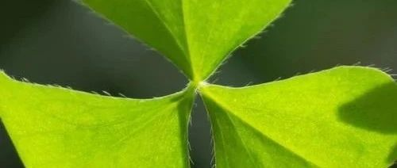
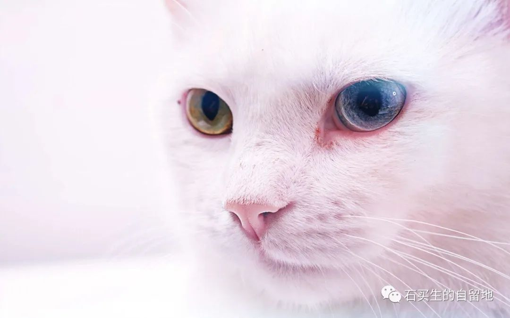
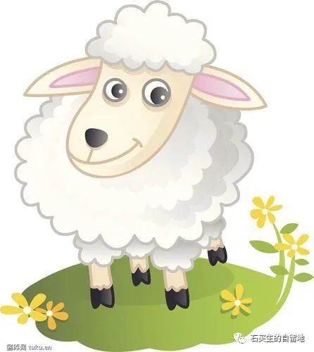
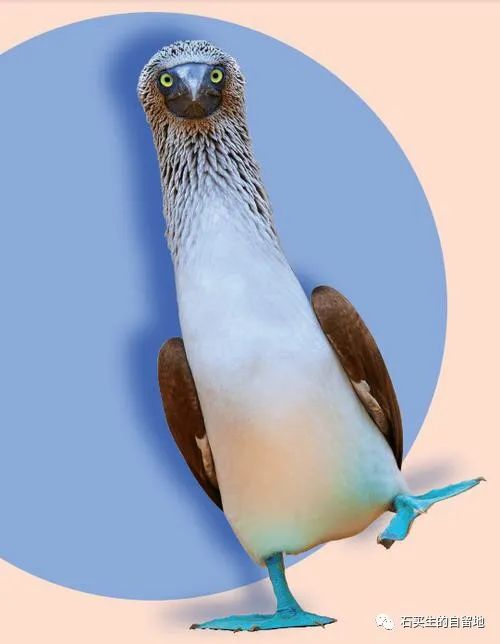

#  三叶草

原创  石买生  [ 石买生的自留地 ](javascript:void\(0\);)

__ _ _ _ _

近日，学生一帆、欧垟和我分别就猫、羊和鸟写了三则性情文字，我编辑为三叶草，六一将近，算做献给孩子们的礼物吧。

  

​

图片来自网络

  

猫啊，猫

2022级高一（20）班 莓一帆  
  
读过一本书，叫《猫的饲养与猫病的防治》，在本书前半部分讲的都是对猫的爱护，甚至给猫洗澡要在耳中墨棉求都提醒了读者。待到书的后半部，作者笔锋大转，谈起人应如何杀与剥猫皮获利。  
这便是人对动物的随意，有时人好像成了功物的奴仆，但那终归是一种假象。  
曾经养过一只爱吃芹菜的猫，说是爱吃，也不过是我爱吃而吃剩的喂它它吃了罢了，后来在书中，就是讲杀猫那本书中，看见猫似乎确实对芹菜的味道有偏爱，也好，我的猫主子便和我同一等级，与我一同吃芹菜好了。猫真是太好了，既不嫌线穷，也不嫌我长得丑，一无所用，还不理我是黑是白。  
半夜起来打游戏，它也跳上来，用胡子碰我的脸，对我说喵，我摸摸它的头，说乖。  
小猫平日爱睡大觉，我也爱，不过它睡觉时四脚朝天，露出腹部白毛，若是我也想睡，它便踏入我怀中，先踩一遍，再睡下来，趴在胸前睡觉，晚上也一样，赶不走的，也不会赶。看着猫熟睡，尤其是呼呼大睡的猫，我伸开手脚，我蜷成一团，只觉世间哪有那么物累，一切都是浮云。  
  
  

​

图片来自网络

  

看海鸥的羊  
2022级高一（17）班 欧垟  
  
海鸥生活在海上，羊生活在草地上。  
总有一只海鸥，迷恋草地，迁徙时迷了路。总有一只羊，深爱天空，行路时失了神。  
  
在很久很久以前，有一只不经世事的海鸥，跟随鸥群迁徙之时，它看见了绿色的大地--
好多好多种绿色的大地。“我以为大地是白色的”海鸥心想，“多美啊。”“别落队了”另一只海鸥提醒到。“我知道，我只想去看看”，海鸥渐渐停了下来，“我很快就回来。”说完便头也不回的飞走了，飞向那片绿色的大地。  
有一只羊，从小喜欢天空，变幻莫测的天空。这天，它一如既往的沉溺于天空，它看见一只海鸥，比别的海鸥都要大，越来越大，“我以为海鸥都是小小的，”它心想，好奇的盯着那只不一样的海鸥，蓝色的天空上，白色的海鸥。  
它好奇草地，它也想认识那只羊。它喜欢天空，它也看到了那只海鸥。  
越来越近，越来越近……  
海鸥看到了和自己一样的白色，和沙滩一样的白色。它在羊的上方盘旋了几圈，小心的落在绿地上。看着那团白色它歪了歪头:“你们这地为什么是绿色的?”“那是草的颜色。”羊边说边咀嚼着嘴里的青草。“可惜了，它多美啊”海鸥看着羊嘴里的青草，感到有些惋惜。“傻瓜，我们又不吃草根，来年它会再长出来的。”“真的吗”海鸥睁大了眼睛，高兴的振了振翅膀，“我也可以带回去种吗?”“回哪里?”羊顿了顿。“海上，我要把它种在海边，这样每天都可以看到它!”看着眼前这只雀跃的海鸥，看着它美丽的梦，羊有些触动，不忍打破，又有些犹豫。海鸥看它好像有些顾虑，便说“我是借你的，我会还的!”“我送给你啦”“等我种好了就回来找你。”海鸥自顾自的说着。  
它们用稻草编成一个小袋子，在里面装了些带着草根的棕色的土。海鸥用爪子拎着装了土的稻草袋子，在羊的上方盘旋了几圈。“我欠你一袋土”“那是我送你的”“等我种出了草，我还会来找你的。”海鸥自顾自的说着。羊看着海鸥，越来越小，不时回头，看向它迷恋的草地。越来越小，和别的海鸥一样小，渐渐消失在它深爱的天空。  
变幻莫测的天空里，有只和自己一样的白色。  
那只羊还是喜欢天空。偏爱海鸥迁徙时的天空。  
海鸥将带着草根的棕土均匀的洒在白色沙滩上，如同苍穹之上的点点繁星，它满怀期待。  
一天，一月，一季，一年……  

  
还是这天，羊在看海鸥。海鸥在它上方盘旋了几圈，停在了它的身旁，懊恼的低着头:“我把它洒在沙滩上，可它的颜色越来越淡，越来越淡……”海鸥的头越来越低。羊轻轻的趴在海鸥身边看着它，耐心的听它说。“现在已经不见了……”海鸥有些委屈。“它已经分解了。”羊慢慢的解释着，用蹄子轻轻的拍了拍它的翅膀。  
“那我要永远欠你这袋土了”“你已经还给我了”。  
迁徙之时，总有一只羊在看海鸥，也总有一只海鸥在这只羊的上方盘旋。

年年如是。

  

​

图片来自网络

  

我与一只海鸟的距离

石买生

  

步子笨拙

样子木讷

你好像游离于这个时代

  

你脚底的蓝

接纳了多少片珊瑚礁

多少片大海

  

蓝色鲣鸟

因为你

我衰老的眼眸

  

又一闪

对世界重新打量

孰丑孰美

  

我想起塞壬

想学做浮士德

闻到了热带海洋的气息

  

  

注：图片来自网络

  

预览时标签不可点

微信扫一扫  
关注该公众号

****

****

×  分析

__

微信扫一扫可打开此内容，  
使用完整服务

：  ，  ，  ，  ，  ，  ，  ，  ，  ，  ，  ，  ，  。  视频  小程序  赞  ，轻点两下取消赞  在看  ，轻点两下取消在看
分享  留言  收藏  听过

精选留言

吴丰强来自广东

诗人脚底也是一片蓝！

石买生的自留地来自

[咖啡][握手]

