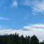

#  最美的礼物，最好的勋章

原创  陈曙兵等  [ 石买生的自留地 ](javascript:void\(0\);)

__ _ _ _ _

\-----退休时亲爱的同事、学生所赠诗文存念

  

​

图片来自网络

  

瞧，老石这个人

陈曙兵（同事）

  
老石是一名教师  
他教的科目是人生  
在日月星辰里  
他勤劳地打捞  
快乐和信心  
在山川旷野里  
他辛勤劳作  
建造一座又一座路标  
他每天都和一颗树聊聊天  
给它浇浇水  
然后就有了一片森林  
  
老石是闹市里的山人  
他喜欢尼采  
也喜欢钓鱼  
在钓鱼的时候只是垂钓  
垂钓生命里的快乐  
在阅读尼采的时候只是阅读  
阅读人世的沧桑  
老石还喜欢旅游  
四野八荒、北海南凕  
他看得多，所以他经常写诗  
  
老石是我的导师  
我的太阳  
永远是初生的太阳  
红得热烈，红得纯粹  
像天空袒露的心胸  
  
我爱山川  
我爱星辰  
我爱大地  
我爱雨露  
都比不上  
我爱老石这个人

  

​

图片来自网络

  

致石老师

潘科峰（同事）

那天，听说您退休了

我心情非常失落

失落，是因为我赶了个末班车，

刚在车上坐下

司机就交班了

那天，听说您还在上课

我内心一阵欣喜

欣喜的是

在早餐时刻还能和您攀谈

向您学习为人处世的达观

向您讨教教书育人的睿智

向您寻求利锁名缰的开解

您把生活酿成了诗

您把诗调成了乐

您把乐谱成了歌

今天，您真的荣休了

我很荣幸能在这里为您读一首粗拙的小诗

斗胆在班门前弄斧，在雷门口布鼓

羡慕您

此去，

可以赏遍姹紫嫣红，酣然入梦

可以遨游五洲瀚海，醉邀神龙

可以夫妻携手畅叙春华，不羡鸳鸯不羡仙

可以儿孙绕膝含饴自得，闲闲一颗云水心

您素雅清淡，青菜鲜鱼白米饭，瓦壶天水菊花茶，有百龄之相，眉寿之福，

您安步当车，环湖攀山爬五楼，十斤草鱼一竿收，有龙马之神，乔松之健。

  

​

图片来自网络

  

我的师傅石买生

黄菊（同事）

他总是笑眯眯的

同他说话的时候

人间好像正值  好时节

（  若无闲事挂心头  ，

便是人间好时节  ）

偶尔看见他桌子上的小书

陌生的外国诗人或小说家

发黄的书页  、  朴素的装帧

那是诗歌时代的留痕

那个文学的黄金时代

我多羡慕他亲历过那样璀璨的日子

望着讲台上的师傅

学生们偶尔在嘻嘻哈哈

我盯着他短袖上的小菠萝图案走神

这个好静  通透的老人

这个穿小菠萝短袖的老师

这个写下或嬉笑或犀利或天真文字的诗人

究竟  曾跋涉过多少路

又将看遍多少风雨和云霞呢

江南小镇  大漠孤烟  西南山居

都想去隐居数月

——  石老师曾这样提及他的退休计划

一个流浪的人  一个多情的人

流浪在天地间  爱尘世  也爱稚子

诗人的心啊

是雨过之后的天青

  

​

图片来自网络

  

  

纪念石老师荣休

江松林（93届毕业学生）

  
石老师退休了，自作《退休证》一诗，诙谐幽默，我不知道石老师是否精通美术，但这诗的画面感实在太过强烈逼真，我记得有不少大家自撰墓志铭，待石老师百年之后，也不妨一用。读罢几遍，我回“只一个劲儿绿，向您致敬，老师！”然后，恭敬地抄录于日记本上。  
我爱石老师，乃石老师之纯粹，他纯粹得像个孩子，“终日与最纯洁的灵魂晤对”。石老师是幸运的，他自己是天使，身边环绕的，也是天使。他与世无争，来去从无计较，金钱权利外，还有素琴金经。他不礼佛，但参透了佛理，慈悲，心怀怜悯。他的时代，正是改革开放四十年，他犹如空中的一片白云，恣意漫游，仿若庄周之蝶。他自比陶潜，似像又不像，像的是都远离漩涡，不事权贵；不像的是，石师儿女皆成器，无须《责子》，无须《乞食》，好不快哉！他不是隐者，四十有四，从故乡到异乡，步伐坚定，毫不彷徨。石老师爱好广泛，除了文学，还有垂钓，象棋，斗地主，充实极了。他畅想，退休后，到美国白宫门口，摆残局。  
1993年8月的某个午后，趴在桌上午休的我们睡眼惺忪，讲台上似乎有个背影缓慢移动，哟，在板书呢。“你一会儿看我，一会儿看云……”，转过身来，推了推眼镜，白色粉笔灰吸附在半透明的镜框上。  
初识石老师，初识顾城。  
五年前，几位同学松湖小聚，计划着再旁听一回石老师的课，本以为五年很长，岂知疫情便三年。虽未能如愿，但依旧心存念想。  
三十年，转眼一瞬。  
石老师退休快乐！

  

  

注：图片来自网络  
  

  

预览时标签不可点

微信扫一扫  
关注该公众号

****

****

×  分析

__

微信扫一扫可打开此内容，  
使用完整服务

：  ，  ，  ，  ，  ，  ，  ，  ，  ，  ，  ，  ，  。  视频  小程序  赞  ，轻点两下取消赞  在看  ，轻点两下取消在看
分享  留言  收藏  听过

精选留言

紫琰来自北京

石老师退休了，回都昌养老吗

石买生的自留地来自

应该偶尔回。基本是候鸟式的生活[呲牙]

江东焱来自广东

终于过上了不工作也有钱的日子了[强]石老师：愿您历尽千帆，归来仍是少年！从此过上陶渊明一样洒脱的生活[呲牙]

石买生的自留地来自

谢谢东焱祝福！[咖啡][玫瑰]

吴丰强来自广东

经师易得，人师难求！ 人生六十始，祝老石退休生活快乐！[玫瑰][玫瑰][玫瑰]

石买生的自留地来自

谢谢老吴，羡慕夫子深谙为师之道！[握手][咖啡][玫瑰]

旷欣来自广东

石老师荣休，祝开心健康

石买生的自留地来自

谢谢心怡爸！[咖啡][握手][玫瑰]

林子来自广东

诗性、达观、睿智，向石老师致敬！祝荣休快乐！

石买生的自留地来自

谢谢林子兄祝福！[咖啡][玫瑰]

黄媛麟(格桑花)来自广东

我们都爱石老师，终日与纯洁的灵魂晤对！

石买生的自留地来自

[咖啡][拥抱]

随缘童来自广东

老石退休快乐😁

石买生的自留地来自

谢谢老童！[咖啡][玫瑰]

大雄来自江西

石老师退休快乐！

石买生的自留地来自

[咖啡][玫瑰]

