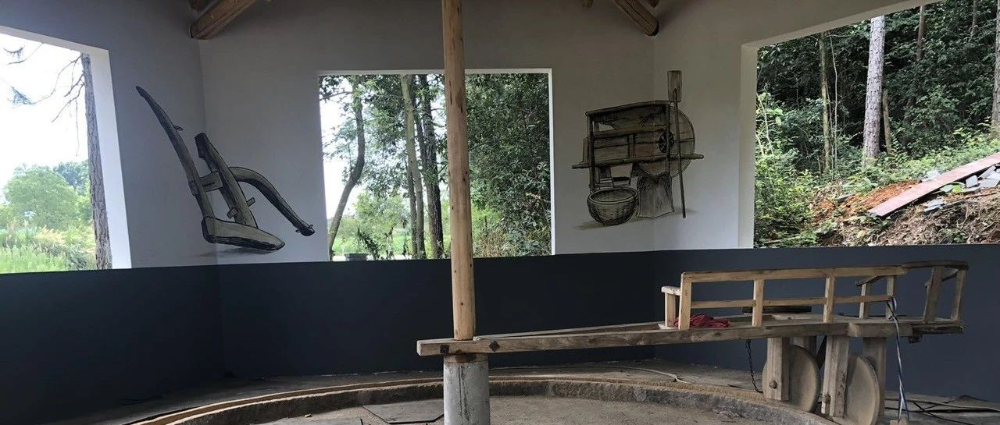
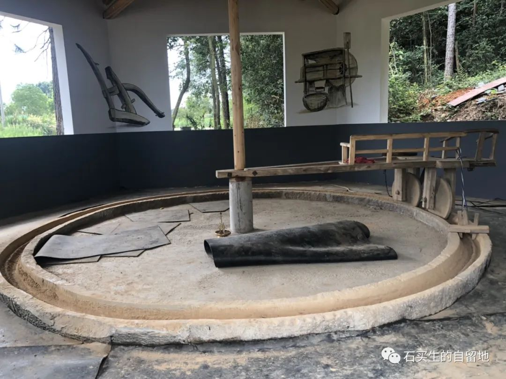
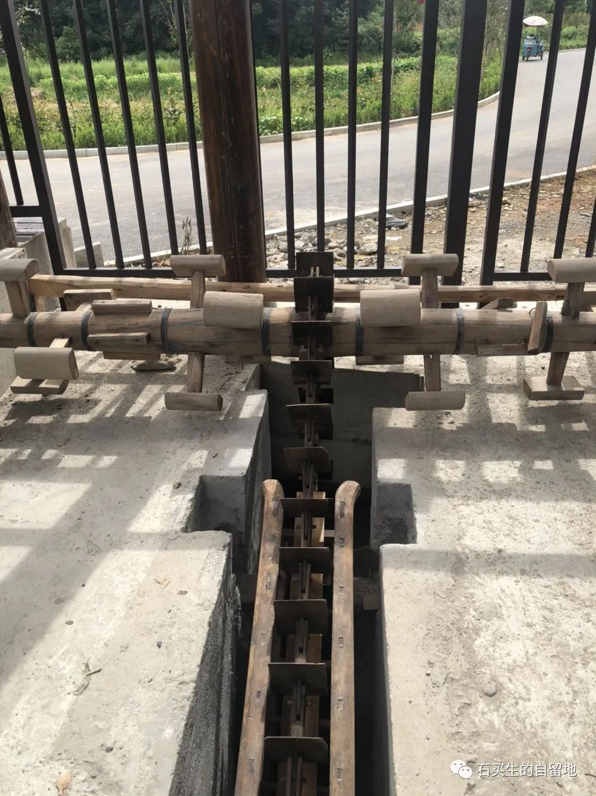
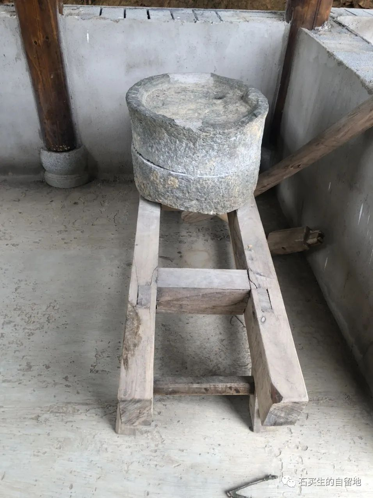
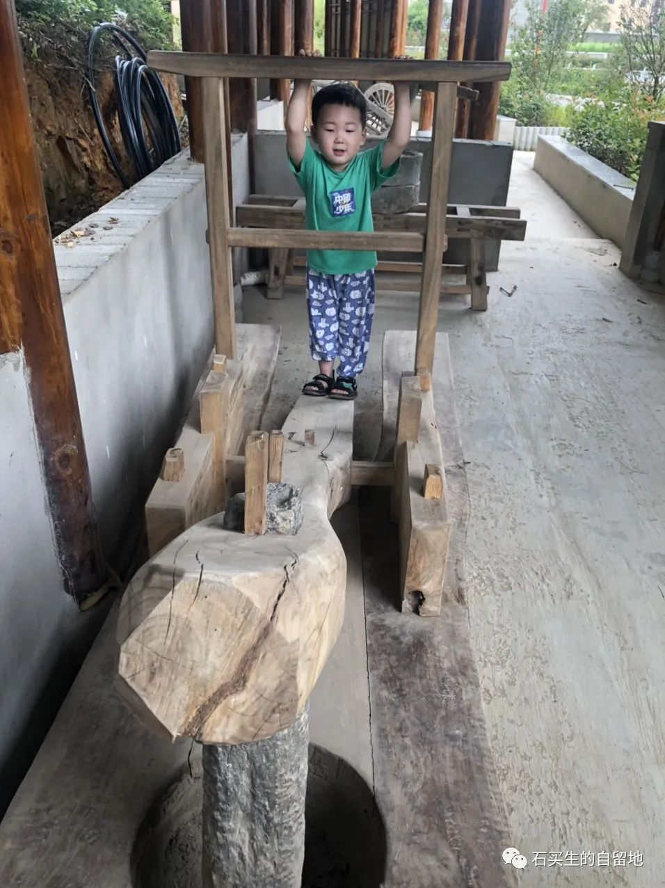
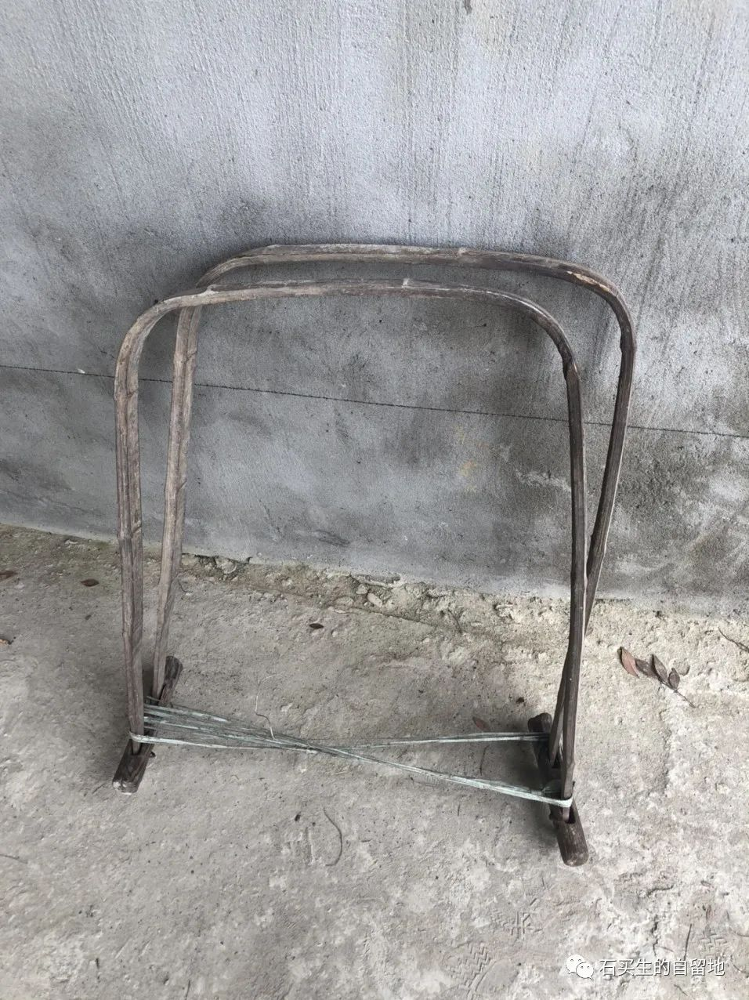
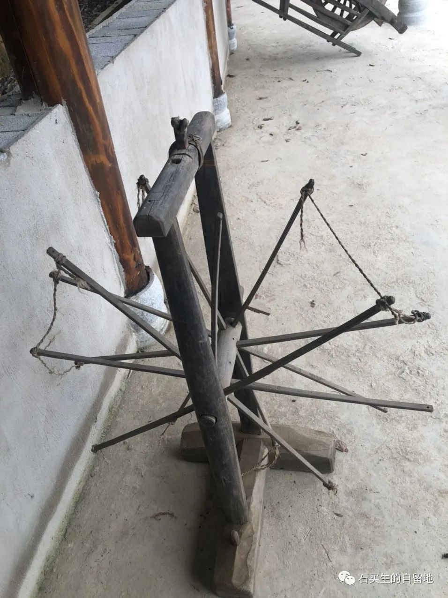
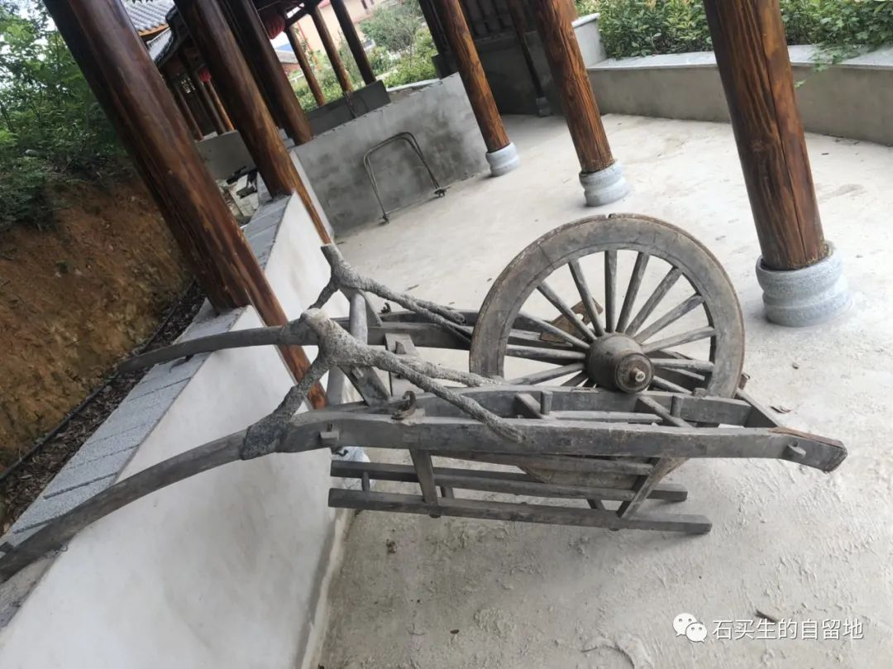
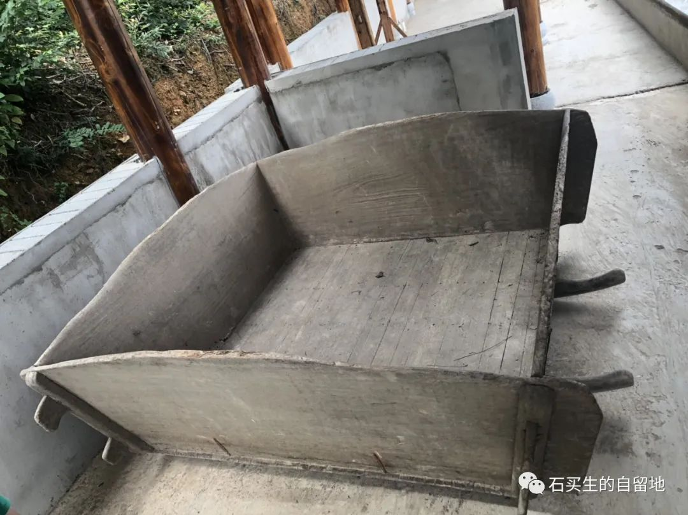
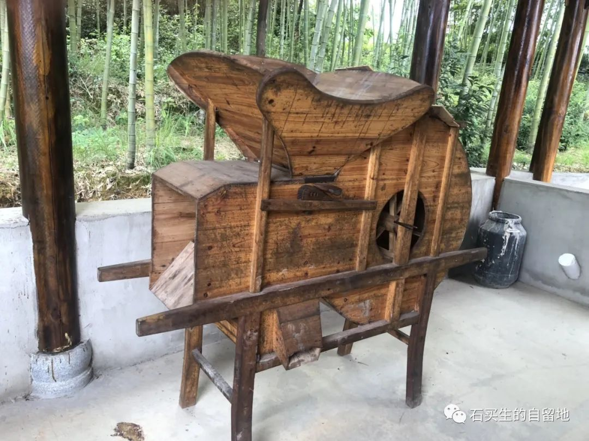

#  乡愁难于复制和粘贴

原创  石买生  [ 石买生的自留地 ](javascript:void\(0\);)

__ _ _ _ _

乡愁难于复制与粘贴

  

我村新建一条农耕时代的文化长廊，集中展示各种农具，试图还原昔日农村生活场景，唤醒遥远的乡愁。我拍了一组照片，配诗一组，表达我的思考和感悟。

——-  题记

  

​

  

  

大碾房

  

  

牛

哪去了

在碾肩睡觉的孩童

哪去了

赶碾的阿婆或阿公

哪去了

碾盘下没有簇新生活

只有淡黄色粉末

默默忍受

疼痛

  

​

  

脚踏水车

  

  

新的

有桐油味儿

脚踩

车板也呱呱响

我手握车把手感觉陌陌

眼前不见稻苗滚滚

也没有清风佛面

只有难以掩饰的寂寥

与忧愁

  

​

  

磨盘

  

那圆圆的

小小的磨眼里

曾变戏法似的变出

许多雪白豆腐和香喷喷米粑

我瘦瘦的童年

我姆妈的辛劳

我祖母的慈爱

只可惜

那青石磨盘啊

再怎么咿呀

也不会地久天长

  

​

舂

  

舂的最多的是米

也可以是麦麸

也可以是豆

也可是无

也可是

一段清贫彻底的

乡村生活

  

​

  

勒条

  

猪栏里的栏粪

随你挑

土地能生长万物

离不开勒条的功劳

尽管它样子丑

也很少人

识得它名字

  

​

  

纺车

  

它曾帮助先民

抵御严寒

它曾在课本里

和一个婆婆一起

在世界扬名

而今它骨头散架

静静接受

被遗弃的命运

  

​

  

手推车

  

在乡村土路上

它吱扭一声

让农人的日子

由沉重变得轻便

它的轻功与慢功

赛过宝马与奔驰

当满世界的人都在追名逐利

它最骄傲啦

瞅！它正四仰八叉地休息

  

​

  

禾杌

  

它是最早的稻谷脱粒机

它是农村双枪季节

首先擂响的战鼓

它是男人女人战天斗地的标志

它比春秋更古老

如果发大洪水

它也可以成为东方的

诺亚方舟

  

​

  

风车

  

它是男权时代一个绝妙讽刺

它拒绝男人的野蛮与粗暴

它臣服于女子的轻柔与小巧

它寻找适中的力度

快速区分饱满与干瘪

在甄别真与假这事儿上

它完全可申请世界吉尼斯纪录

它是农耕时代

唯一与世界接轨的

具有普世价值神秘成员

  

  

注：图片系自拍

预览时标签不可点

微信扫一扫  
关注该公众号

****

****

×  分析

__

微信扫一扫可打开此内容，  
使用完整服务

：  ，  ，  ，  ，  ，  ，  ，  ，  ，  ，  ，  ，  。  视频  小程序  赞  ，轻点两下取消赞  在看  ，轻点两下取消在看
分享  留言  收藏  听过

