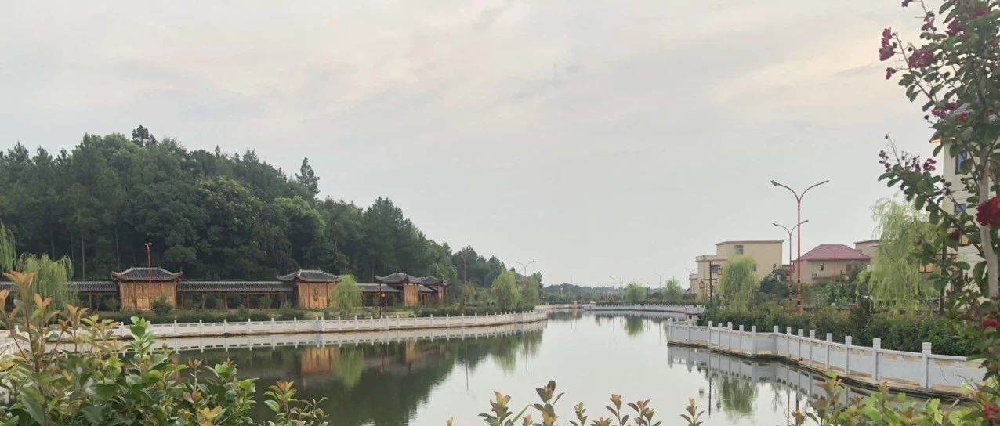
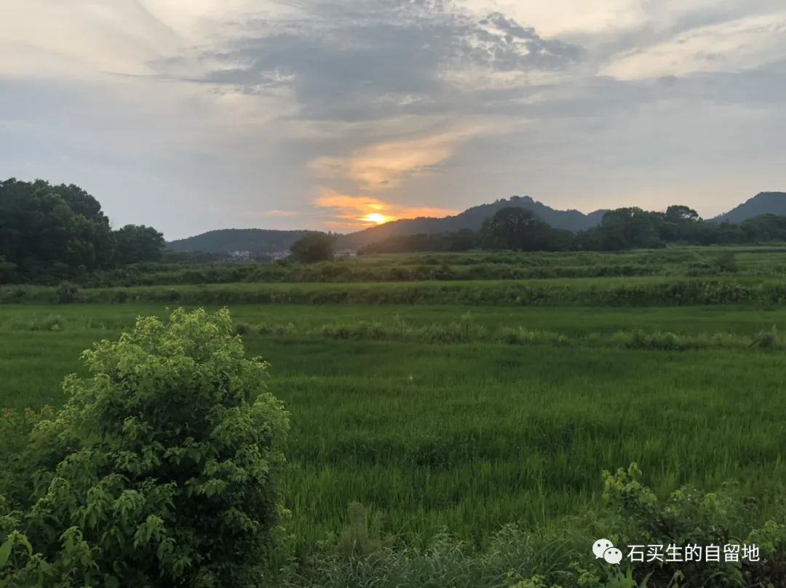
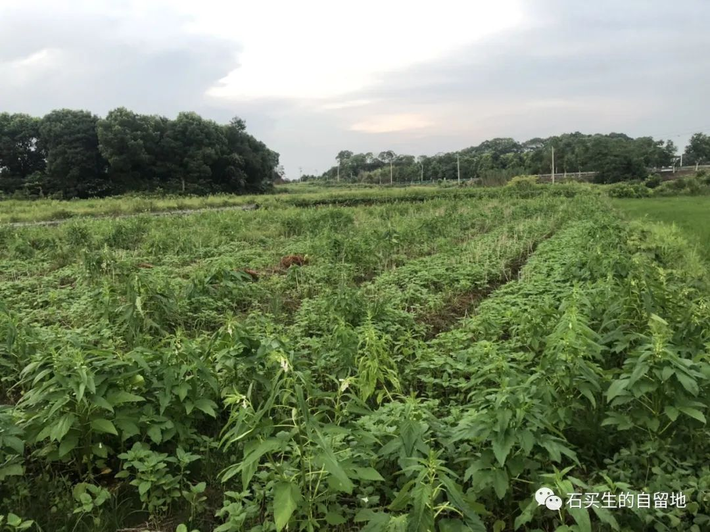
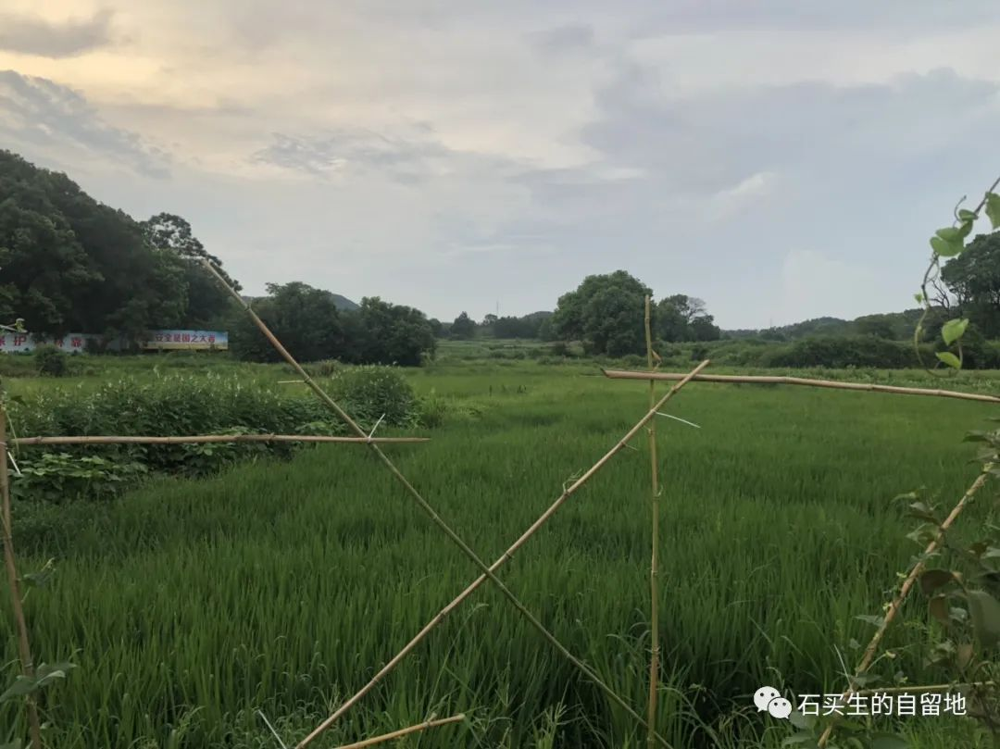
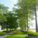

#  听刀郎唱《罗刹海市》

原创  石买生  [ 石买生的自留地 ](javascript:void\(0\);)

__ _ _ _ _

​  图片自拍  

小哲学家安排后事

  

  

我牵着三岁多的外孙  QQ

看我父母的遗像

你认识这两个老人吗

不认识

他们是我爸爸妈妈

我像谁呀

你爸爸

他们哪去啦

死啦

怎么死的

病死的

他们不回来吗

不回来

他们埋在村子东边那座山上

一个土堆下面

QQ  一脸懵不做声了

我老了怎么办呀

也埋到你爸爸妈妈

那山上去吧

  

​

图片自拍

  

土地的诚实

  

  

几年前回乡

看见村子周围的田地多有荒芜

杂草和野花在风中摇曳

此次我在田野蹀躞

水稻芝麻红薯高粱不再视我为稀客

它们静默生长

几个零散的大伯大娘在除草

他们恪守土地的古训

总相信土里有黄金

刨土流汗为求一份心安

八月骄阳正在为粮食酿造最后的甘甜

土地的诚实亘古不变

村子早已日新月异

老人留守村庄

年轻后生和漂亮姑娘远在天边外

  

图片自拍​

  

听刀郎唱《罗刹海市》

  

  

刀郎在轻吼心中积郁

吃瓜听众在欣赏陈年旧事皇帝新衣

哦资本剜肉从来不知廉耻

谁动了我的蛋糕我找谁去

讲一个以丑为美的故事再加一点哲理也只能哄骗有闲阶级

跟接地气没半毛关系

这事儿唯一价值是让我看清了艺术是啥玩意儿

疯癫颓废卖傻他妈全是假的

这世界只有真实科学的镜子令人敬畏

俄乌战争也越来虚幻了

眼下我看小村镇的麻将声和做爱的呻吟更接近形而上的本质

  

  

注：图片自拍

预览时标签不可点

微信扫一扫  
关注该公众号

****

****

×  分析

__

微信扫一扫可打开此内容，  
使用完整服务

：  ，  ，  ，  ，  ，  ，  ，  ，  ，  ，  ，  ，  。  视频  小程序  赞  ，轻点两下取消赞  在看  ，轻点两下取消在看
分享  留言  收藏  听过

精选留言

吴丰强来自广东

土地是诚实的，照片都很美，好想回去一趟[呲牙]

石买生的自留地来自

大概这就是乡土情结[玫瑰][咖啡]

强来自广东

没人喜欢你也没打赏你，该醒醒了

石买生的自留地来自

有理，正在反省！[玫瑰][抱拳]

占文才来自安徽

老师还记得我写的那首《昨天，今天，明天》吗？[偷笑]，那应该是97年左右，您还在班上念了😄

石买生的自留地来自

有印象[抱拳][玫瑰][咖啡]

